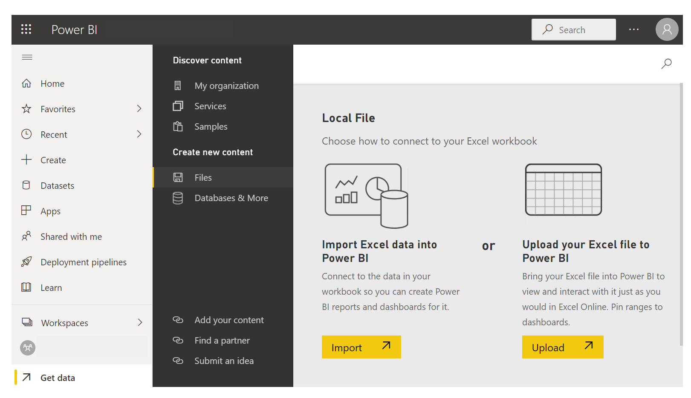

Likely, you've used Microsoft Excel to create or view reports or to build pie charts or other visuals. Getting your Excel data into Power BI is a straightforward process. 

In this unit, you will bring Excel workbooks into Power BI.

&nbsp;

**Video**: 
> [!VIDEO https://www.microsoft.com/videoplayer/embed/RE3nkKG]

> [!NOTE]
> To follow along with the example in this video, download the sample Excel workbook <a href="https://go.microsoft.com/fwlink/?linkid=2114225" target="_blank">**here**</a>.

This unit explains how you can import an Excel workbook file that contains a simple table from a local drive into Power BI. You'll then learn how to begin exploring that table's data in Power BI by creating a report.

> [!NOTE]
> Up until now, we've been importing data through Power BI Desktop. This unit page is done from the Power BI service. 

Make sure that each column has a good name in excel; it will make it easier for you to find the data that you want when creating your reports in Power BI.

## Import from a local drive
Wherever you keep your files, Power BI makes importing them simple. In Power BI, you can go **Get Data > Files > Local File** to select the Excel file that you want.

After you click Local file, you have two options.  You can import excel data into Power BI or you can upload your excel file to Power BI.

Import will connect to the data in your workbook so you can create Power BI reports and dashboards.  Upload will bring your excel file into Power BI so you can view and interact with it as you would in Excel Online

After the file has been imported into Power BI, you can begin creating reports.

Your files don't have to be on a local drive. If you save your files on OneDrive or SharePoint Team Site, that's even better.

## Create reports
After your workbook's data has been imported, a dataset is created in Power BI and it will appear under **Datasets**. 

Now, you can begin exploring your data by creating reports and dashboards. Select the **Open menu** icon next to the dataset and then select **Explore**. A new blank report canvas appears. On the right-hand side, under **Fields**, are your tables and columns. Select the fields for which you want to create a new visualization on the canvas.

You can change the type of visualization and apply filters and other properties under **Visualizations**.

If you use any of Excel's advanced BI features like **Power Query**, **Power Pivot**, or **Power View**, you can import that data into Power BI, too.

For more information, see [Get data from Excel workbook files](/power-bi/service-excel-workbook-files).
