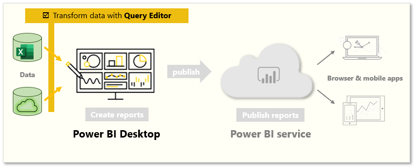
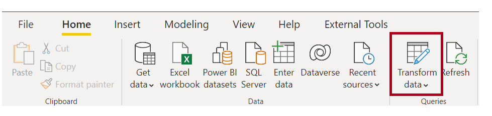
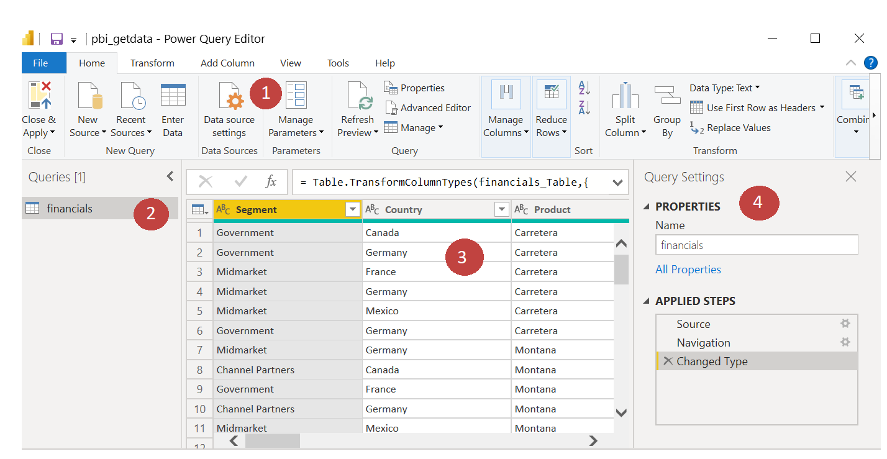
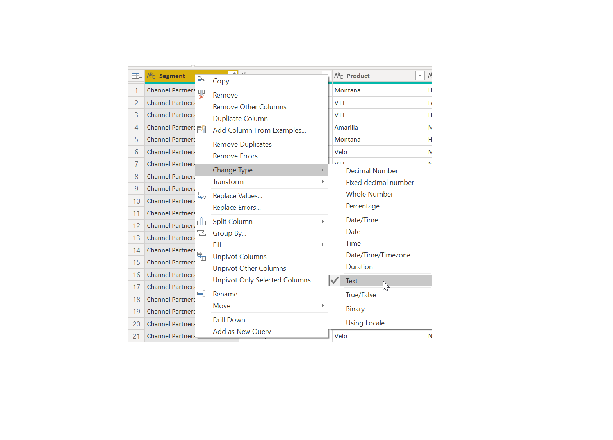
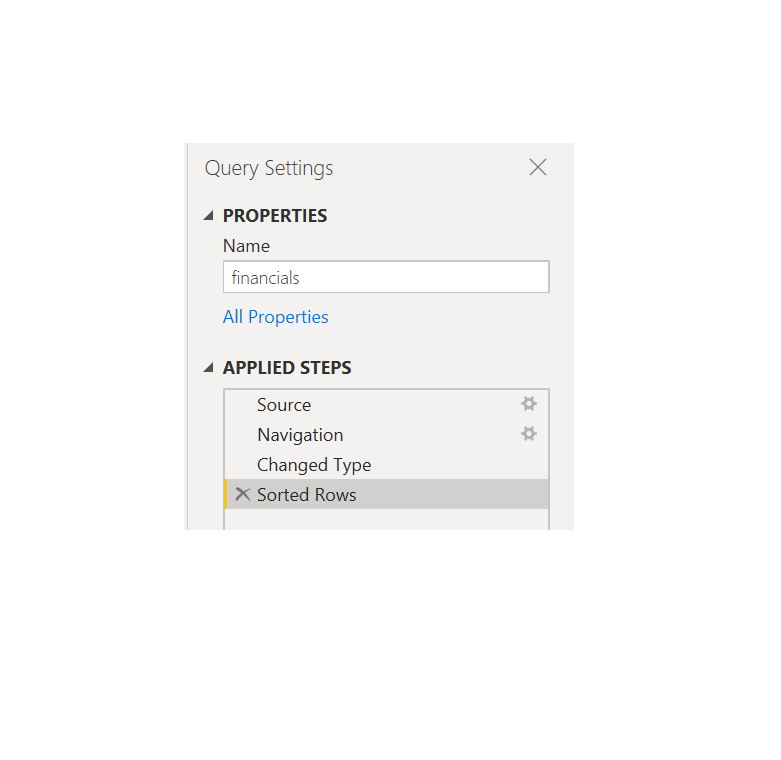

Sometimes, your data might contain extra data or have data in the wrong format. Power BI Desktop includes the **Power Query Editor** tool, which can help you shape and transform data so that it's ready for your models and visualizations. 

In this unit, you will transform data with Power Query Editor.

&nbsp;

**Video**: 
> [!VIDEO https://www.microsoft.com/en-us/videoplayer/embed/RE3nva7]

### Launch Power Query Editor

To begin, select **Edit** from the **Navigator** window to launch Power Query Editor. You can also launch Power Query Editor directly from Power BI Desktop by using the **Edit Queries** button on the Home ribbon.

After loading your data into Power Query Editor, you'll see the following screen.

1. In the ribbon, the active buttons enable you to interact with the data in the query.
2. On the left pane, queries (one for each table, or entity) are listed and available for selecting, viewing, and shaping.
3. On the center pane, data from the selected query is displayed and available for shaping.
4. The **Query Settings** window lists the query’s properties and applied steps.

### Transform data

On the center pane, right-clicking a column displays the available transformations. Examples of the available transformations include removing a column from the table, duplicating the column under a new name, or replacing values. From this menu, you can also split text columns into multiples by common delimiters.

The Power Query Editor ribbon contains additional tools that can help you change the data type of columns, add scientific notation, or extract elements from dates, such as day of the week.

> [!TIP] 
> If you make a mistake, you can undo any step from the **Applied Steps** list.

As you apply transformations, each step appears in the **Applied Steps** list on the Query Settings pane. You can use this list to undo or review specific changes, or even change the name of a step. To save your transformations, select **Close & Apply** on the **Home** tab.

After you select **Close & Apply**, Power Query Editor applies the query changes and applies them to Power BI Desktop.

For more information, see [Quickstart: Using Power Query in Power BI Desktop](https://docs.microsoft.com/power-query/power-query-quickstart-using-power-bi).
