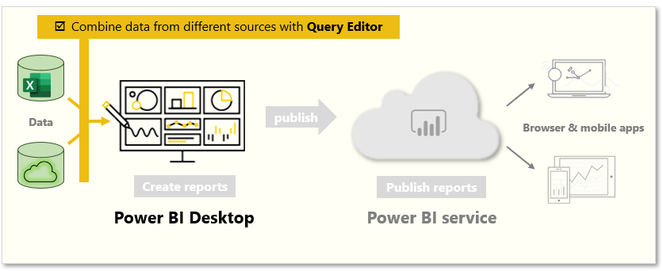
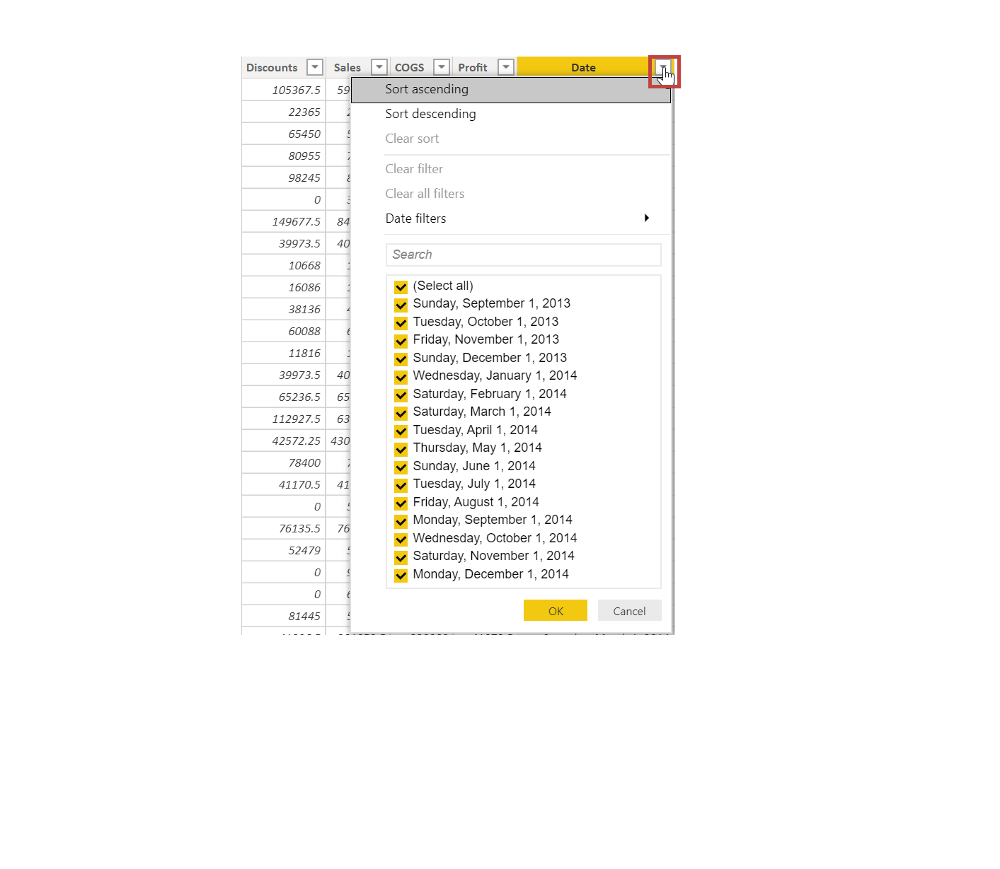
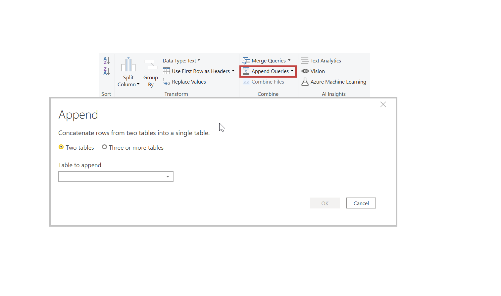
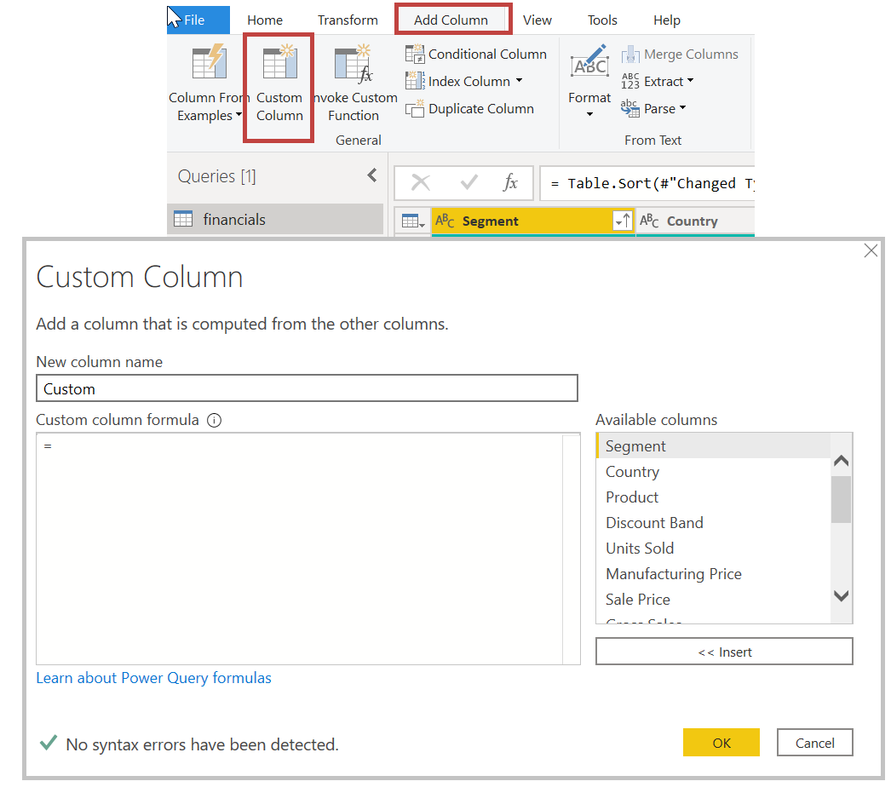

With Power BI Desktop, you can use the Power Query Editor tool to combine data from multiple sources into a single report. 

In this unit, you will combine data from different sources by using Query Editor.

&nbsp;

**Video**: Modeling and transforming data
> [!VIDEO https://www.microsoft.com/en-us/videoplayer/embed/RE3wTTj]

## Add more data sources

To add more sources to an existing report, from the Home ribbon, select **Edit Queries** and then select **New Source**. You can use many potential data sources in Power BI Desktop, including folders. By connecting to a folder, you can import data from multiple Excel or CSV files at once. 

Power Query Editor allows you to apply filters to your data. For example, selecting the drop-down arrow next to a column opens a checklist of text filters. Clearing a filter allows you to remove values from your model before the data is loaded into Power BI.

> [!IMPORTANT]
> Filtering in the Power Query Editor changes which data is loaded into Power BI. Later, when you apply filters in the Data View or Report View, those filters only apply to what you see in visuals but do not change the underlying dataset.

### Merge and append queries

You can also merge and append queries. In other words, Power BI pulls data that you select from multiple tables or various files into a single table. Use the Append Queries tool to add the data from a new table to an existing query. Power BI Desktop attempts to match the columns in your queries, which you can then adjust as necessary in Power Query Editor.

### Write customized queries

You can use the Add Custom Column tool to write new customized query expressions by using the powerful M language.

For more information, see [Tutorial: Shape and combine data in Power BI Desktop](https://docs.microsoft.com/power-bi/desktop-shape-and-combine-data/?azure-portal=true).
