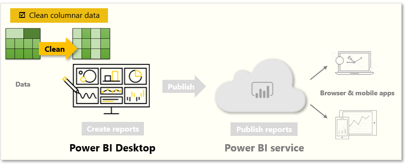
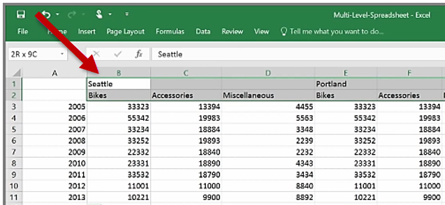
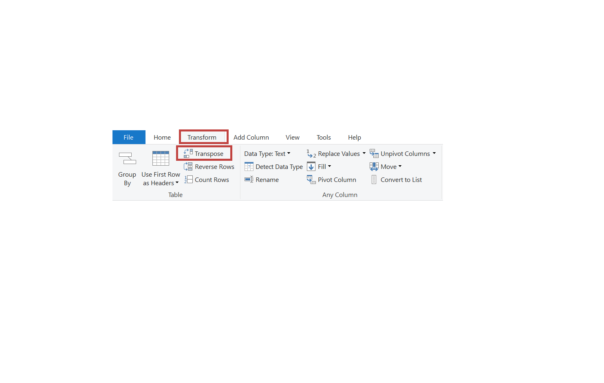
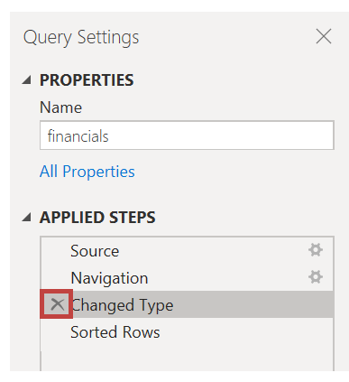

While Power BI can import your data from almost any source, its visualization and modeling tools work best with columnar data. Sometimes, your data won't be formatted in simple columns, which is often the case with Excel spreadsheets. 

In this unit, you will clean columnar data with Power Query Editor.

&nbsp;

**Video**: 
> [!VIDEO https://www.microsoft.com/en-us/videoplayer/embed/RE3nnkH]

A table layout that looks good to the human eye might not be optimal for automated queries. For example, the following spreadsheet has headers that span multiple columns.

## Clean data

Fortunately, Power Query Editor has tools to help you quickly transform multi-column tables into datasets that you can use.

### Transpose data
By using **Transpose** in Power Query Editor, you can swap rows into columns to better format the data.

### Format data
You might need to format data so that Power BI can properly categorize and identify that data. With some transformations, you'll cleanse data into a dataset that you can use in Power BI. Examples of powerful transformations include promoting rows into headers, using **Fill** to replace *null* values, and **Unpivot Columns**. 

With Power BI, you can experiment with transformations and determine which will transform your data into the most usable columnar format. Remember, the **Applied Steps** section of Power Query Editor records all your actions. If a transformation doesn't work the way that you intended, select the **X** next to the step, and then undo it.

After you've cleaned your data into a usable format, you can begin to create powerful visuals in Power BI.

For more information, see [Tutorial: Combine sales data from Excel and an OData feed](https://docs.microsoft.com/power-bi/desktop-tutorial-analyzing-sales-data-from-excel-and-an-odata-feed).
