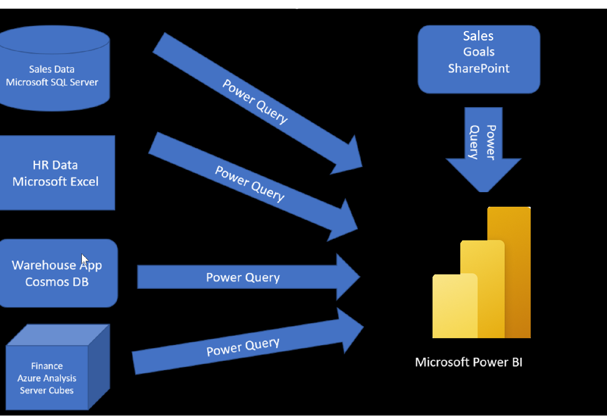

Like most of us, you work for a company where you are required to build
Power BI reports and the data resides in several different databases and
files. These data repositories are very different from each other, some
are SQL Server, some are in Excel, but the data is all related. 

For instance, imagine you work for TradeWind Traders.   You've been
tasked by senior leadership to create a suite of reports that are
dependent on data in several different locations.  The database that
tracks sales transactions is in a relational database, Microsoft SQL
Server.  That database contains which customer bought which items and
when. It also tracks which Employee made the sale, along with the
employee name and employee id. It doesn't contain the employee hire
date, the employee title, or who their manager is. For that, you need to
pull in some files that HR keeps in MS Excel. You\'ve been begging them
for years to use a SQL database, but they haven\'t gotten around to it
yet.   

When an item ships, it gets recorded in the warehousing application. 
That application was brand new.  The developers chose to store data
in CosmosDB, as a set of JSON documents.   

TradeWind Traders has an application that helps with financial
projections, so they can predict what their sales will be in future
months and years, based on past trends.  Those projections are stored in
Azure Analysis Services.  Here's a view of the many datasources you are
asked to combine data from.

 

:::image type="content" source="media/1-data-source-scenario-c.png" alt-text="TradeWind Traders data locations" lightbox="media/1-data-source-scenario-c.png":::

Before you can create reports, you must first extract the data from the
various data sources. Interacting with SQL Server is very different from
Excel, so you will have to learn the nuances of both systems. Once you
go through this effort, you can use Power Query (the query engine used
by Power BI and Excel) to help you clean the data: like renaming
columns, replacing values, removing errors, and combining query
results.  Once the data is cleaned and organized, you are ready to build
reports in Power BI.  Finally, you will publish
your combined dataset and reports to the Power BI Service (PBIS). From
there, other people can use your dataset and build their own reports, or
use the reports that you've already built.  And if someone else built a
dataset that you'd like to use, you can build reports from that, too! 

This module will focus on the first step, getting the data from the
different data sources and importing it into Power BI by using Power
Query. 

In this module, you will: 

-   Identify and connect to a data source 

-   Get data from a relational database, like Microsoft SQL Server 

-   Get data from a file, like Microsoft Excel 

-   Get data from applications 

-   Get data from Azure Analysis Services 

-   Select a storage mode 

-   Fix performance issues 

-   Resolve data import errors 
