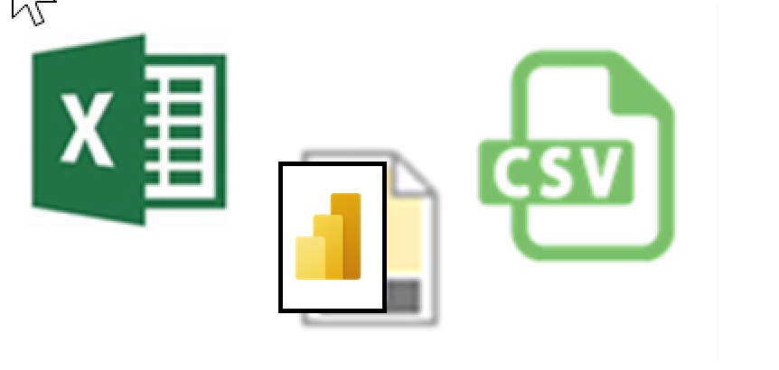
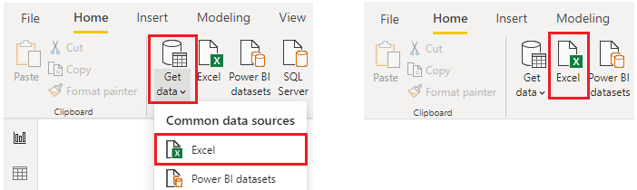
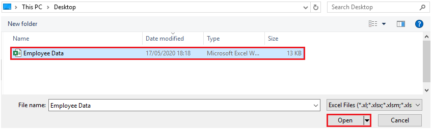
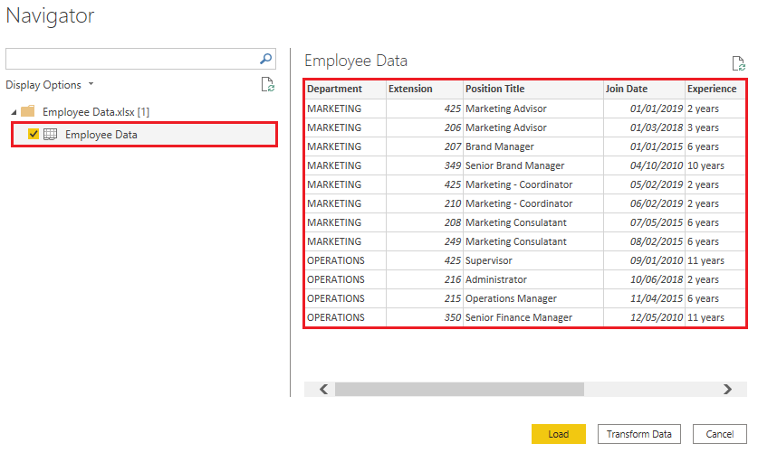

Organizations often export and store data in files. One possible file
format is a flat file. A flat file is a type of file that has only one
data table and every row of data is in the same structure. The file does
not contain hierarchies. Likely, you're familiar with the most common
types of flat files, which are comma-separated values (.csv) files,
delimited text (.txt) files, and fixed width files. Another type of file
would be the output files from different applications, like
Microsoft Excel workbooks (.xlsx).

> [!div class="mx-imgBorder"]
> 

Power BI Desktop allows you to get data from many types of files. You
can find a list of the available options when you use the **Get
data** feature in Power BI Desktop. The following sections explain how
you can import data from an Excel file that is stored on a local
computer.

## Scenario

The Human Resources (HR) team at Tailwind Traders has prepared a flat file that contains some of your organization's employee data, such as employee name, hire date, position, and manager. They've requested that you build Power BI reports by using this data, and data that is located in several other data sources.

### Flat file location

The first step is to determine which file location you want to use to export and store your data.

Your Excel files might exist in one of the following locations:

- **Local** - You can import data from a local file into Power BI.
    The file isn't moved into Power BI, and a link doesn't remain to
    it. Instead, a new dataset is created in Power BI, and data from
    the Excel file is loaded into it. Accordingly, changes to the
    original Excel file are not reflected in your Power BI dataset.
    You can use local data import for data that doesn't change.

- **OneDrive for Business** - You can pull data from OneDrive for
    Business into Power BI. This method is effective in keeping an
    Excel file and your dataset, reports, and dashboards in Power BI
    synchronized. Power BI connects regularly to your file on
    OneDrive. If any changes are found, your dataset, reports, and
    dashboards are automatically updated in Power BI.

- **OneDrive - Personal** - You can use data from files on a personal
    OneDrive account, and get many of the same benefits that you would
    with OneDrive for Business. However, you'll need to sign in with
    your personal OneDrive account, and select the **Keep me signed in**
    option. Check with your system administrator to determine whether
    this type of connection is allowed in your organization.

- **SharePoint - Team Sites** - Saving your Power BI Desktop files to SharePoint Team Sites is similar to saving to OneDrive for Business. The main difference is how you connect to the file from Power BI. You can specify a URL or connect to the root folder.

  > [!div class="mx-imgBorder"]
  > 

Using a cloud option such as OneDrive or SharePoint Team Sites is the
most effective way to keep your file and your dataset, reports, and
dashboards in Power BI in-sync. However, if your data does not change
regularly, saving files on a local computer is a suitable option.  

### Connect to data in a file

In Power BI, on the **Home** tab, select **Get data**. In the list that displays, select the option that you require, such as **Text/CSV** or **XML**. For this example, you will select **Excel**.

> [!TIP]
> The **Home** tab contains quick access data source options, such as **Excel**, next to the **Get data** button.  

> [!div class="mx-imgBorder"]
> 

Depending on your selection, you need to find and open your data source. You might be prompted to sign into a service, such as OneDrive, to authenticate your request. In this example, you will open the **Employee Data** Excel workbook that is stored on the Desktop (Remember, no files are provided for practice, these are hypothetical steps).

> [!div class="mx-imgBorder"]
> 

### Select the file data to import

After the file has connected to Power BI Desktop, the **Navigator** window opens. This window shows you the data that is available in your data source (the Excel file in this example). You can select a table or entity to preview its contents, to ensure that the correct data is loaded into the Power BI model.

Select the check box(es) of the table(s) that you want to bring in to Power BI. This selection activates the **Load** and **Transform Data** buttons as shown in the following image.

> [!div class="mx-imgBorder"]
> 

You now have the option to select the **Load** button to automatically load your data into the Power BI model or select the **Transform Data** button to launch the Power Query Editor, where you can review and clean your data before loading it into the Power BI model.

We often recommend that you transform data, but that process will be discussed later in this module. For this example, you can select **Load**.

### Change the source file

You might have to change the location of a source file for a data source
during development, or if a file storage location changes. To keep your
reports up to date, you'll need to update your file connection paths in
Power BI.

Power Query provides a number of ways for you to accomplish this
task, so that you can make this type of change when needed.

1. Data source settings  
1. Query settings  
1. Advanced Editor

> [!WARNING]
> If you are changing a file path, make sure that you
reconnect to the same file with the same file structure. Any structural
changes to a file, such as deleting or renaming columns in the source
file, will break the reporting model.

For example, try changing the data source file path in the data source
settings. Select **Data source settings** in Power Query. In the **Data
source settings** window, select your file and then select **Change
Source**. Update the **File path** or use the **Browse** option to
locate your file, select **OK**, and then select **Close**.

> [!div class="mx-imgBorder"]
> 
