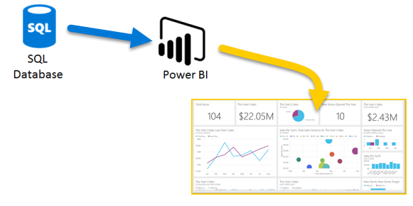
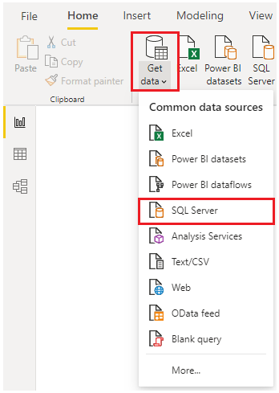
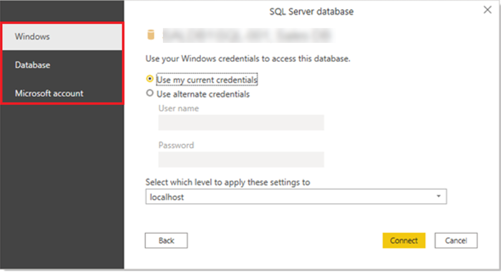
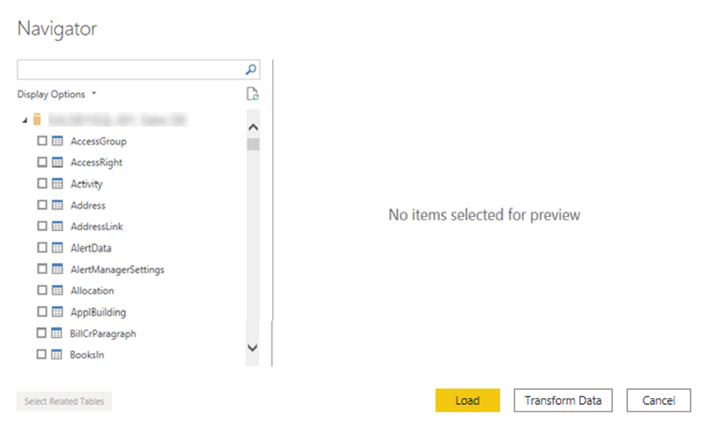
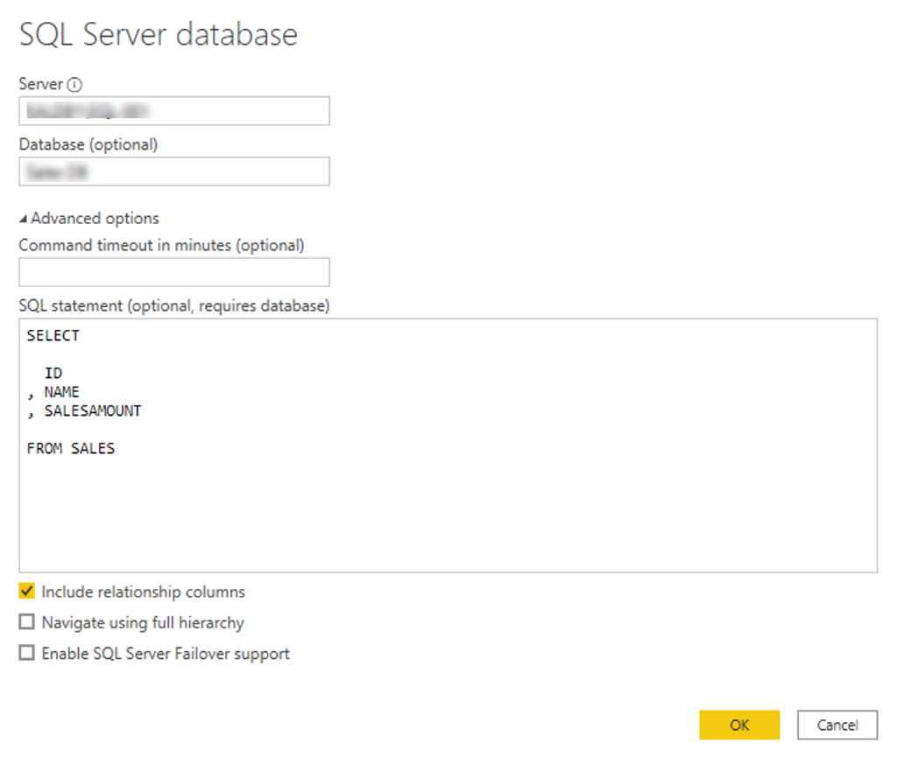
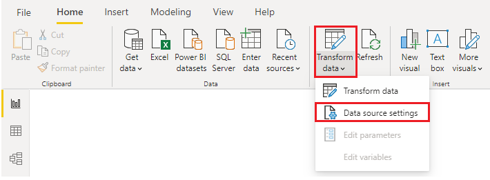
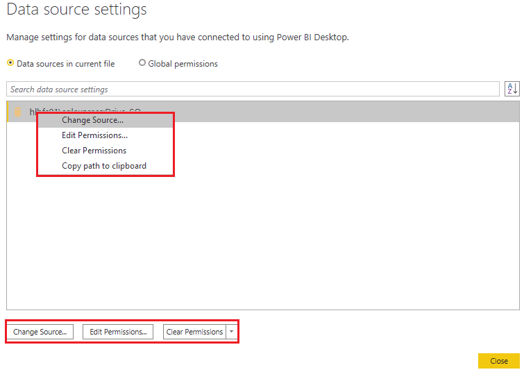
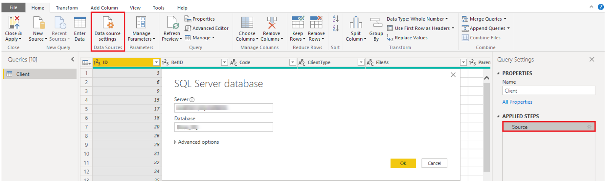

If your organization uses a relational database to record its sales
transactions, you can use Power BI Desktop to establish a connection
to your organization's relational database, rather than getting data
from individual flat files. 

Connecting Power BI to your database will help you to monitor the
progress of your business and identify trends, so you can forecast sales
figures, plan budgets and set performance indicators and targets.  Power
BI Desktop can connect to many relational databases that are either in
the cloud or on-premises. 

**Scenario**

The Sales team at Tailwind Traders have requested that you connect to
the organization's on-premises SQL Server database and get the sales
data into Power BI Desktop so you can build sales reports.   

> [!div class="mx-imgBorder"]
> [](../media/3-get-data-sql-server-ssm.png#lightbox)

### Connect to data in a relational database 

You can use the **Get data** feature in Power BI
Desktop and select the applicable option for your relational
database. For this example, you would select the **SQL Server** option,
as shown in the following screenshot.  

> [!TIP]
> Next to the **Get Data** button are quick access data source
options, such as **SQL Server.**

> [!div class="mx-imgBorder"]
> [](../media/3-get-data-sql-server-dropdown-ssm..png#lightbox)

Your next step is to enter your database server name and a database name
in the **SQL Server database** window. The two data connectivity mode
options are: **Import** (selected by default, recommended) and
**DirectQuery**. Mostly, you select **Import.** Other
advanced options are also available in the **SQL Server database**
window, but you can ignore them for now. 

> [!div class="mx-imgBorder"]
> [](../media/3-get-data-sql-server-db-ss.png#lightbox)

After you have added your server and database
names, select **OK**. Then, you will be prompted to sign in with a
username and password. You will have three sign-in options: 

-   **Windows** - Use your Windows account (Azure Active Directory credentials).

-   **Database** - Use your database credentials.  For instance, SQL Server has its own sign-in and authentication system that is sometimes used.  If the database administrator gave you a unique sign-in to the database, you might need to enter those credentials on the **Database** tab. 

-   **Microsoft account** - Use your Microsoft account credentials. This option is often used for Azure services. 

Select a sign-in option, enter your username and password, and
then select **Connect**.  

> [!div class="mx-imgBorder"]
> [](../media/3-sql-creds-ssm.png#lightbox) 

### Select data to import 

After the database has been connected to Power BI Desktop,
the **Navigator** window displays the data that is available in your
data source (the SQL database in this example). You can select a table
or entity to preview its contents and make sure that the correct data
will be loaded into the Power BI model.  

Select the check box(es) of the table(s) that you want to bring in to
Power BI Desktop, and then select either the **Load** or **Transform
Data** option.  

-   **Load** - Automatically load your data into a Power BI model in its current state. 

-   **Transform Data** - Open your data in Microsoft Power Query, where you can perform actions such as deleting unnecessary rows or columns, grouping your data, removing errors, and many other data quality activities. 

	> [!div class="mx-imgBorder"]
	> [](../media/3-table-selection-ssm.png#lightbox)

### Import data by writing an SQL query  

Another way you can import data is to write a SQL
query to specify only the tables and columns that you need. This
approach makes the import process faster and will lower the performance
load on SQL Server.   

To write your SQL query, on the **SQL Server database** window, enter
your server and database names, and then select the arrow next
to **Advanced options** to expand this section and view your options. In
the **SQL statement** box, write your query statement, and
then select **OK**. In this example, you will use the **Select** SQL
statement to load the ID, NAME and SALESAMOUNT columns **from** the
SALES table. 

> [!div class="mx-imgBorder"]
> [](../media/3-sql-statement-ss.png#lightbox)

### Change data source settings  

After you create a data source connection and load data into Power BI
Desktop, you can return and change your connection settings at any
time. This action is often required due to a security policy within the
organization, for example when the password needs to be updated every 90
days. You can change the data source, edit permissions or clear
permissions. 

On the **Home** tab, select **Transform data,** and then
select the **Data source settings** option. 

> [!div class="mx-imgBorder"]
> [](../media/3-change-sql-settings-ssm.png#lightbox)

From the list of data sources that displays, select the data source that
you want to update. Then, you can right-click that data source to view
the available update options or you can use the update option buttons on
the lower left of the window. Select the update option that you
need, change the settings as required, and then apply your changes. 

> [!div class="mx-imgBorder"]
> [](../media/3-sql-data-source-edit-ssm.png#lightbox)

You can also change your data source settings from within Power Query. Select the table, and then select the **Data source setting** option on the **Home** ribbon. Alternatively, you can go to the **Query Settings** panel on the right side of the screen and select the settings icon next to Source (or double Select Source). In the window that displays, update the server and database details, and then select **OK**. 

> [!div class="mx-imgBorder"]
> [](../media/3-edit-creds-ssm.png#lightbox)

After you have made the changes, select **Close and Apply** to
apply those changes to your data source settings. 

### Write an SQL statement 

As previously mentioned, you can import data into your Power BI model by
using an SQL query. SQL stands for Structured Query Language and is a
standardized programming language that is used to manage relational
databases and perform various operations on the data in them.  

Consider the scenario where your database has a large table that is
comprised of sales data over several years.  Sales data from 2009 is not
relevant to the report that you are creating. This situation is where
SQL is beneficial because it allows you to load only the required set of
data by specifying exact columns and rows in your SQL statement and
then importing them into your data model. You can also join different
tables, run specific calculations, create logical statements, and filter
data in your SQL query.  

The following example shows a simple query where the ID, NAME
and SALESAMOUNT are selected from the SALES table. 

The SQL query starts with a SELECT statement, which allows you to
choose the specific fields that you want to pull from your database. In
this example, you want to load the ID, NAME and SALESAMOUNT columns. 

	```
	SELECT  
	 ID 
	, NAME 
	, SALESAMOUNT 
	FROM 
	```

FROM specifies the name of the table that you want to pull the data
from. In this case, it's the SALES table. The following example is the
full SQL query: 

	```
	SELECT  
	 ID 
	, NAME 
	, SALESAMOUNT 
	FROM  
	SALES 
	```

When using an SQL query to import data, try to avoid using the wildcard
character (\*) in your query. If you use the wildcard character (\*) in
your SELECT statement, you import all contents from the specified
table. 

The following example shows the query using the wildcard character.  

	```
	SELECT *  
	FROM  
	SALES 
	```

The wildcard character (\*) will import all columns within the SALES
table. This method is not recommended because it will lead to redundant
data in your data model, which will cause performance issues and require
additional steps to normalize your data for reporting.  

All queries should also have a **WHERE** clause. This clause will filter
the rows to the exact records that you want. In this example, if you
want to get recent sales data only, add a **WHERE** clause. The final
query would look like the following example.

	``` 
	SELECT  
	 ID 
	, NAME 
	, SALESAMOUNT 
	FROM  
	SALES 
	WHERE  
	OrderDate >= ‘1/1/2020’ 
	```
