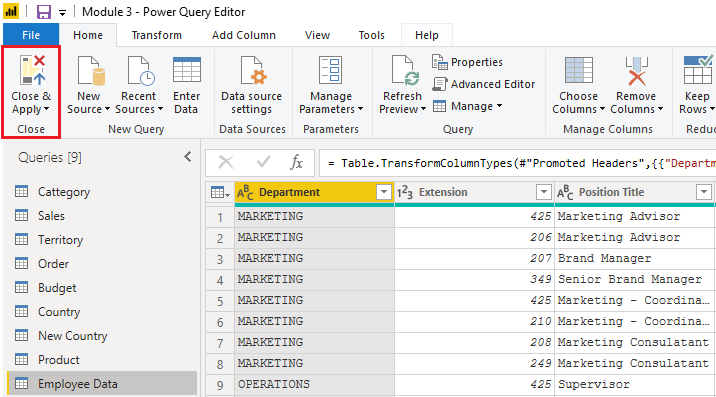

Some organization don't use a relational database but instead use
a *NoSQL* database. A NoSQL database (also referred to as non-SQL, not
only SQL or *non-relational*) is a flexible type of database that does
not use tables to store data.  

**Scenario**

Software developers at Tailwind Traders created an application to manage
shipping and tracking products from their warehouses that uses CosmosDB,
a NoSQL database, as the data repository.  This application uses Cosmos
DB to store JSON documents, which are open standard file formats that
are primarily used to transmit data between a server and web
application. You need to import this data into a Power BI data model for
reporting.

### Connect to a NoSQL database (Azure Cosmos DB) 

In this scenario, you will use the **Get data** feature in Power BI
Desktop. However, this time you will select the **More...** option to
locate and connect to the type of database that you use. In this
example, you will select the **Azure** category, select **Azure
Cosmos DB,** and then select **Connect**. 

> [!div class="mx-imgBorder"]
> 

On the **Preview Connector** window, select **Continue** and then enter
your database credentials. In this example, on the **Azure Cosmos
DB** window, you can enter the database details. You can specify the
Azure Cosmos DB account endpoint URL that you want to get the data
from (you can get the URL from the **Keys** blade of your Azure portal).
Alternatively, you can enter the database name, collection name or use
the navigator to select the database and collection to identify the data
source.

If you are connecting to an endpoint for the first time, as you are in
this example, make sure that you enter your account key. You can find
this key in the **Primary Key** box in the **Read-only Keys** blade of
your Azure portal.

### Import a JSON file 

JSON type records must be extracted and normalized before you can report
on them, so you need to transform the data before loading it into Power
BI Desktop. 

After you have connected to the database account,
the **Navigator** window opens, showing a list of databases under that
account. Select the table that you want to import. In this example, you
will select the Product table. The preview pane only shows **Record**
items because all records in the document are represented as a Record
type in Power BI. 

> [!div class="mx-imgBorder"]
> 

Select the **Edit** button to open the records in Power Query.  

In Power Query, select the **Expander** button to the right side of
the **Column1** header, which will display the context menu with a list
of fields. Select the fields that you want to load into Power BI
Desktop, clear the **Use original column name as prefix** checkbox, and
then select **OK**. 

> [!div class="mx-imgBorder"]
> 

Review the selected data to ensure that you are satisfied with it,
then select **Close & Apply** to load the data into Power BI Desktop. 

> [!div class="mx-imgBorder"]
> 

The data now resembles a table with rows and columns. Data from Cosmos
DB can now be related to data from other data sources and can eventually
be used in a Power BI report. 
