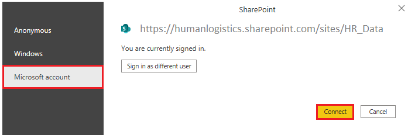
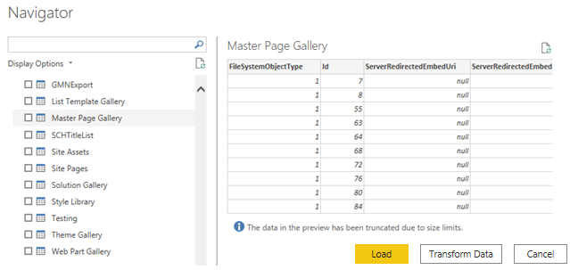
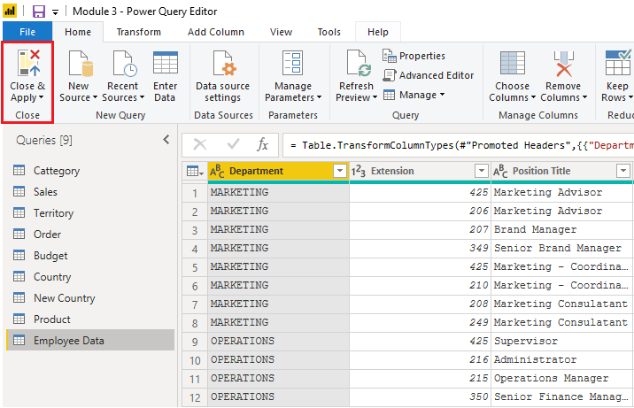

To support their daily operations, organizations frequently use a range
of software applications, such as SharePoint, OneDrive, Dynamics 365,
Google Analytics and so on. These applications produce their own data.
Power BI can combine the data from multiple applications to produce more
meaningful insights and reports. 

**Scenario:**

Tailwind Traders uses SharePoint to collaborate and store sales
data. It's the start of the new financial year and the sales
managers want to enter new goals for the sales team. The form that the
leaders use exists in SharePoint. You are required to establish a
connection to this data within Power BI Desktop, so that the sales goals
can be used alongside other sales data to determine the health of the
sales pipeline. 

The following sections examine how to use the Power BI Desktop Get
Data feature to connect to data sources that are produced by external
applications. To illustrate this process, an example is provided that
shows how to connect to a SharePoint site and import data from an online
list.  

### Connect to data in an application 

When connecting to data in an application, you would begin in the same
way as you would when connecting to the other data sources:
by selecting the **Get data** feature in Power BI Desktop. Then, select
the option that you need from the **Online Services** category. In this
example, you select SharePoint Online.  

After you have selected **Connect**, you'll be asked for your
SharePoint URL. This URL is the one that you use to sign into your
SharePoint site through a web browser. You can copy the URL from your
SharePoint site and paste it into the connection window in Power BI. You
do not need to enter your full URL file path; you only need to load your
site URL because when you are connected, you can select the specific
list that you want to load. Depending on the URL that you copied, you
might need to delete the last part of your URL, as illustrated in the
following image. 

> [!div class="mx-imgBorder"]
> 

After you have entered your URL, select **OK**. Power BI needs to
authorize the connection to SharePoint, so sign in with your Microsoft
account and then select **Connect**. 

> [!div class="mx-imgBorder"]
> 

### Choose the application data to import 

After Power BI has made the connection with SharePoint, the
**Navigator** window appears, as it does when you connect to other data
sources. The window displays the tables and entities within your
SharePoint site. Select the list that you want to load into Power BI
Desktop. Similar to when you import from other data sources, you have
the option to automatically load your data into Power BI model or launch
the Power Query Editor to transform your data before loading it.   

For this example, you select the **Load** option.   

> [!div class="mx-imgBorder"]
> 

> [!div class="mx-imgBorder"]
> 

Once you are happy with your data, Select the **Close & Apply** button
to apply your changes and load your data into Power BI Desktop. 
