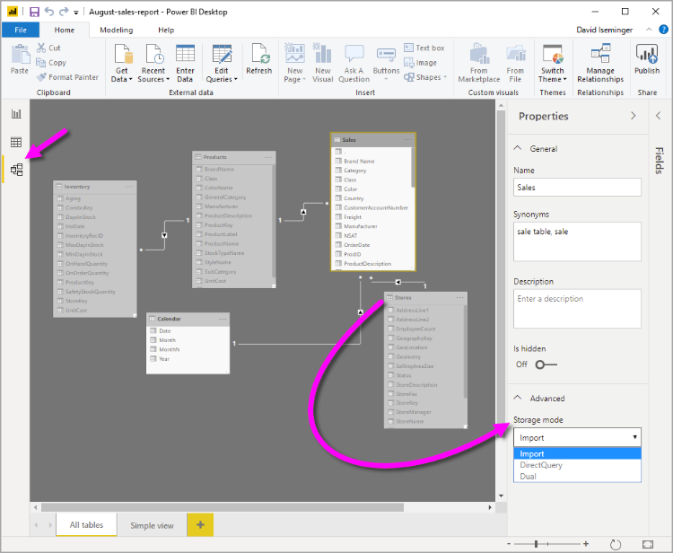

The most popular way to use data in Power BI is to import it into a Power BI dataset.  Importing the data means that the data is stored in the Power BI file and gets published along with the Power BI reports. This process helps make it easier for you to interact directly with your data. 

To continue with the scenario, you are building Power BI reports for the Sales department  at Tailwind Traders, where importing the data is not an ideal method. The first task you need to accomplish is to create your datasets in Power BI so you can build visuals and other report elements. The Sales department has many different datasets of varying sizes. For security reasons, you are not allowed to import local copies of the data into your reports, so directly importing data is no longer an option. Therefore, you need to create a direct connection to the Sales department’s data source.   The following section describes how you can ensure these business requirements are satisfied when you are importing data into Power BI.  

However, sometimes there may be security requirements around your data that make it impossible to directly import a copy. Or your datasets may simply be too large and would take too long to load into Power BI, and you want to avoid creating a performance bottleneck. Power BI solves these problems by  using the DirectQuery mode, which allows you to query the data in the data source directly and not import a copy into Power BI.   DirectQuery is useful because it ensures you are always viewing the most recent version of the data.   

The three different types of storage modes you can choose from are:  

-   Import 

-   DirectQuery 

-   Dual (Composite)

You can access storage modes by switching to the **Model** view, selecting a data table, and in the resulting Properties pane, selecting the mode you want to use from the **Storage mode** drop-down list, as shown in the following visual. 

> [!div class="mx-imgBorder"]
> 

Let's take a closer look at the different types of Storage Modes.  

### Import mode 

The Import mode allows you to create a local Power BI copy of your datasets from your data source. You can use all Power BI service features with this storage mode, including Q&A and Quick Insights. However, data refreshes must be done manually. Import mode is the default for creating new Power BI reports. 

### DirectQuery 

The DirectQuery option is useful when you do not want to save local copies of your data because your data will not be cached. Instead, you can query the specific tables that you will need by using native Power BI queries, and the required data will be retrieved from the underlying data source. Essentially, you are creating a direct connection to the data source. Using this model ensures that you are always viewing the most up-to-date data, and that all security requirements are satisfied. Additionally, this mode is suited for when you have large datasets to pull data from. Instead of slowing down performance by having to load large amounts of data into Power BI, you can use DirectQuery to create a connection to the source, solving data latency issues as well.   

### Dual (Composite mode) 

In Dual mode, you can identify some data to be directly imported and other data that must be queried. Any table that is brought in to your report is a product of both Import and DirectQuery modes. Using the Dual mode allows Power BI to choose the most efficient form of data retrieval. 

For more information regarding Storage Modes, please refer to [Storage
Modes](https://docs.microsoft.com/power-bi/transform-model/desktop-storage-mode/?azure-portal=true). 
