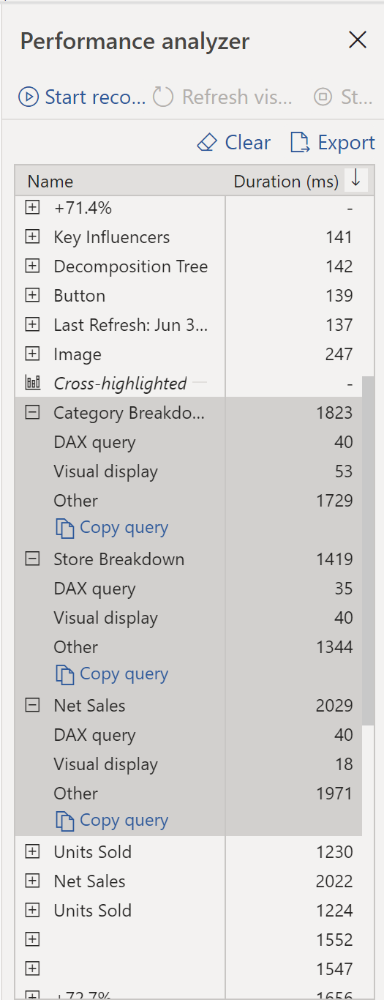

In our example, you are building reports for the Sales team at
your organization. You've imported your data, located in several tables
within Sales' SQL database by creating a data connection to the database
via DirectQuery. You begin creating some preliminary visuals and
filters. However, you notice that some tables are queried faster than
others and some filters are taking longer than others. To address
performance issues, you need to identify the most and least efficient
report elements so that you can ensure your reports are performing at
the highest level. How can you do that? 

You can do this by utilizing the Performance Analyzer, which are
logs that measure how your report elements are performing as
you and your users are interacting with them by measuring the duration
of how long it takes to load report elements. By doing this, Performance
Analyzer gives you a quantitative view of which elements are the most
and least resource intensive. 

## Performance Analyzer 

You can use Performance Analyzer to pinpoint exactly where you might
have bottlenecks in your report elements. The Performance Analyzer is
located under the View tab on the Home Ribbon. To begin
collecting logistics, select "Start Recording". Then, as you or your
users begin interacting with the visuals on your report, data will be
collected.

> [!NOTE]
> Don't click Refresh Visuals unless you want to restart the
Performance Analyzer process and are OK with losing any previous
results.

Each interaction creates a grouping which includes the details of the
action conducted and the duration to complete the action, as you can see
in "Changed a Slicer" at location 1 in the above image. Expanding on a
report element within a grouping will show that each grouping has DAX
query, Visual Display, and Other sections.  

### DAX Query

If you have backend DAX process in the grouping, this detail will tell
you how long it took from the point the DAX request is received,
computed, and outputted as a calculation.  

### Visual Display

How long it takes to render the visual components for that report
element.  

If you are interested in learning more, please refer to [Use Performance Analyzer](https://docs.microsoft.com/power-bi/create-reports/desktop-performance-analyzer /?azure-portal=true).

## Optimize Performance in Power BI 

Now that we've discussed how to pinpoint potential bottlenecks, how can
we optimize our processes to reduce this potential sources of reduced
performance? To answer this question, let's look at a few different
optimization methods:

-   Query Folding

-   Query diagnostics

### Query Folding 

Query Folding is the process by which the transformations and edits you
make in Power Query Editor are simultaneously tracked as native queries
-- or simple SELECT statements - while you are actively making
transformations, so that these transformations can take place in the
original data source server and do not overwhelm Power BI computing
resources.  

When you load data in Power BI, you utilize Power Query to do so. When
you make further transformations to your data such as renaming or
deleting columns, appending, parsing, filtering, or grouping your
data, you do this in Power Query Editor. Within Power Query Editor is a
feature called Query Folding which can improve the performance of your
Power BI reports.  

Let's say you've renamed a few columns in the Sales data and merged a
city and state column together in the format "city
state". Meanwhile, Query Folding tracks those changes in native
queries. Then, when you load your data, the transformations have taken
place independently in the original source and you have ensured that
performance is optimized in Power BI.  

There are several benefits to query folding:  

-   **More efficiency in data refreshes and incremental
    refreshes:** When importing data tables using query folding,
    Power BI is better able to allocate resources and refresh the data
    faster, as Power BI does not have to run through each
    transformation locally.  

-   **Automatic compatibility with DirectQuery and Dual Storage
    Modes**:  All DirectQuery and Dual storage mode data sources must
    have the backend server processing abilities to create a direct
    connection, which means that query folding is an automatic
    capability to utilize. If all transformations can be reduced into
    a single SELECT statement, then query folding can occur.  

Let's look at query folding in action. You would like to apply a set of
queries to multiple tables. Upon adding a new data source using Power
Query, and being directed to the Power Query Editor navigate to the
Query Settings pane, and right-click the last applied step, as seen in
the following.  

If "View Native Query" is not bold, this means that query folding is not
possible for this step  and that you can work backwards in the Applied
Steps until you reach the step in which Native Query is bold. This
will reveal the Native Query used to transform the dataset.  

Native Queries are not possible for the following transformations:  

-   Adding an index column  

-   Merging and appending columns of different tables with two different sources 

-   Changing the data type of a column 

-   Running complex DAX functions 

A good rule of thumb to remember is that if you can translate a
transformation into a SQL SELECT statement, which includes operators and
clauses such as GROUP BY, SORT BY, WHERE, UNION ALL, and JOIN, you can
use query folding.  

If you are interested in learning more, please refer to [Query Folding Guidance](https://docs.microsoft.com/power-bi/guidance/power-query-folding/?azure-portal=true) and [Query Folding](https://docs.microsoft.com/power-query/power-query-folding/?azure-portal=true).  

### Query Diagnostics  

Like Performance Analyzer, another tool that you can use to study query
performance is Query Diagnostics. This feature allows you to determine
what bottlenecks (if any) exist whilst loading and transforming your
data, refreshing your data in Power Query, running SQL statements in
Query Editor, and the like.  

To access Query Diagnostics in Power Query Editor, go to Tools in the
Home Ribbon. When you are ready to begin transforming your data or
making any other edits on Power Query Editor, select "Start Diagnostics"
on Selecting Diagnostics of this tab. Then, when you are finished, make
sure to select "Stop Diagnostics".  

Selecting **Diagnose Step** will show you the duration it took to run
that step, as shown in the following image. This can tell you if there
was a step that took longer to complete, which then serves as a starting
point to investigate further.  

This tool is particularly useful when you want to analyze performance on
the Power Query side for tasks such as loading datasets, running data
refreshes, or running other transformative tasks. 

## Other Techniques to Optimize Performance  

There are other ways to optimize query performance in Power BI. A few of
the ways are outlined below:  

-   **Process as much data as possible in the original data
    source.** Power Query and Power Query Editor are built to allow
    you to process the data, however, the processing power required to
    do this may lower performance in other areas of your reports. It
    is generally good practice to process as much as possible in the
    native data source.  

-   **Use native SQL queries.** When using DirectQuery for SQL
    databases, such as in your case at TradeWind Traders, make sure
    that you are **not** pulling data from stored procedures or common
    table expressions (CTEs).  

-   **Separate Date and Time if bound together.** If any of your tables
    have columns that combine DATE and TIME, make sure to separate
    them into separate columns before importing them into Power
    BI. This will increase compression abilities.  

In this discussion, we have outlined tools to both diagnose performance
issues through Performance Analyzer and Query Analyzer and optimize your
data retrieval and transformation through Query Folding. At your
organization, you noticed some filters were taking much too long to
refresh and some visuals were faster than others - so you can first
utilize Performance Analyzer to pinpoint the bottleneck on the front
end and then investigating further on the backend in Power Query Editor
through Query Folding. Upon doing this, not only do you find the
bottlenecks within your report but also have added a few useful
techniques to your toolbelt!  
