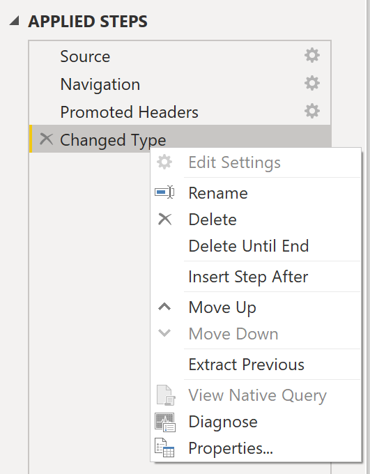
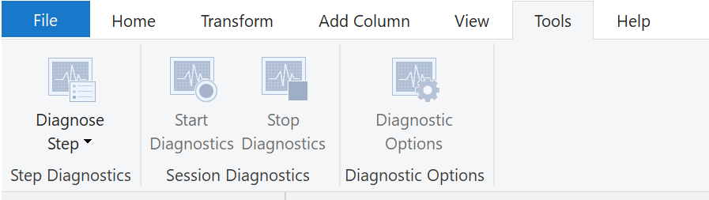

Occasionally, organizations will need to address performance issues when running reports. Power BI provides the Performance Analyzer tool to help fix problems and streamline the process.

Consider the scenario where you are building reports for the Sales team in your organization. You’ve imported your data, which is in several tables within the Sales team’s SQL database, by creating a data connection to the database through DirectQuery. When you create preliminary visuals and filters, you notice that some tables are queried faster than others, and some filters are taking longer to process compared to others.

## Optimize performance in Power Query

The performance in Power Query depends on the performance at the data source level. The variety of data sources that Power Query offers is very wide, and the performance tuning techniques for each source are equally wide. For instance, if you extract data from a Microsoft SQL Server, you should follow the performance tuning guidelines for the product. Good SQL Server performance tuning techniques includes index creation, hardware upgrades, execution plan tuning, and data compression. These topics are beyond the scope here, and are covered only as an example to build familiarity with your data source and reap the benefits when using Power BI and Power Query.

Power Query takes advantage of good performance at the data source through a technique called Query Folding.

### Query folding

The query folding within Power Query Editor helps you increase the performance of your Power BI reports. *Query folding* is the process by which the transformations and edits that you make in Power Query Editor are simultaneously tracked as native queries, or simple **Select** SQL statements, while you are actively making transformations. The reason for implementing this process is to ensure that these transformations can take place in the original data source server and do not overwhelm Power BI computing resources.

You can use Power Query to load data into Power BI. Using Power Query Editor you can then make further transformations to your data, such as renaming or deleting columns, appending, parsing, filtering, or grouping your data.

Consider a scenario where you’ve renamed a few columns in the Sales data and merged a city and state column together in the “city state” format. Meanwhile, the query folding feature tracks those changes in native queries. Then, when you load your data, the transformations take place independently in the original source, this ensures that performance is optimized in Power BI.

The benefits to query folding include:

- **More efficiency in data refreshes and incremental refreshes.** When you import data tables by using query folding, Power BI is better able to allocate resources and refresh the data faster because Power BI does not have to run through each transformation locally.

- **Automatic compatibility with DirectQuery and Dual storage modes.** All DirectQuery and Dual storage mode data sources must have the back-end server processing abilities to create a direct connection, which means that query folding is an automatic capability that you can use. If all transformations can be reduced to a single **Select** statement, then query folding can occur.

The following scenario shows query folding in action. In this scenario, you apply a set of queries to multiple tables. After you add a new data source by using Power Query, and you are directed to the Power Query Editor, you go to the **Query Settings** pane and right-click the last applied step, as shown in the following figure.

> [!div class="mx-imgBorder"]
> 

If the **View Native Query** option is not available (not displayed in bold type), then query folding is not possible for this step, and you will have to work backward in the **Applied Steps** area until you reach the step in which **View Native Query** is available (displays in bold type). This process will reveal the native query that is used to transform the dataset.

Native queries are not possible for the following transformations:

- Adding an index column
- Merging and appending columns of different tables with two different sources
- Changing the data type of a column

A good guideline to remember is that if you can translate a transformation into a **Select** SQL statement, which includes operators and clauses such as GROUP BY, SORT BY, WHERE, UNION ALL, and JOIN, you can use query folding.

While query folding is one option to optimize performance when retrieving, importing, and preparing data, another option is query diagnostics.

### Query diagnostics  

Another tool that you can use to study query performance is *query diagnostics*. This feature allows you to determine what bottlenecks (if any) exist while loading and transforming your data, refreshing your data in Power Query, running SQL statements in Query Editor, and so on.

To access query diagnostics in Power Query Editor, go to **Tools** in the Home ribbon. When you are ready to begin transforming your data or making other edits in Power Query Editor, select **Start Diagnostics** on the **Session Diagnostics** tab. When you are finished, make sure that you select **Stop Diagnostics**.

> [!div class="mx-imgBorder"]
> 

Selecting **Diagnose Step** shows you the length of time that it takes to run that step, as shown in the following image. This selection can tell you if a step takes longer to complete than others, which then serves as a starting point for further investigation.

> [!div class="mx-imgBorder"]
> 

This tool is useful when you want to analyze performance on
the Power Query side for tasks such as loading datasets, running data
refreshes, or running other transformative tasks.

## Other techniques to optimize performance  

Other ways to optimize query performance in Power BI include:

- **Process as much data as possible in the original data source.** Power Query and Power Query Editor allow you to process the data; however, the processing power that is required to complete this task might lower performance in other areas of your reports. Generally, a good practice is to process, as much as possible, in the native data source.

- **Use native SQL queries.** When using DirectQuery for SQL databases, such as the case for our scenario, make sure that you are not pulling data from stored procedures or common table expressions (CTEs).

- **Separate date and time, if bound together.** If any of your tables have columns that combine date and time, make sure that you separate them into distinct columns before importing them into Power BI. This approach will increase compression abilities.

For more information, refer to [Query Folding Guidance](/power-bi/guidance/power-query-folding/?azure-portal=true) and [Query Folding](/power-query/power-query-folding/?azure-portal=true).
