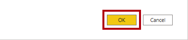
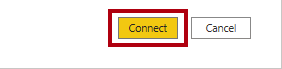
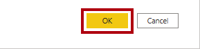
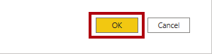
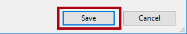
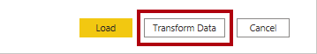
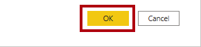
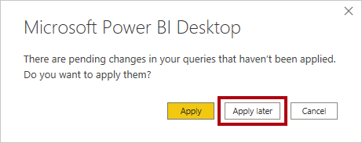

**The estimated time to complete the lab is 45 minutes.**

In this lab, you commence the development of a Power BI Desktop solution
for the Adventure Works company. It involves connecting to source data,
previewing the data, and using data preview techniques to understand the
characteristics and quality of the source data.

In this lab, you learn how to:

- Open Power BI Desktop

- Set Power BI Desktop options

- Connect to source data

- Preview source data

- Use data preview techniques to better understand the data

### Lab story

This lab is one of many in a series of labs that was designed as a complete story from data preparation to publication as reports and dashboards. You can complete the labs in any order. However, if you intend to work through multiple labs, for the first 10 labs, we suggest you do them in the following order:

1. **Prepare data in Power BI Desktop** << You are here. This is the lab for the current module.

1. [Load data in Power BI Desktop](https://docs.microsoft.com/learn/modules/clean-data-power-bi/8-lab/?azure-portal=true)

1. [Model data in Power BI Desktop, part 1](https://docs.microsoft.com/learn/modules/design-model-power-bi/8-lab/?azure-portal=true)

1. [Model data in Power BI Desktop, part 2](https://docs.microsoft.com/learn/modules/design-model-power-bi/9-lab/?azure-portal=true)

1. [Introduction to DAX in Power BI Desktop](https://docs.microsoft.com/learn/modules/create-measures-dax-power-bi/6-lab/?azure-portal=true)

1. [Time Intelligence and Measures in DAX](https://docs.microsoft.com/learn/modules/create-measures-dax-power-bi/8-lab/?azure-portal=true)

1. [Design a report in Power BI Desktop](https://docs.microsoft.com/learn/modules/visuals-power-bi/8-lab/?azure-portal=true)

1. [Enhance Power BI reports with slicers, interaction, and formatting](https://docs.microsoft.com/learn/modules/data-driven-story-power-bi/13-lab/?azure-portal=true)

1. [Create a Power BI dashboard](https://docs.microsoft.com/learn/modules/create-dashboards-power-bi/9-lab/?azure-portal=true)

1. [Perform data analysis in Power BI Desktop](https://docs.microsoft.com/learn/modules/ai-visuals-power-bi/5-lab/?azure-portal=true)

1. [Create a paginated report](https://docs.microsoft.com/learn/modules/create-paginated-reports-power-bi/6-lab/?azure-portal=true)

> [!NOTE]
> Each lab starts with a PBIX file that has all of the previous lab work completed. If you should lose your work for any reason, you can open the PBIX file that includes the progress up to that point from the folder indicated at the beginning of the next lab.

## Exercise 1: Prepare data

In this exercise you will create eight Power BI Desktop queries. Six queries will source data from SQL Server, and two from CSV files.

### **Task 1: Save the Power BI Desktop file**

In this task, you will first save the Power BI Desktop file.

1. To open the Power BI Desktop, on the taskbar, select the Microsoft Power BI Desktop shortcut.

1. To close the getting started window, at the top-left of the window, select **X**.

1. To save the file, select the **File** ribbon tab to open the backstage view.

1. Select **Save**.

1. In the **Save As** window, navigate to the **D:\DA100\MySolution**
    folder.

1. In the **File Name** box, enter **Sales Analysis**.

    > [!div class="mx-imgBorder"]
    > 

1. Select **Save**.

    > [!TIP]
    > You can also save the file by selecting the **Save** icon located at
the top-left.

### Task 2: Set Power BI Desktop options

In this task, you will set Power BI Desktop options.

1. In Power BI Desktop, select the **File** ribbon tab to open the
    backstage view.

1. At the left, select **Options and Settings**, and then select
    **Options**.

    > [!div class="mx-imgBorder"]
    > 

1. In the **Options** window, at the left, in the **Current File**
    group, select **Data Load**.

    > [!div class="mx-imgBorder"]
    > 

    The **Data Load** settings for the current file allow setting options that determine default behaviors when modeling.

1. In the **Relationships** group, clear the two options that are selected.

    > [!div class="mx-imgBorder"]
    > 

    While these two options can be helpful when developing a data model, they have been disabled to support the lab experience. When you create relationships in **Lab 03A**, you will learn why you are adding each one.

1. Select **OK**.

1. Save the Power BI Desktop file.

### Task 3: Get data from SQL Server

In this task, you will create queries based on SQL Server tables.

1. On the **Home** ribbon tab, from inside the **Data** group, select
    **SQL Server**.

    > [!div class="mx-imgBorder"]
    > 

1. In the **SQL Server Database** window, in the **Server** box, enter
    **localhost**.

    > [!div class="mx-imgBorder"]
    > 

    In the labs, you will connect to the SQL Server database by using **localhost**. This isn’t a recommended practice, however, when creating your own solutions. It’s because gateway data sources cannot resolve **localhost**.

1. Select **OK**.

1. Notice that the default authentication is to **Use My Current Credentials**.

    > [!div class="mx-imgBorder"]
    > 

1. Select **Connect**.

1. When prompted about encryption support, select **OK**.

1. In the **Navigator** window, at the left, expand the **AdventureWorksDW2020** database.

    The **AdventureWorksDW2020** database is based on the **AdventureWorksDW2017** sample database. It has been modified to support the learning objectives of the course labs.

    > [!div class="mx-imgBorder"]
    > 

1. Select but don’t check the **DimEmployee** table.

      > [!div class="mx-imgBorder"]
      > 

1. In the right pane, notice a preview of the table.

    The preview allows you to determine the columns and a sample of rows.

1. To create queries, select the following six tables:

    - DimEmployee
    - DimEmployeeSalesTerritory
    - DimProduct
    - DimReseller
    - DimSalesTerritory
    - FactResellerSales

1. To apply transformations to the data of the selected tables, select
    **Transform Data**.

    You won’t be transforming the data in this lab. The objectives of this lab are to explore and profile the data in the **Power Query Editor** window.

### Task 4: Preview SQL Server queries

In this task, you will preview the data of the SQL Server queries. First, you will learn relevant information about the data. You will also use column quality, column distribution, and column profile tools to understand the data, and assess data quality.

1. In the **Power Query Editor** window, at the left, notice the **Queries** pane.

    > [!div class="mx-imgBorder"]
    > 

    The **Queries** pane contains one query for each selected table.

1. Select the first query **DimEmployee**.

    The **DimEmployee** table stores one row for each employee. A subset of the rows represent the salespeople, which will be relevant to the model you’ll develop.

1. At the bottom left, in the status bar, notice the table statistics - the table has 33 columns, and 296 rows.

    > [!div class="mx-imgBorder"]
    > 

1. In the data preview pane, scroll horizontally to review all columns.

1. Notice that the last five columns contain **Table** or **Value**
    links.

    These five columns represent relationships to other tables in the database. They can be used to join tables together. You will join tables in **Lab 03A**.

1. To assess column quality, on the **View** ribbon tab, from inside
    the **Data Preview** group, select **Column Quality**.

    > [!div class="mx-imgBorder"]
    > 

      Column quality allows you to easily determine the percentage of valid, error, or empty values.

1. For the **Position** column (sixth last column), notice that 94% of
    rows are empty (null).

    > [!div class="mx-imgBorder"]
    > 

1. To assess column distribution, on the **View** ribbon tab, from inside the **Data Preview** group, select **Column Distribution**.

    > [!div class="mx-imgBorder"]
    > 

1. Review the **Position** column again, and notice that there are four distinct values, and one unique value.

1. Review the column distribution for the **EmployeeKey** (first)
    column—there are 296 distinct values, and 296 unique values.

    > [!div class="mx-imgBorder"]
    > 

    When the distinct and unique counts are the same, it means the column contains unique values. When modeling, it’s important that some tables contain unique columns. You can use these unique columns to create one-to-many relationships, which you will do in the **Model Data in Power BI Desktop, Part 1** lab.

1. In the **Queries** pane, select the **DimEmployeeSalesTerritory** query.

    > [!div class="mx-imgBorder"]
    > 

    The **DimEmployeeSalesTerritory** table stores one row for each employee and the sales territory regions they manage. The table supports relating many regions to a single employee. Some employees manage one, two, or possibly more regions. When you model this data, you’ll need to define a many-to-many relationship, which you’ll do in the **Model Data in Power BI Desktop, Part 2** lab.

1. In the **Queries** pane, select the **DimProduct** query.

    > [!div class="mx-imgBorder"]
    > 

    The **DimProduct** table contains one row per product sold by the company.

1. Horizontally scroll to reveal the last columns.

1. Notice the **DimProductSubcategory** column.

    When you add transformations to this query in the **Load Data in Power BI Desktop** lab, you’ll use the **DimProductSubcategory** column to join tables.

1. In the **Queries** pane, select the **DimReseller** query.

    > [!div class="mx-imgBorder"]
    > 

    The **DimReseller** table contains one row per reseller. Resellers sell, distribute, or add value to Adventure Works’ products.

1. To view column values, on the **View** ribbon tab, from inside the **Data Preview** group, select **Column Profile**.

    > [!div class="mx-imgBorder"]
    > 

1. Select the **BusinessType** column header.

1. Notice that a new pane opens beneath the data preview pane.

1. Review the column statistics and value distribution.

1. Notice the data quality issue: there are two labels for warehouse
    (**Warehouse**, and the misspelled **Ware House**).

   > [!div class="mx-imgBorder"]
   > 

1. Hover the cursor over the **Ware House** bar, and notice that there are five rows with this value.

    You’ll apply a transformation to relabel these five rows in the **Load Data in Power BI Desktop** lab.

1. In the **Queries** pane, select the **DimSalesTerritory** query.

    > [!div class="mx-imgBorder"]
    > 

     The **DimSalesTerritory** table contains one row per sales region, including **Corporate HQ** (headquarters). Regions are assigned to a country, and countries are assigned to groups. In the **Model Data in Power BI Desktop, Part 1** lab, you’ll create a hierarchy to support analysis at region, country, or group level.

1. In the **Queries** pane, select the **FactResellerSales** query.

    > [!div class="mx-imgBorder"]
    > 

    The **FactResellerSales** table contains one row per sales order line - a sales order contains one or more line items.

1. Review the column quality for the **TotalProductCost** column, and
    notice that 8% of the rows are empty.

    > [!div class="mx-imgBorder"]
    > 

    Missing **TotalProductCost** column values is a data quality issue. To address the issue in the **Load Data in Power BI Desktop** lab, you'll apply transformations to fill in missing values by using the product standard cost, which is stored in the **DimProduct** table.

### Task 5: Get data from a CSV file

In this task, you will create a query based on a CSV file.

1. To add a new query, in the **Power Query Editor** window, on the
    **Home** ribbon tab, from inside the **New Query** group, select the
    **New Source** down-arrow, and then select **Text/CSV**.

    > [!div class="mx-imgBorder"]
    > 

1. In the **Open** window, navigate to the **D:\DA100\Resources** folder,
    and select the **ResellerSalesTargets.csv** file.

1. Select **Open**.

1. In the **ResellerSalesTargets.csv** window, review the data preview.

1. Select **OK**.

1. In the **Queries** pane, notice the addition of the
    **ResellerSalesTargets** query.

    > [!div class="mx-imgBorder"]
    > 

    The **ResellerSalesTargets** CSV file contains one row per salesperson, per year. Each row records 12 monthly sales targets (expressed in thousands). The business year for the Adventure Works company commences on July 1.

1. Notice that no columns contain empty values. When there isn’t a monthly sales target, a hyphen character is stored instead.

1. Review the icons in each column header, to the left of the column
    name.

    > [!div class="mx-imgBorder"]
    > 

    The icons represent the column data type. **123** is whole number, and **ABC** is text.

    You’ll apply many transformations to achieve a different shaped result consisting of only three columns: **Date**, **EmployeeKey**, and **TargetAmount** in the **Load Data in Power BI Desktop** lab.

### Task 6: Get additional data from a CSV file

In this task, you will create an additional query based on a different
CSV file.

Use the steps in the previous task to create a query based on the
**D:\DA100\Resources\ColorFormats.csv** file.

> [!div class="mx-imgBorder"]
> 

The **ColorFormats** CSV file contains one row per product color. Each row records the HEX codes to format background and font colors. You’ll integrate this data with the **DimProduct** query data in the **Load Data in Power BI Desktop** lab.

### Task 7: Finish up

In this task, you'll complete the lab.

1. On the **View** ribbon tab, from inside the **Data Preview** group, clear the three data preview options:

    - Column quality
    - Column distribution
    - Column profile

    > [!div class="mx-imgBorder"]
    > 

1. To save the Power BI Desktop file, on the **File** backstage view, select **Save**.

    > [!div class="mx-imgBorder"]
    > 

1. When prompted to apply the queries, select **Apply Later**.

    Applying the queries will load their data to the data model. You’re not ready to do that, as there are many transformations that must be applied first.

1. If you intend to start the next lab, you can opt to leave Power BI Desktop open.

    > [!WARNING]
    > If you leave the lab open, it will time out after one to four hours. Your work in the *current* module's lab will be lost, but each lab after the first one includes a PBIX file with the work from all previous labs completed so that you don't need to start over.

    You’ll apply various transformations to the queries and then apply the queries to load them to the data model in the Load Data in Power BI Desktop lab.
