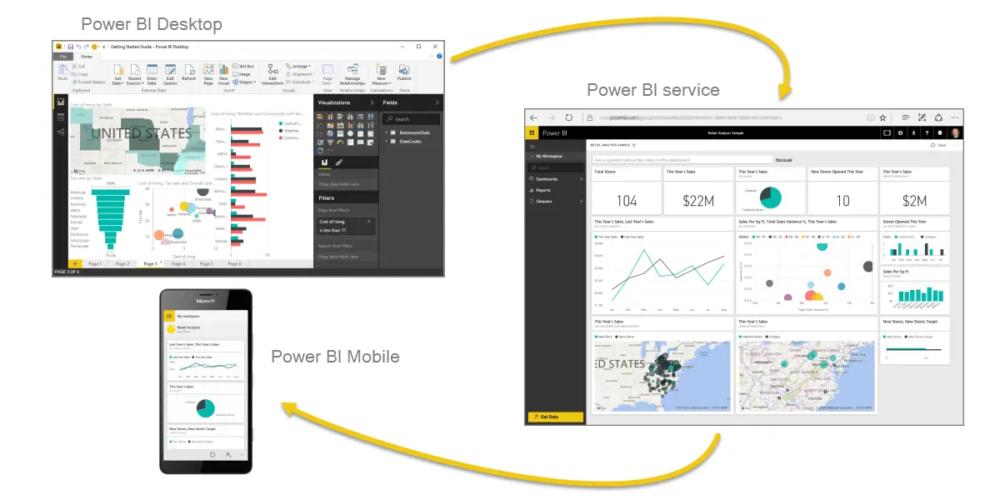

**Microsoft Power BI** is a collection of software services, apps, and connectors that work together to turn your unrelated sources of data into coherent, visually immersive, and interactive insights. Whether your data is a simple Microsoft Excel workbook, or a collection of cloud-based and on-premises hybrid data warehouses, **Power BI** lets you easily connect to your data sources, visualize (or discover) what's important, and share that with anyone or everyone you want.

**Power BI** can be simple and fast, capable of creating quick insights from an Excel workbook or a local database. But **Power BI** is also robust and enterprise-grade, ready not only for extensive modeling and real-time analytics, but also for custom development. Therefore, it can be your personal report and visualization tool, but can also serve as the analytics and decision engine behind group projects, divisions, or entire corporations.

If you're a **beginner** with Power BI, this module will get you going. If you're a Power BI **veteran**, this module will tie concepts together and fill in the gaps.

## The parts of Power BI
Power BI consists of a Microsoft Windows desktop application called **Power BI Desktop**, an online SaaS (*Software as a Service*) service called the **Power BI service**, and mobile Power BI **apps** that are available on Windows phones and tablets, and also on Apple iOS and Google Android devices.

These three elements—**Desktop**, the **service**, and **Mobile** apps—are designed to let people create, share, and consume business insights in the way that serves them, or their role, most effectively.

## How Power BI matches your role
How you use Power BI might depend on your role on a project or a team. And other people, in other roles, might use Power BI differently, which is just fine.

For example, you might view reports and dashboards in the **Power BI service**, and that might be all you do with Power BI. But your number-crunching, business-report-creating coworker might make extensive use of **Power BI Desktop** (and publish Power BI Desktop reports to the Power BI service, which you then use to view them). And another coworker, in sales, might mainly use her Power BI phone app to monitor progress on her sales quotas and drill into new sales lead details.

You also might use each element of **Power BI** at different times, depending on what you're trying to achieve, or what your role is for a given project or effort.

Perhaps you view inventory and manufacturing progress in a real-time dashboard in the service, and also use **Power BI Desktop** to create reports for your own team about customer engagement statistics. How you use Power BI can depend on which feature or service of Power BI is the best tool for your situation. But each part of Power BI is available to you, which is why it's so flexible and compelling.

We discuss these three elements—**Desktop**, the **service**, and **Mobile** apps—in more detail later. In upcoming units and modules, we'll also create reports in Power BI Desktop, share them in the service, and eventually drill into them on our mobile device.

You can download Power BI Desktop from the web or as an app from the Microsoft Store on the Windows tab.

| Download Strategy | Link | Notes |
|-------------------|------|-----------------------------------|
| Windows Store App | <a href="https://go.microsoft.com/fwlink/?linkid=2101122" target="_blank">Windows Store</a>| Will automatically stay updated |
| Download from web | [Download .msi](http://go.microsoft.com/fwlink/?LinkID=521662) | Must manually update periodically |

## Sign in to Power BI service
Before you can sign in to Power BI, you'll need an account. To get a free trial, go to <a href="https://go.microsoft.com/fwlink/?linkid=2101313" target="_blank">app.powerbi.com</a> and sign up with your email address. 

For detailed steps on setting up an account, see [Sign in to Power BI service](https://docs.microsoft.com/power-bi/consumer/end-user-sign-in)

## The flow of work in Power BI
A common flow of work in Power BI begins in **Power BI Desktop**, where a report is created. That report is then published to the **Power BI service** and finally shared, so that users of **Power BI Mobile** apps can consume the information.

It doesn't always happen that way, and that's okay. But we'll use that flow to help you learn the different parts of Power BI and how they complement each other.

Okay, now that we have an overview of this module, what Power BI is, and its three main elements, let's take a look at what it's like to use **Power BI**.

