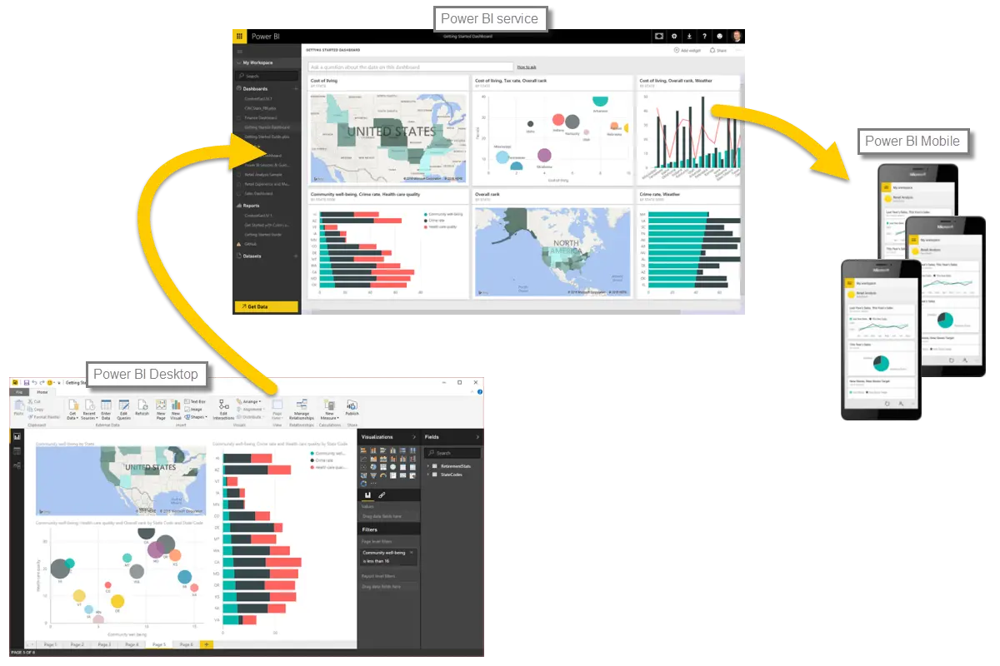

Let’s do a quick review of what we covered in this first module.

**Power BI** is a collection of software services, apps, and connectors that work together to turn your data into interactive insights. You can use data from single basic sources, such as an Excel workbook, or pull data in from multiple databases and cloud sources to create complex datasets and reports. Power BI can be as straightforward as you want, or as enterprise-ready as your complex global business requires.

Power BI consists of three main elements – the **Power BI Desktop**, the **Power BI service**, and **Power BI Mobile** – which all work collectively to let you create, interact with, share, and consume your data how you want it.

We discussed the basic building blocks in Power BI too, which are:

* **Visualizations** – a visual representation of data, sometimes just called visuals
* **Datasets** – a collection of data that Power BI uses to create visualizations
* **Reports** – a collection of visuals from a dataset, spanning one or more pages
* **Dashboards** – a single page collection of visuals, built from a report
* **Tiles** – a single visualization found in a report or dashboard

In the **Power BI service**, we installed an **app** with just a few clicks. That **app** – a ready-made collection of visuals and reports – let us easily connect to a **software service** to populate the app and bring that data to life.

Lastly, we set up a **refresh schedule** for our data, so we know when we go back to the Power BI service that data will be fresh.

## Next steps
**Congratulations!** You've completed the first module of the **Learning Path** for Power BI. You now have a firm foundation of knowledge to move on to the next section, which walks through the steps to create your first report. 

We mentioned this before, but it's worth restating: this Learning Path builds your knowledge by following the common flow of work in Power BI:

* Bring data into **Power BI Desktop**, and create a report.
* **Publish** to the Power BI service, where you create new visualizations or build dashboards
* **Share** your dashboards with others, especially people who are on the go
* View and interact with shared dashboards and reports in **Power BI Mobile** apps

You might not do all that work yourself - some people will only view dashboards in the service that were created by someone else. That's fine, and we'll soon have a module dedicated to dedicated to showing you how to easily navigate and use the **Power BI service**, so you can easily view and interact with reports and apps.

In following the flow of work in Power BI, however, the next module shows you how to create a report and publish that report to the Power BI service. In the next module, you'll learn how those reports and dashboards are created, and how they connected to the data... and you might even decide to create one of your own.

See you in the next module!

