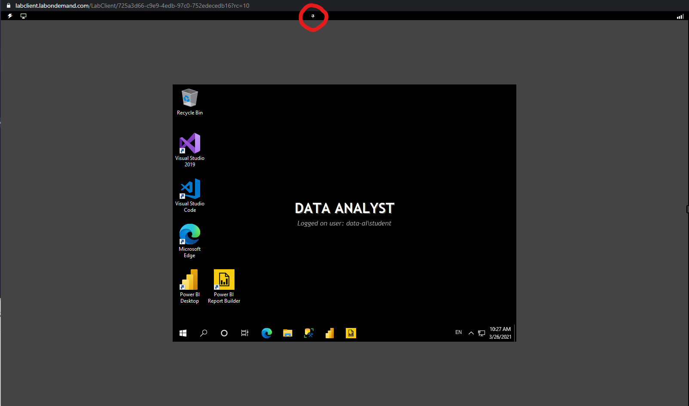

## Access your environment

Before you start this lab (unless you are continuing from a previous lab), select **Launch lab** above.

You are automatically logged in to your lab environment as data-ai\student.

You can now begin your work on this lab.

> [!TIP]
> To dock the lab environment so that it fills the window, select the push pin icon at the top center.
>
> [!div class="mx-imgBorder"]
> 
