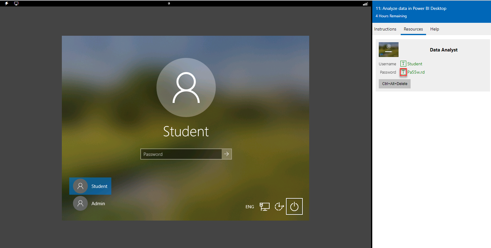

## Access your environment

Before you start this lab, select **Launch lab** above. 

To log in to your lab environment:

1.	Click anywhere on the Windows desktop in the lab window.
2.	On the **Resources** tab on the lab side bar, select the **T** icon next to **Password**. The machine password is automatically entered for you. You can log in with the Student profile.
3.	Press **Enter**.

   

You can now begin your work on this lab. 
