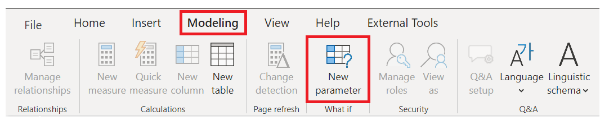
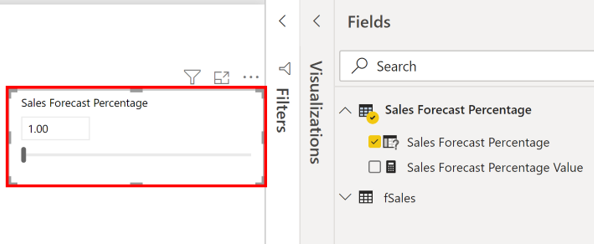
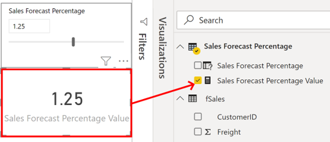
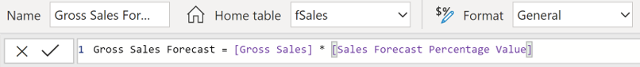
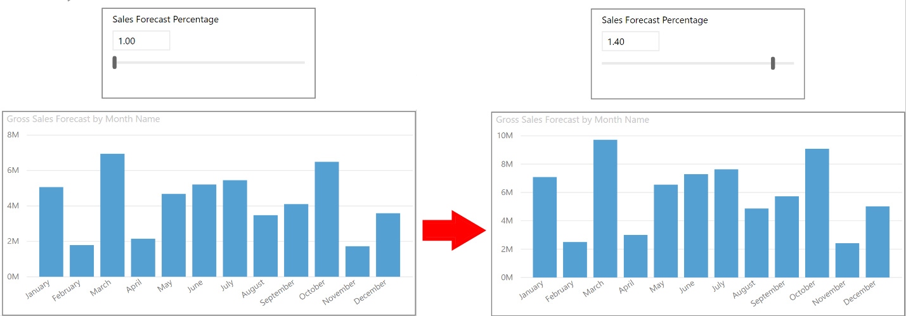
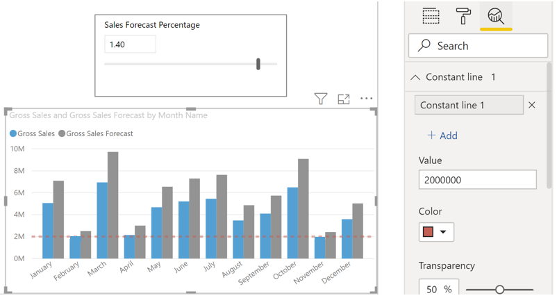

You can use 'what-if' parameters to run scenarios and scenario type analysis on your data. What-if parameters are a powerful addition to your Power BI data models and reports because they enable you to look historically and analyze what would have happened if a different scenario had played out, and they enable you to look forward, to predict or forecast what could happen in the future.

You can use what-if parameters in all sorts of situations, such as to see the effect of increased sales to deeper discounts, or to let sales consultants see their compensation, if they meet certain sales goals or percentages.

In this example, you want to enable the sales team to find out how much growth (percentage) from a sales perspective they need to make, in order to earn $2 million gross sales per month.

## Create a what-if parameter

To create a what-if parameter, go to the **Modeling** tab, select **New Parameter**,

> [!div class="mx-imgBorder"]
> 

On the **What-if parameter** window, configure the new parameter. In this example, you change the parameter name to **Sales Forecast Percentage** and select **Fixed decimal number** as the **Data type** list, as you are using currency in your forecast. You then set the **Minimum** value to 1, the **Maximum** value to 1.50, and the **Increment** value to 0.05, which is how much the parameter will adjust when interacted with in a report, and then set the **Default** value to 1.00. Leave the **Add slicer to this page** check box selected, so Power BI will automatically add a slicer with your what-if parameter onto the current report page, then select **OK**.

> [!div class="mx-imgBorder"]
> 

> [!NOTE]
> For decimal numbers, make sure you precede the value with a zero, as in 0.50 versus just .50. Otherwise, the number won't validate and the **OK** button won't be selectable.

You'll see the new slicer visual on the current report page. You can move the slider to see the numbers increase according to the settings you applied a moment ago. You'll also see a new field for the **Sales Forecast Percentage** table in the **Fields** pane, and when you expand that field, you'll see the what-if parameter is selected.

> [!div class="mx-imgBorder"]
> 

Similarly, you'll see that a measure was also created. You can use this measure to visualize the current value of the what-if parameter.

> [!div class="mx-imgBorder"]
> 

It's important and useful to note that once you create a what-if parameter, both the parameter and the measure become part of your model. So, they're available throughout the report and can be used on other report pages. And, since they're part of the model, you can delete the slicer from the report page. If you want it back, just drag the what-if parameter from the **Fields** list onto the canvas, then change the visual type to a slicer.

## Use a what-if parameter

When you've created the what-if parameter, in order to use it, you need to create a new measure whose value adjusts with the slider. You can create complex and interesting measures that let the end-users of your reports visualize the variable of your what-if parameter. However, in this in this example, you keep it simple - the new measure is the total sales amount, with the forecast percentage applied, as illustrated in the following image.

> [!div class="mx-imgBorder"]
> 

Next, you create a clustered column chart with the **MonthName** field on the axis, and both **GrossSales** and the just-created measure, **Gross Sales Forecast** as the values.

You'll see that initially, the bars are the same but as you move the slider, you'll see that the **Gross Sales Forecast** column reflects the sales forecast percentage amount.

> [!div class="mx-imgBorder"]
> 

To enhance the visual, you can add a constant line, so you can clearly see how the organization is performing against a particular threshold or target. In this example, you add a constant line with $2 million as the threshold value. You then use the slider to find out what percentage of the gross sales needs to increase by, each month, to reach that threshold. In the following image, the gross sales need to increase by 1.40 percent in order to reach the $2 million threshold.

> [!div class="mx-imgBorder"]
> 