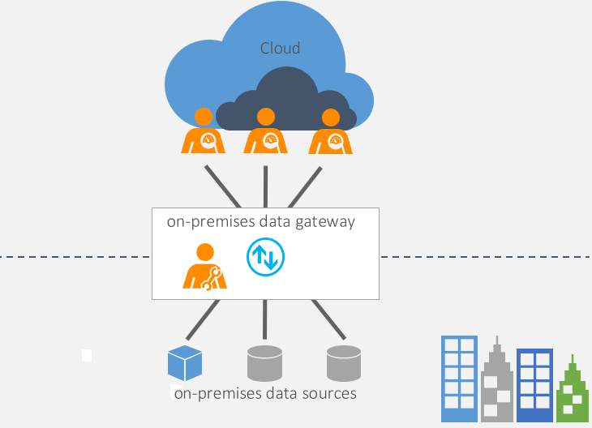
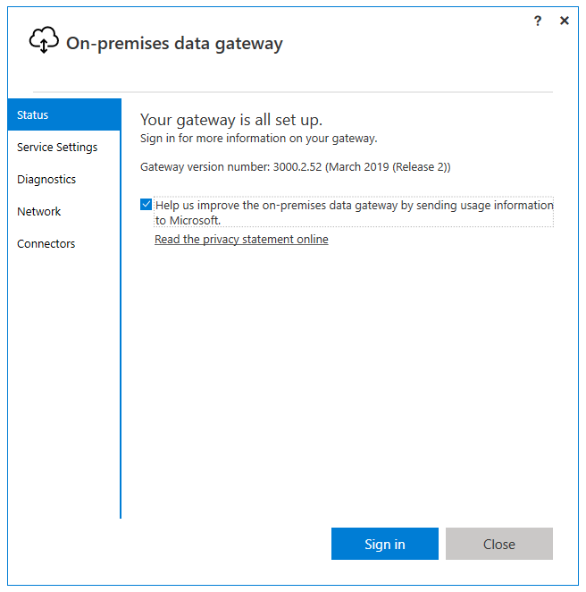

Gateway software acts like a bridge - it allows organizations to retain databases and other data sources on their on-premises networks, and access that on-premises data in cloud services, such as Power BI and Azure Analysis Services.

A gateway facilitates quick and secure behind-the-scenes communication flowing from a user in the cloud to your on-premises data source, and then back again to the cloud.

> [!div class="mx-imgBorder"]
> 

There are two types of on-premises gateway:

-   Organization mode - Allows multiple users to connect to multiple on-premises data sources and is suitable for complex scenarios. The gateway must be installed on the same server as the data source.

-   Personal mode - Allows one user to connect to data sources. This type of gateway can be used only with Power BI and it can't be shared with other users, so it is suitable in situations where you're the only one in your organization who creates reports. You install the gateway on your local computer, which needs to stay online in order for the gateway to work.

## Use on-premises gateway

Before you can connect to your on-premises data source, you need to [install the on-premises data gateway](https://docs.microsoft.com/data-integration/gateway/service-gateway-install/?azure-portal=true), then configure it to suit your organizational needs. This task is usually done by an admin in your organization.

When the on-premises gateway is installed and configured, you can start the gateway and sign in using your Office 365 organization account.

> [!div class="mx-imgBorder"]
> 

When you are working in the cloud and interact with an element that is connected to an on-premises data source, the following actions occur:

-   The cloud service creates a query and the encrypted credentials for the on-premises data source. The query and credentials are sent to the gateway queue for processing.

-   The gateway cloud service analyzes the query and pushes the request to Azure Service Bus.

-   Azure Service Bus sends the pending requests to the gateway.

-   The gateway gets the query, decrypts the credentials, and connects to one or more data sources with those credentials.

-   The gateway sends the query to the data source to be run.

-   The results are sent from the data source back to the gateway and then to the cloud service. The service then uses the results.

> [!div class="mx-imgBorder"]
> 

## Troubleshoot on-premises data gateway

Troubleshooting a gateway is an ever-changing topic. Please looks at these documents for the latest troubleshooting guidance:

-   To learn how to run a network port test, see [Adjust communication settings for the on-premises data gateway](https://docs.microsoft.com/data-integration/gateway/service-gateway-communication#network-ports-test/?azure-portal=true).

-   To get information on how to provide proxy information for your gateway, see [Configure proxy settings for the on-premises data gateway](https://docs.microsoft.com/data-integration/gateway/service-gateway-proxy/?azure-portal=true).

-   To find the current data center region you're in, see [Set the data center region](https://docs.microsoft.com/data-integration/gateway/service-gateway-data-region/?azure-portal=true).
