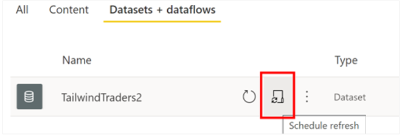
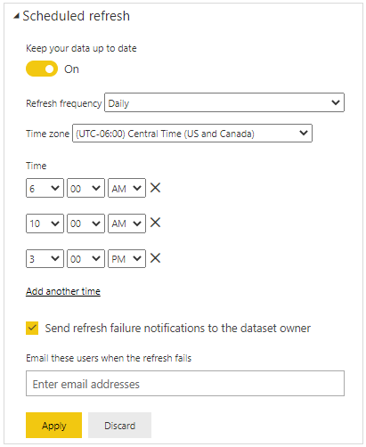
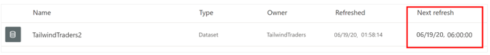
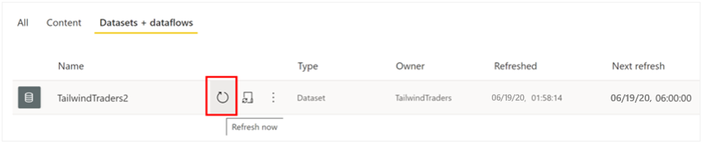
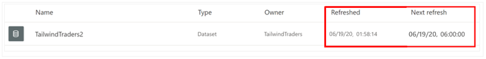
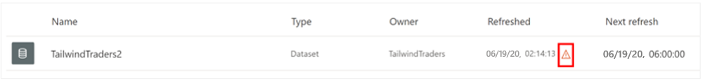
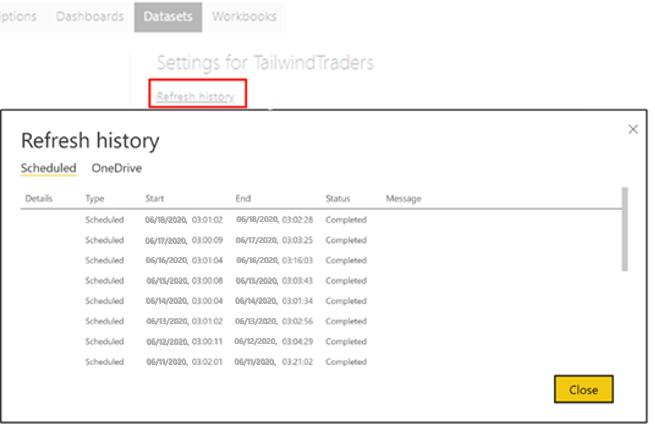

The **Scheduled refresh** feature in Power BI Service allows you to define the frequency and time slots to refresh a particular dataset. Scheduling the refresh of your data will save you time, as you don't have to manually refresh the data. It also ensures that the end users can access the most up-to-date data.

In this example, you are creating a report but you realize that the version of the Sales data you are using isn't the most up to date. You check the refresh status and see that it was last refreshed 10 days ago! And there is no refresh scheduled to take place.

> [!div class="mx-imgBorder"]
> 

Considering how important it is to have accurate sales data, you need to find a solution. The data usually gets updated every week but you don't want to have to come back to the report every week to manually refresh the dataset, and sometimes you forget to do it. You decide to use Power BI's scheduled refresh functionality to solve this problem.

## Set up a refresh schedule

Before you can set up a refresh schedule, you must have created a gateway connection.

To set up a refresh schedule for your dataset, go to the **Datasets + dataflows** page. Hover over the dataset for which you want to set up the schedule then, the select the **Schedule refresh** icon.

> [!div class="mx-imgBorder"]
> 

On the **Settings** page, turn on the scheduled refresh feature. Next, select the refresh frequency, and ensure the correct time zone is selected. You then add the time(s) that you want the refresh to occur. You can configure up to eight daily time slots, if your dataset is on shared capacity, or 48 time slots on Power BI Premium. When you have finished configuring the scheduled refresh, select **Apply**.

> [!NOTE]
> Whilst you can set a time for the refresh, be aware that the refresh might not take place at that exact time. Power BI starts scheduled refreshes on a best effort basis. The target is to initiate the refresh within 15 minutes of the scheduled time slot, but a delay of up to one hour can occur if the service can't allocate the required resources sooner.

In this example, you want the system to refresh the Sales data on a daily basis 6:00 AM, 10:00 AM, and 3:00 PM, as illustrated in the following image.

> [!div class="mx-imgBorder"]
> 
> 

When you have configured a refresh schedule, the dataset settings page informs you of the next refresh time, as you can see in the following image.

> [!div class="mx-imgBorder"]
> 

## Perform an on-demand refresh

In addition to the scheduled refreshes, you can refresh a dataset at any time by performing an on-demand refresh. This type of refresh doesn't affect the next scheduled refresh time.

For example, you might need to refresh now because you need to view the most recent data and cannot wait for the next refresh time, or you might want to test your gateway and data source configuration.

To perform an on-demand refresh, on the **Datasets + dataflows** page, hover over the dataset that you want to refresh, then select the **Refresh now** icon.

> [!div class="mx-imgBorder"]
> 

## Check the refresh status and history

You can check the refresh status and history at any time. This is useful if you want to find out when the last refresh occurred and when the next one is scheduled. It is also good practice to check the status of your datasets from time to time, to see if there have been any refresh errors.

> [!NOTE]
> Power BI deactivates your refresh schedule after four consecutive failures or when the service detects an unrecoverable error that requires a configuration update, such as invalid or expired credentials. It is not possible to change the consecutive failures threshold.

A quick way to check the refresh status is to view the list of datasets in a workspace.

> [!div class="mx-imgBorder"]
> 

If a dataset displays a small warning icon, you'll know that the dataset is currently experiencing an issue. Select the warning icon to get more information.

> [!div class="mx-imgBorder"]
> 

You should also check the refresh history occasionally, to review the success or failure status of past synchronization cycles. To view the refresh history, open the dataset's settings page, then select **Refresh history**.

> [!div class="mx-imgBorder"]
> 

