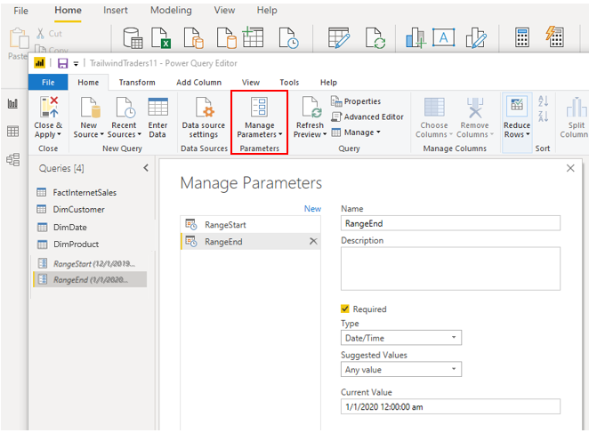
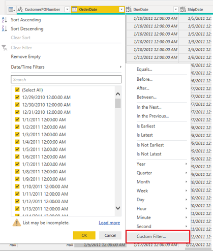
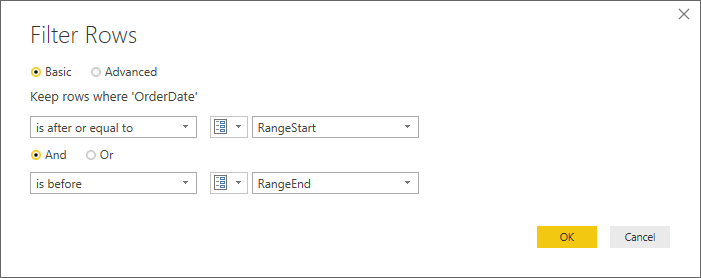
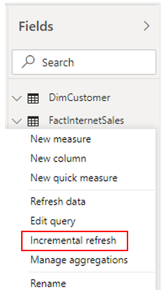
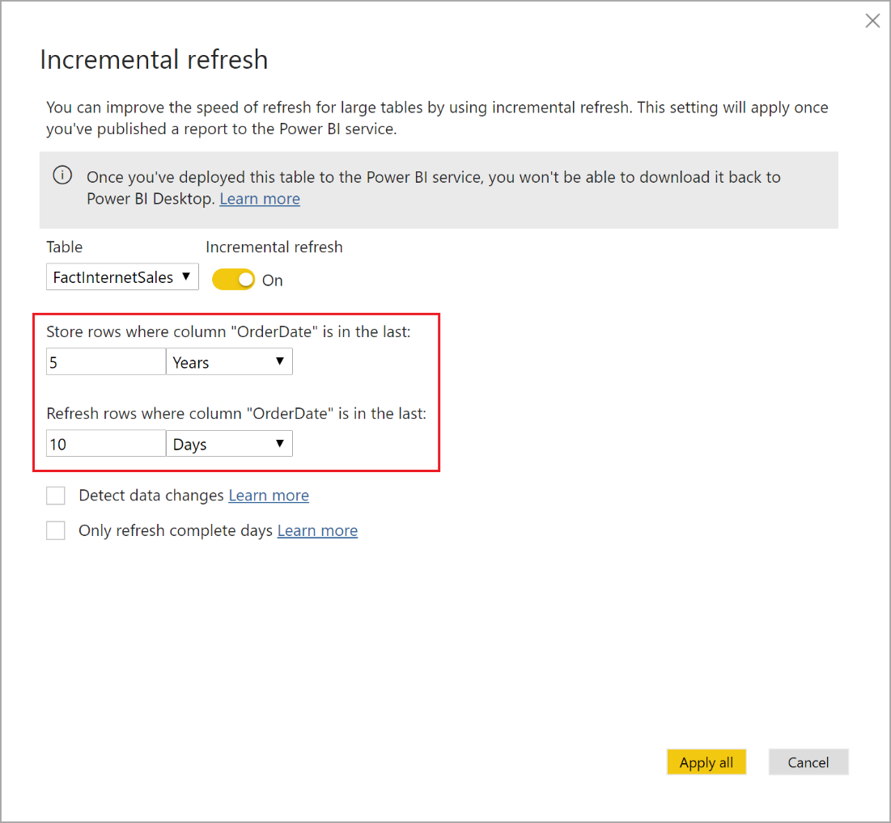

The **Incremental Refresh** feature in Power BI is an extremely popular feature, as it allows you to refresh very large datasets quickly, and as often as needed, without having to reload the historical data each time.

> [!WARNING]
> Incremental Refresh should only be used on data sources and queries that support query folding. If query folding isn't supported, Incremental Refresh could lead to a bad user experience because whilst it will still issue the queries for the relevant partitions, it will pull all of the data, potentially multiple times.

Traditionally, complex code was required for implementing incremental refreshes but you can now easily define a refresh policy within Power BI Desktop. The refresh policy is applied when you publish to the Power BI Service. Power BI Service then does the work of managing partitions for optimized data loads, resulting in the following benefits:

-   Refreshes are faster - Only the data that needs to be changed gets refreshed. For example, if you have 5 years' worth of data, and you only need to refresh the last 10 days because that is the only data that has changed, the incremental refresh will refresh only those 10 days of data. As you can imagine, the time it takes to refresh 10 days of data is much shorter than 5 years of data.

-   Refreshes are more reliable - You no longer need to keep your connections to long-running data connections open to schedule a refresh.

-   Resource consumption is reduced - Because you only need to refresh the smaller the amount of data, the overall consumption of memory and other resources is reduced

In this example, the Sales team has come to you in a bind - the data in their report is already out-of-date. It isn't feasible for you to manually refresh the data by adding a new file, since the refreshes need to happen regularly to match the frequency of the sales transactions occurring. Also, the manual refresh task is becoming more difficult as the datasets have millions of rows. You need to implement a better data refresh solution.

You can define an incremental refresh policy to solve this business problem. This process involves the following steps:

-   Define the filter parameters

-   Use the parameters to apply a filter

-   Define the incremental refresh policy

-   Publish changes to the Power BI Service.

## Define the filter parameters

Whether you are using incremental refresh or not, large datasets are commonly filtered when they are imported into Power BI Desktop, because the PBIX file is limited by the memory resources available on the desktop computer. For incremental refresh, the datasets are filtered by two date/time parameters: **RangeStart** and **RangeEnd**. These parameters have a dual purpose. In Power BI Desktop, they are the filtering window, as they restrict the used data to the range listed in the start and end dates. Once published to the service, they are taken over to be the sliding window for what data to actually pull in.

To define the parameters for the incremental refresh, open your dataset in Power Query Editor, then on the **Home** tab, select **Manage Parameters**. On the **Parameters** window that displays, add two new parameters, **RangeStart** and **RangeEnd**, ensuring that for both parameters, the **Type** is set to **Date/Time**, the **Suggested Value** is set to **Any value**. In regards to the **Current Value**, for the **RangeStart** parameter, enter the date on which you want to begin the import, and for the **RangeEnd** parameter, enter the date on which you want the import to end.

> [!div class="mx-imgBorder"]
> 

## Apply the filter

When you have defined the new parameters, you can apply the filter. Go to the applicable **Date** column, then right-click that column and select **Custom Filter**.

> [!div class="mx-imgBorder"]
> 

In the **Filter Rows** window that displays, to avoid the double counting of rows, ensure you keep rows where OrderDate is after or equal to the **RangeStart** parameter, and before the **RangeEnd** parameter.

> [!div class="mx-imgBorder"]
> 

Select **Close and Apply** from the Power Query Editor and you'll then see a subset of the dataset in Power BI Desktop.

## Define the incremental refresh policy

When you have filtered the data, you can define the incremental refresh policy for the data table, which sets up the refresh process.

Right-click the applicable table, then select **Incremental Refresh**.

> [!div class="mx-imgBorder"]
> 

On the **Incremental refresh** window that displays, turn on the incremental refresh. Then configure the refresh as required. In this example, you define a refresh policy to store data for five full calendar years plus data for the current year up to the current date, and incrementally refresh ten days of data. 

> [!div class="mx-imgBorder"]
> 

The first refresh operation in the Power BI service will load the historical data for the last five years. The subsequent refresh operations are incremental, and they'll refresh the data that was changed in the last ten days up to the current date. The incremental refreshes will also remove calendar years that are older than five years prior to the current date.

## Publish to the Power BI Service

When you have defined the incremental refresh policy in Power BI Desktop, to apply that refresh policy, you need to publish the report to the Power BI Service.

For more information and to learn about the advanced settings, see [Incremental Refresh on Power BI](https://docs.microsoft.com/power-bi/service-premium-incremental-refresh/?azure-portal=true).
