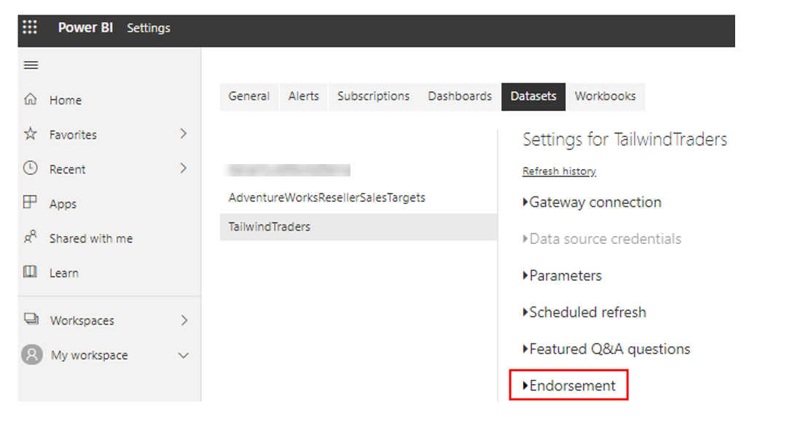
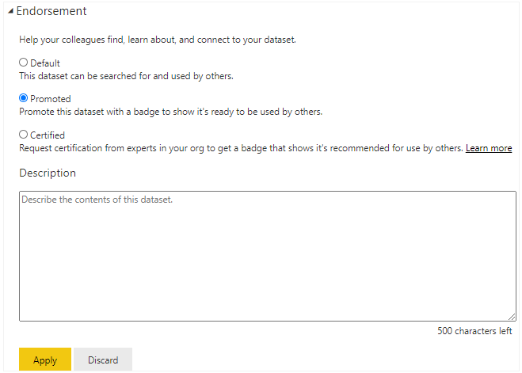
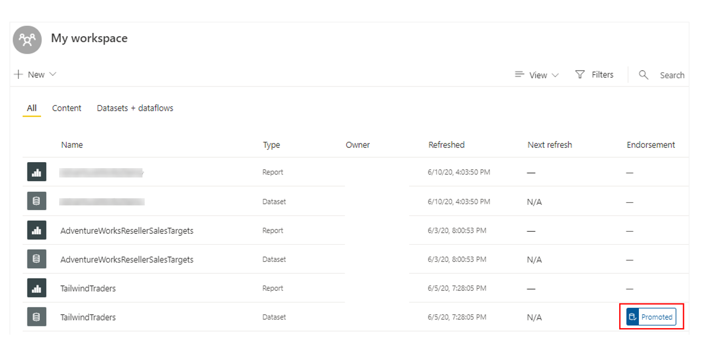
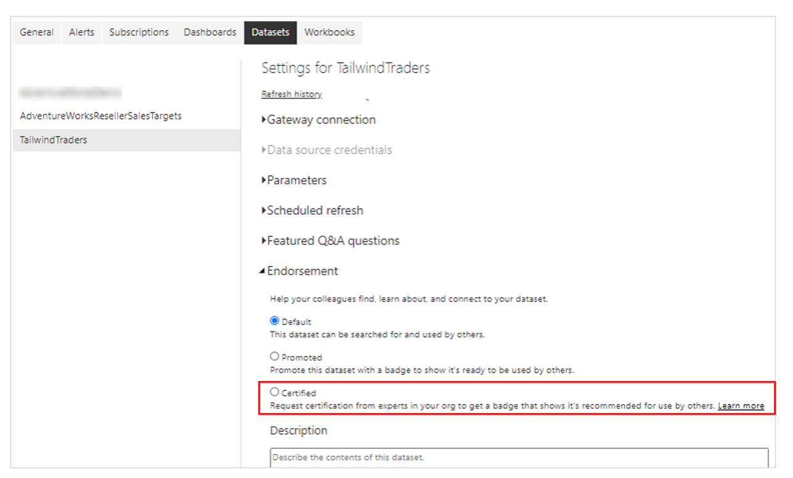
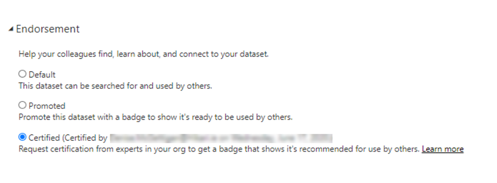

Business intelligence involves collaboration, and sharing datasets across workspaces is a powerful way to collaborate within your organization. However, if your organization has many different datasets that can be accessed by many users, you might want to take measures to manage those datasets. For instance, you might want to direct your users to the most up-to-date and highest quality datasets in your workspaces, or you might want to restrict the reuse of datasets across your workspaces.

To ensure your organization has consistent data for making decisions, and a healthy data culture, it's important to create and share optimized datasets, and then endorse those datasets as the 'one source of truth'. Report creators can then reuse those endorsed datasets to build accurate, standardized reports.

Power BI provides two ways to endorse your datasets:

-   **Promotion** - Promote your datasets when they're ready for wide-spread usage. Any workspace member with Write permissions can promote your datasets.

-   **Certification** - Request certification for a promoted dataset from an admin user that is defined in the Dataset Certification tenant admin setting. This adds an additional layer of security for your datasets. Certification can be a highly selective process, so only the truly reliable and authoritative datasets are used across the organization.

In this example, you and the other teams are using a workspace in Power BI Service to organize all of your reports and dashboards. However, you start getting emails from very confused users, who expected to see a Sales report and are now looking at a Product report. You need to make some changes in order to direct your users to the datasets that they should be accessing, and you can do this with Power BI's endorsing capability.

In this example, the certification type of endorsement is best suited for the Sales team, as this will require users to have special access before they see the Sales dashboards. By implementing the certification, you'll lead your users to the most appropriate reports and dashboards, avoiding the unavoidable confusion that might arise with building and sharing a diversity of reports.

You'll learn how to certify the dataset shortly, but you'll first take a look at how to promote a dataset, in case you prefer to use that method.

## Promote a dataset 

You can only promote a dataset if you are a Power BI admin user, or the owner of that dataset.

To promote a dataset, go to your workspace in Power BI Service, then open the settings page for the dataset that you want to promote. In this example, you want to promote the Tailwind Traders dataset.

Select the **Endorsement** setting.

> [!div class="mx-imgBorder"]
> 

In the **Endorsement** settings, select the **Promoted** option, and then select **Apply**.

> [!div class="mx-imgBorder"]
> 

When you return to your workspace, you'll see a badge in the **Endorsement** column for that dataset, indicating that it is ready for viewing by all of your users.

> [!div class="mx-imgBorder"]
> 

## Certify a dataset 

You can only certify a dataset if you have been listed as a user in the Tenant settings. The certification option will be greyed out for other users.

To certify a dataset, you start the same way as you did to promote the dataset. This time, however, you select the **Certified** option in the **Endorsement** settings.

> [!div class="mx-imgBorder"]
> 

When you apply your change, the **Certified** setting updates to display a message regarding who certified the dataset, and when they did so.

> [!div class="mx-imgBorder"]
> 

For more detailed information on these dataset endorsement options, see [Promote your dataset](https://docs.microsoft.com/power-bi/service-datasets-promote/?azure-portal=true) or [Certify datasets](https://docs.microsoft.com/power-bi/service-datasets-certify/?azure-portal=true).
