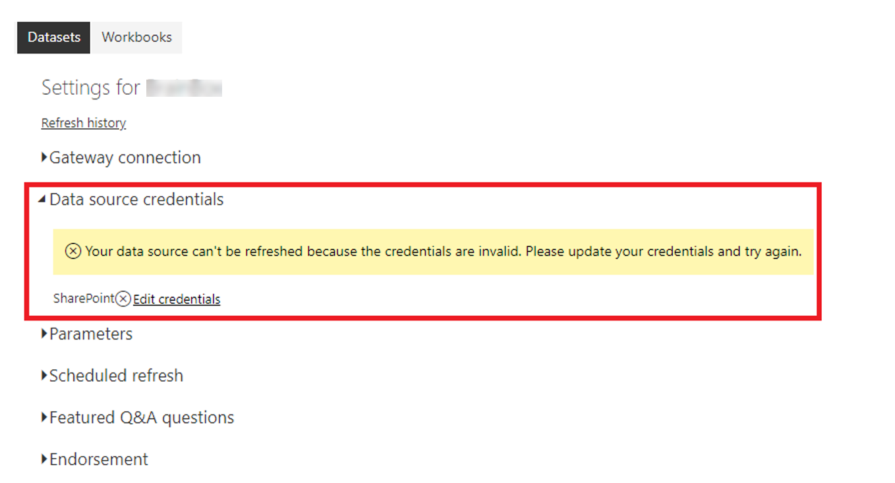

Cloud services like SharePoint Online do not require any gateway, as the data is already in the cloud. You only need to provide your authorization credentials to setup a data source connection.

If your report fails to refresh, ensure that your data source credentials are up to date.

> [!div class="mx-imgBorder"]
> 

If your data source credentials are up to date. You'll need to take further action to investigate and resolve the issue.

For information regarding the different scenarios you might face when refreshing data within the Power BI service, see [Troubleshooting refresh scenarios](https://docs.microsoft.com/power-bi/connect-data/refresh-troubleshooting-refresh-scenarios/?azure-portal=true).