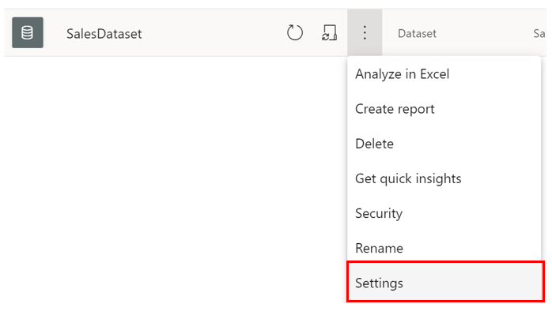

As you begin collaborating with more teams to build reports and dashboards, you notice that some of your datasets are causing the reports to load much more slowly than before, and it is starting to irk your users. The Sales team would like to know how they can improve performance and make these reports much faster.

Power BI's query caching ability can be used to solve this problem. With this feature, you can use Power BI Service's local caching services to process query results. Instead of relying on the dataset itself to calculate queries, which when overloaded can reduce performance, you can use Cloud resources on your Premium capacities on Power BI Service to load your report and thereby, ensure constant performance. 

## Query Caching 

Query caching is a local caching feature that maintains results on a per-user, per-report basis. It is a service only available to users with Power BI Premium or Power BI Embedded.  

When using query caching, the query results are only specific to a user, and you can only use query caching on a specific page of a report. There are several benefits to using query caching:  

-   It improves the performance of reports, dashboards, and dashboard tiles by reducing loading time and increasing query speed; this is especially true for datasets that are not refreshed often and accessed frequently.  

-   It respects bookmarks and default filters, so even if you enable query caching, any bookmarks you have created still exist. 

-   Cached query results are specific to the user. 

-   All security labels are followed.   

-   It reduces the load on your dedicated capacity, since query caching allows for usage of dedicated capacity and NOT on the dataset itself.  

To access and configure query caching, go to a dataset in your workspace and open its **Settings** page. In this example, you enable query caching for **SalesDataset**.  

> [!div class="mx-imgBorder"]
> 

Select the **Datasets** tab, and expand the **Query Caching** options, as seen in the following image.  

> [!div class="mx-imgBorder"]
> 

Here, you can choose from several options. The default enables query caching off, but you can also choose **Off**, which turns off query caching for the specific dataset in question, and **On**, which turns on query caching for this specific dataset only.  

In this case, you select **On**f or your dataset, as you want to apply query caching to your specific dataset.  

> [!NOTE]
> Going from **On** to **Off** will clear all previous saved query results. When turning off query caching (either through the default or **Off** option), there will be a small delay in query loading, as the report queries are running against the dataset and it does not have saved queries to fall back on.

> [!WARNING]
> If many datasets have query caching enabled, and a refresh occurs, there may be a reduction in performance, as there are a large number of queries being processed at once.  

For more information, see [[Query Caching in Power BI]{.underline}](https://docs.microsoft.com/power-bi/connect-data/power-bi-query-caching/?azure-portal=true).

