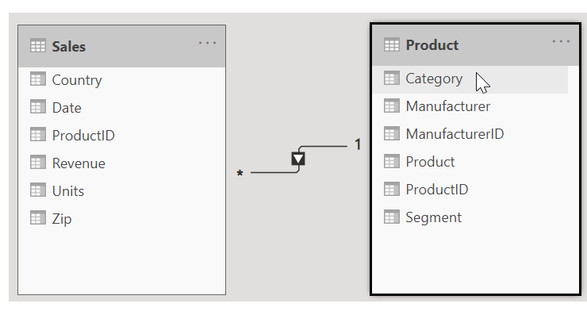
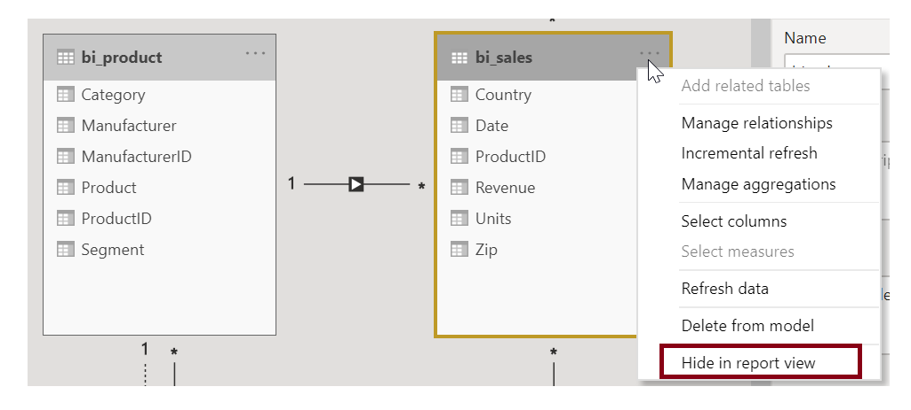
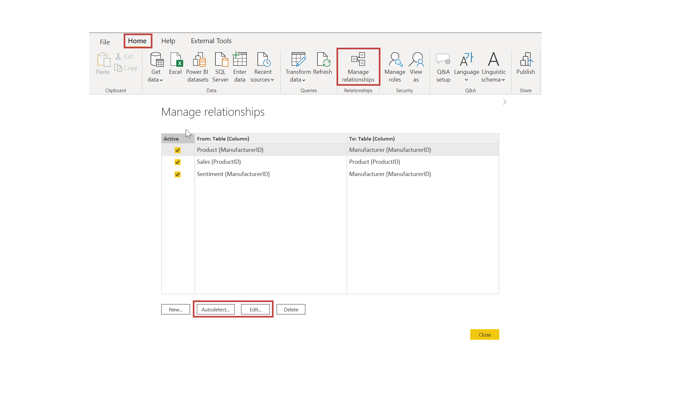

The **Model view** in Power BI Desktop allows you to visually set the relationship between tables or elements. A relationship is where two or more tables are linked together because they contain related data. This enables users to run queries for related data across multiple tables.Use the Model view to see a diagrammatic view of your data.

Tasks in this unit include:

**Video**: Manage data relationships
> [!VIDEO https://www.microsoft.com/videoplayer/embed/RE3wRhg]

> [!NOTE]
> To follow along with the examples in the videos and on this page, download the sample Access database <a href="https://go.microsoft.com/fwlink/?linkid=2120368" target="_blank">**here**</a> and import into Power BI Desktop (**Get Data > Database > Access database**). If you have any issues loading the Access database, please read this <a href="https://go.microsoft.com/fwlink/?linkid=2131277" target="_blank">**article**</a>.

In the Model view, notice that a block represents each table and its columns and that lines between them represent relationships.

Adding and removing relationships is straightforward. To remove a relationship, right-click the relationship and select **Delete**. To create a relationship, drag and drop the fields that you want to link between tables.

To hide a table or individual column from your report, right-click the table or column in the Model view and select **Hide in report view**.

For a more detailed view of your data relationships, on the **Home** tab, select **Manage Relationships**. The **Manage Relationships** dialog box displays your relationships as a list instead of as a visual diagram. From the dialog box, you can select **Autodetect** to find relationships in new or updated data. Select **Edit** to manually edit your relationships. You'll find advanced options in the Edit section to set the *Cardinality* and *Cross-filter* direction of your relationships.

Your options for Cardinality are explained in the following table.

| Cardinality options     |  Example                                 |
|-------------------    |------    |-----------------------------------    |
| *Many to One*     | The most common default relationship. The column in one table can have more than one instance of a value. The related table (or lookup table) has only one instance of a value.    |
| *One to One*     | The column in one table has only one instance of a particular value, and the other related table has only one instance of a particular value.     |

By default, you will set relationships to cross-filter in both directions. Cross-filtering in just one direction limits some of the modeling capabilities in a relationship.

Setting accurate relationships between your data allows you to create complex calculations across multiple data elements.

For more information, see: [Create and manage relationships in Power BI Desktop](https://docs.microsoft.com/power-bi/desktop-create-and-manage-relationships/?azure-portal=true).
