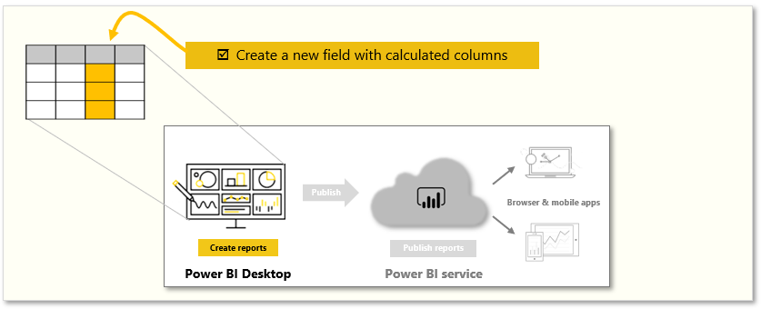
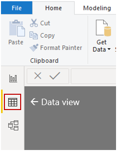
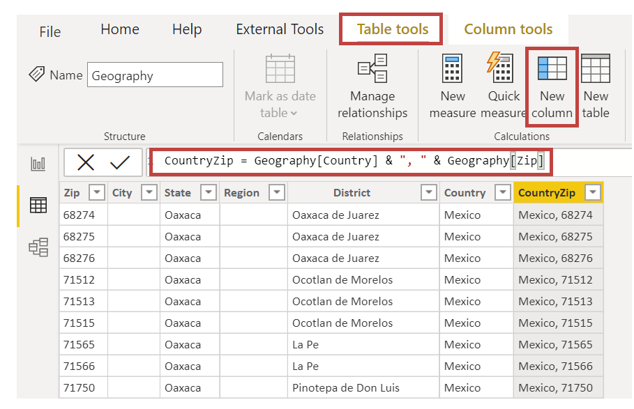
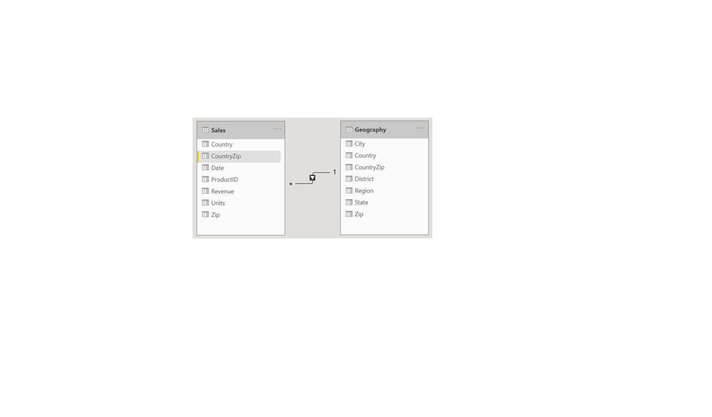

Sometimes, the data that you're analyzing doesn't contain a field that you need. The answer might be *calculated columns*. You can create a new calculated column by transforming two or more elements of existing data. For example, you can create a new column by combining two columns into one.

Tasks in this unit include:

**Video**: Create calculated columns
> [!VIDEO https://www.microsoft.com/videoplayer/embed/RE3x9v5]

> [!NOTE]
> To follow along with the examples in the videos and on this page, download the sample Access database <a href="https://go.microsoft.com/fwlink/?linkid=2120368" target="_blank">**here**</a> and import into Power BI Desktop (**Get Data > Database > Access database**). If you have any issues loading the Access database, please read this <a href="https://go.microsoft.com/fwlink/?linkid=2131277" target="_blank">**article**</a>.

One reason for creating a calculated column is to establish a relationship between tables when no unique fields exist. The lack of a relationship becomes obvious when you create a simple table visual in Power BI Desktop and get the same value for all entries.

For example, to create a relationship with unique fields in data, you can create a new calculated column for "CountryZip" by combining the values from the Country and the Zip columns.

To create a calculated column, select the **Data view** in Power BI Desktop from the left side of the report canvas.

From the **Modeling** tab, select **New Column** to enable the formula bar. You can enter calculations by using Data Analysis Expressions (DAX) language. DAX is a powerful formula language, also found in Excel, that lets you build robust calculations. As you type a formula, Power BI Desktop displays matching formulas or data elements to assist and accelerate the creation of your formula.

The Power BI formula bar will suggest specific DAX functions and related data columns as you enter your expression.

After you have created the calculated columns in each table, they can be used as a unique key to establish a relationship between them. By going to the **Relationship** view, you can then drag the field from one table to the other to create the relationship.

When you return to the **Report** view, notice that a different value for each district shows.

For more information on calculated columns, including the use of `IF` statements, see [Tutorial: Create calculated columns in Power BI Desktop](https://docs.microsoft.com/power-bi/desktop-tutorial-create-calculated-columns/?azure-portal=true).
