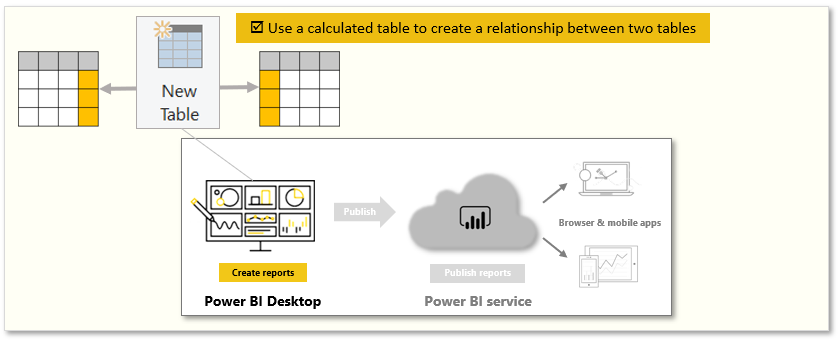
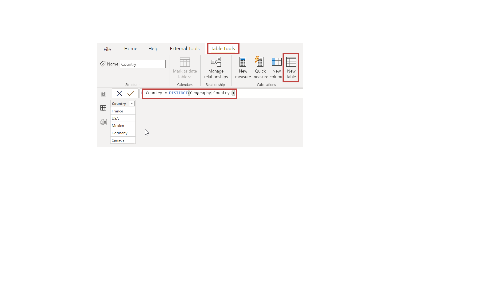

Calculated tables is a function within DAX. Most of the time, you can import data into your model from an external data source. However, calculated tables provide intermediate calculations and data that you want stored as part of the model rather than as part of a query. You can use calculated tables, for example, to cross join two tables.

Tasks in this unit include:

**Video**: Create calculated tables
> [!VIDEO https://www.microsoft.com/videoplayer/embed/RE3x9vn]

> [!NOTE]
> To follow along with the examples in the videos and on this page, download the sample Access database <a href="https://go.microsoft.com/fwlink/?linkid=2120368" target="_blank">**here**</a> and import into Power BI Desktop (**Get Data > Excel**).

To create a calculated table, go to **Data view** in Power BI Desktop, which you can activate from the left side of the report canvas. Select **New Table** from the **Modeling** tab to open the formula bar.

Type the name of your new table, the equal sign, and the calculation that you want to use to form the table. Your new table will appear on the Fields pane in your model.

After the new table has been created, you can use your calculated table as you would any other table in relationships, formulas, and reports.

For more information, see: [Using calculated tables in Power BI Desktop](https://docs.microsoft.com/power-bi/desktop-calculated-tables/?azure-portal=true).
