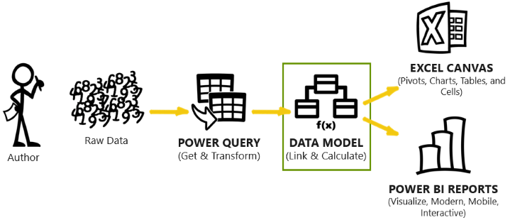

As the original author (or citizen developer) of a Microsoft Modern Analytics solution, you have identified the data sources for your business intelligence reporting needs and connected those disparate data sources from your various lines of business systems by using Power Query. The next and most critical step is to create a data model. A data model is a series of tables that are linked together with relationships between them, along with a series of calculations and metrics that are based on those tables and relationships.

&nbsp;
> [!VIDEO https://www.microsoft.com/videoplayer/embed/RWKC9g]

> [!div class="mx-imgBorder"]
> 

To illustrate the concept of a data model, the following example introduces **SureWi**, a fictitious company that represents the most trusted name in commercial wireless networks. If you're familiar with the fictitious **Contoso** or **Adventure Works** example data sources from Microsoft, then you can consider **SureWi** as being similar.

> [!div class="mx-imgBorder"]
> 

SureWi, the commercial wireless LAN company, accumulates operational data in a Microsoft Azure SQL database. The business needs to explore and discover deeper insights from their data sources, which include customers, quotes, contacts, and installations. They want to ask business questions, such as:

- How many net new customers did we have this month? What about by quarter or by year?

- How long does it take to convert a quoted customer to a contract? What is the average travel time, in days, from contact to installation? Are our resources meeting the demand and our SLAs?

- What are the penetration and win rates by region or district? What about by product or customer size?

The company can answer these business questions, and many more, by using a data model. Power Query connects to the data sources, transforms the data into tables, and then loads these tables for use in the data model.

> [!div class="mx-imgBorder"]
> 

Using the SureWi example, customers have quotes, contracts, and installations. Each component represents a table of data that can be linked together to answer the business questions and to perform analysis. This concept is referred to as a data model, where data is *crunched* into meaningful and insightful metrics.

While you can use Power Query and build data models in Excel, it is a best practice to use Power BI Desktop to design your data model. You can analyze data models that are built in Power BI Desktop and published to Power BI service by using Power BI and Excel while using additional features that aren't available when you're designing a data model in Excel.

The choice to use Power BI or Excel for reporting or analyzing depends on your use case and goals. Excel is proficient at improvised data exploration and integration of a data model, such as through quick, customizable pivot tables and improvised formulas and functions. Power BI reports offer a modern, interactive, and controlled data visualization experience.

A data model that is built in Power BI Desktop and published to Power BI service allows you to use either Excel or Power BI, depending on your needs.
