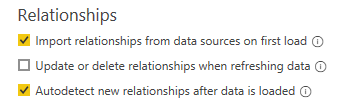
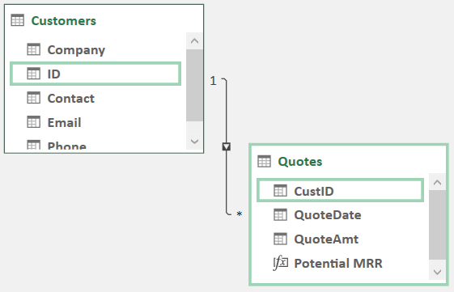
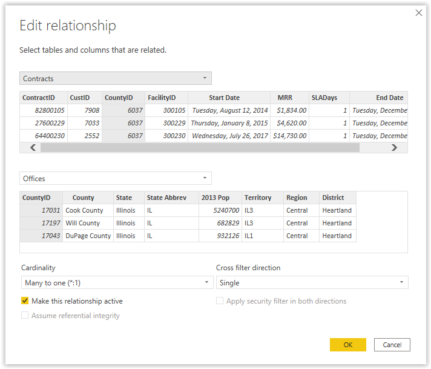

In traditional Excel reporting, users generally bring different fields from multiple tables into a primary table by using VLOOKUP(), HLOOKUP(), or INDEX/MATCH() functions. Additionally, they will supplement these lookups with conditional computations, such as SUMIFS(), AVERAGEIFS(), and SUBTOTAL(), among others.

A data model eliminates the need for multiple lookups through the implementation of relationships among tables. Relationships allow modern analysts to quickly perform analysis over multiple tables and across much larger volumes of data.

## Relationship settings

Prior to making connections or importing data, make sure that you verify current settings for your report. This verification can potentially save you time during setup or help you avoid more work to remove inaccurate autodetected relationships.

Go to **File > Options and Settings > Options > [Current File] Data Load > Relationships**.

> [!div class="mx-imgBorder"]
> 

If the **Autodetect new relationships** checkbox is selected, Power BI will attempt to identify and create relationships between tables after loading tables into your model from Power Query. This process is based on similarities between table and column names, but it's imperfect.

## Relationship introduction

You can display a relationship by using a line connecting the two tables. When you hover over the line, the two corresponding fields that the relationship is built on will be outlined. The following example shows that the **CustID** field from the Quotes table aligns with the **ID** field from the Customers table.

> [!div class="mx-imgBorder"]
> 

Indicators along the line help a viewer understand *cardinality*, *cross filter direction*, and whether the relationship is *active* (solid line) or *inactive* (dotted line). This concept will be discussed in more detail later.

Creating these relationships is quick and simple, with many different methods that have different levels of detail or simplicity.

The simplest way to create a relationship is to go to the **Data Model** or **Diagram** view and then drag a field from one table to a field on another table. The data model will interpret the relationship between the two fields, and if it's reasonably apparent, the relationship will display.

Another more detailed approach to creating relationships is through the **Manage Relationships** window. You can access this window in Power BI on the **Home** tab while in the **Model** view or in Excel on the **Data** tab through the **Relationships** button.

The initial view when you select one of these buttons is a summary of all relationships in the data model.

> [!div class="mx-imgBorder"]
> 

> [!NOTE]
> The **Relationships** window in Excel contains the same information, along with the same options, such as the **Autodetect** feature.

From the **Manage relationships** window, you can choose to **Edit** an existing relationship or create a **New** relationship. Both selections will take you to the same Relationship definition wizard.

To define the relationship in this manner, you'll select the two tables from the dropdown lists and then highlight the corresponding columns/fields to link in the relationship. The wizard will automatically determine cardinality and cross filter direction of the relationship. It also gives you the option to make the relationship active.

> [!div class="mx-imgBorder"]
> 

> [!NOTE]
> You can use multiple columns to define a relationship by holding the **Ctrl** key and selecting the fields. A numerical value will display next to each icon to show how they align with each other.

Cardinality and cross-filter direction are complex settings that have ramifications across your data model in terms of performance, functionality, and ease of use.

## Cardinality

The **Cardinality** setting reflects the directionality of the data and how the tables relate to each other. This relationship can be one-to-many (1 to \*), one-to-one (1 to 1), or many-to-many (\* to \*). These definitions describe how many values of one type might be found in each table.

## One-to-many

In a one-to-many relationship, a unique value in one table will be found many times in the other table. This relationship is most commonly used within data models. An example would be a product table with multiple properties that are related to each product that is tied to a sales table that has multiple records for each product.

## One-to-one

In a one-to-one relationship, a value will have one unique entry in both tables. One-to-one relationships are uncommon, and an author will generally merge one-to-one relationships into a single table for use in a data model.

## Many-to-many

In a many-to-many relationship, a unique value that is taken from the matching column will have multiple entries in both tables. Many-to-many relationships require careful consideration and advanced techniques for appropriate management. When starting out with Power BI, you should avoid many-to-many relationships because they can occasionally produce undesired results regarding measures.

## Cross filter direction

The **Cross filter** setting tells the data model how filters propagate between two tables. In the **Model** view, the arrow(s) in the middle of the line represent the cross filter direction.

## Active and inactive

Periodically, you might want to set up multiple relationships between tables (for example, **Order date** and **Ship date** fields from a sales table and the **Date** field from a calendar table). You are only allowed one active relationship between two tables at a time, but you can set up inactive relationships for use in more advanced Data Analysis Expressions (DAX) measures.
