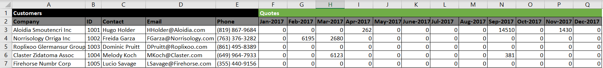
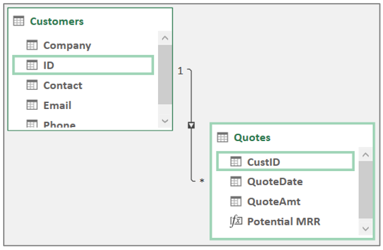
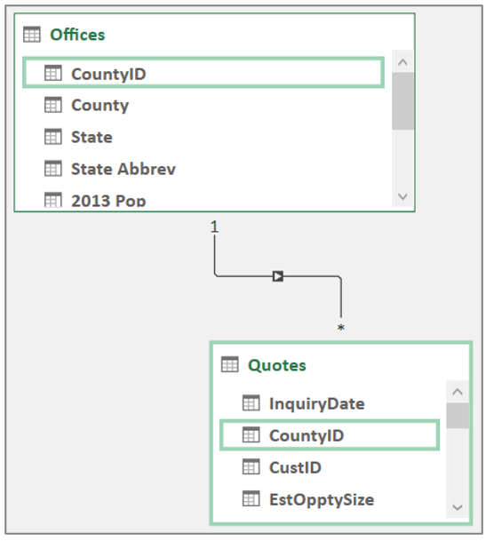

For most Excel users, the idea of creating a data model is a new concept. Where working in Excel often involves creating one large table for use with Excel PivotTables and PivotCharts, with Power Query, a modern analyst can create a data model with separate lookup tables, data tables, and relationships.

Previously, in traditional Excel, you would flatten data into one, large table with the VLOOKUP(), INDEX(), or MATCH() functions to create PivotTables and PivotCharts.

> [!div class="mx-imgBorder"]
> 

Now, you can use Power Query to load data tables, creating a data model with relationships.

> [!div class="mx-imgBorder"]
> 

Whenever you add a new data source to a data model, you need to determine the purpose that the data will serve in your data model, whether it will be a lookup table or a data table.

## Lookup tables

Lookup tables will include qualitative ways to categorize the quantitative data. You can use them to provide descriptions for rows and columns of PivotTables, PivotCharts, and visualizations.

An example of a lookup table would be a table called. Offices that include the corresponding county, state, and country information for each city.

> [!div class="mx-imgBorder"]
> 

One important rule to follow for lookup tables is that they must contain a unique column that is used to match to other tables to create relationships.

General guidelines that you should follow when using lookup tables:

- Include mostly text.

- Provide descriptive information, such as name, address, country, city, and state.

- Update information less frequently.

If the data will be used for creating labels in the rows and/or columns of a PivotTable, then it's likely considered a lookup table.

## Data tables

Data tables will include the quantitative data that is related to information like sales amount, quantity, and quote amount*.* Data tables need to have a column that matches to the lookup table for the relationship to work.

An example of a data table would be a table that includes all quotes for customers or offices. These tables should be long and narrow with as much qualitative information relegated to lookup tables as possible.

The relationship allows a user to perform math on the data table (Count, Sum, MIN, MAX) while also giving them the ability to split the answer into further categories by using the  details that are included in the lookup table.

General guidelines that you should follow when using data tables:

- Include mostly dates and numbers.

- Use them to do math (SUM, AVERAGE, MIN, MAX).

- Update information more frequently, such as new sales or quotes that are created each hour, day, or week.

- Use the data for aggregations or the values of a PivotTable, PivotChart, or other visualization.
