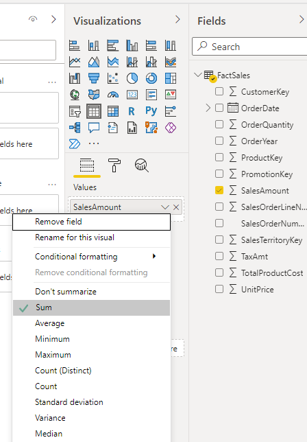
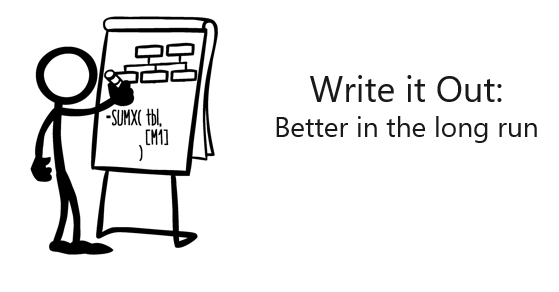

Initially, Excel limited users to only a few standard aggregations or calculations with PivotTables, including Sum, Count, Average, Min, Max, Product, Count, StdDev, StdDevp, Var, and Varp. When you use a data model, then DISTINCTCOUNT() becomes available as well.

Furthermore, when you use the DAX language, you'll have numerous functions available, which will allow you to calculate whatever you want. Instantly, all limitations and barriers that you previously encountered in your analysis will be removed.

Measures calculate a result from an expression formula. When you create your own measures, you'll use the DAX formula language, which is similar to Excel formulas. DAX also has many of the same functions as Excel.

You can create two types of measures: implicit and explicit.

## Implicit measures

Implicit measures are helpful for beginners who need a straightforward way to get started. With this method, you only need to drag a field from a table and then drop it where you want it.

> [!div class="mx-imgBorder"]
> 

Implicit measures use a column from a data table (for example, Sales Amount) by dragging the field into a visual in Power BI. These measures are helpful when you're first starting in Power BI and they allow you to calculate Sum, Count, Average, Min, Max, and DistinctCount. When a field is in the values section, select the dropdown list to determine which summarization calculation that you want to perform on the field. These types of measures work for basic tables and summaries but are limited compared to explicit measures.

> [!div class="mx-imgBorder"]
> 

## Explicit measures

Explicit measures require you to use the DAX formula language to explicitly write out the expression. These measures are better over an extended time and will allow you to create custom analytical metrics like Profit Margin YTD. Writing DAX measures becomes easier over time as you gain experience.

> [!div class="mx-imgBorder"]
> 

You can create explicit measures by writing a formula in the editor. These measures offer the most flexibility and give you the power to use all capabilities of DAX.
