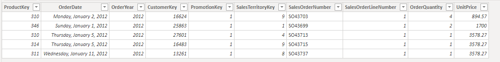
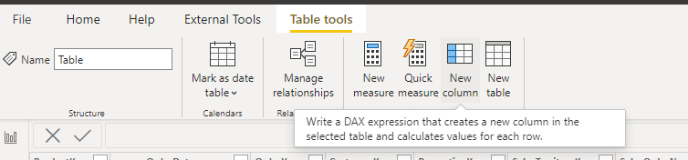

Calculated columns are new fields that are added to tables in the data model by using DAX. You can use these columns for implicit or explicit measures or as additional filter fields. An example of a calculated field would a transaction table, as shown in the following screenshot.

> [!div class="mx-imgBorder"]
> 

The order quantity and unit price are available, but the sales amount isn't included. You can use the **New Column** button to start a calculated column to get to the sales amount.

> [!div class="mx-imgBorder"]
> 

When you select **New Column**, the formula bar will open, where you can type a DAX formula to calculate the result that you want (an example of DAX is shown in the following image).

> [!div class="mx-imgBorder"]
> 

In most cases, you can replicate the information that calculated columns provide by using a measure. Additionally, you can add columns to tables in the model within Power Query. These computed columns are more efficient than calculated columns.
