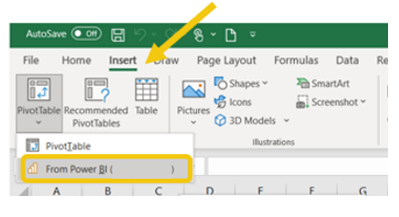
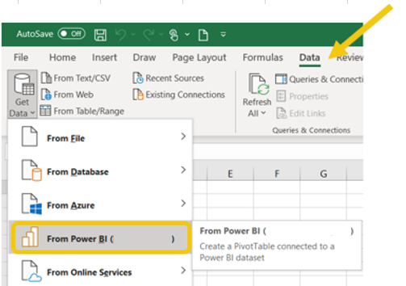
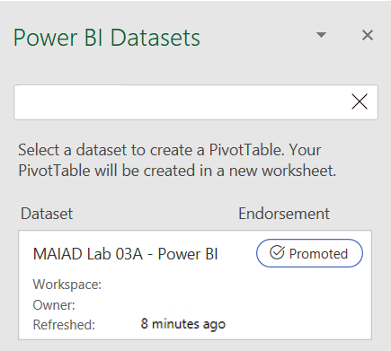

Multiple ways are available for you to choose from when setting up a connection to Power BI datasets within Excel. The first two methods are geared more toward users who are not involved in the creation of the dataset. Additionally, these methods are more likely to be used after the dataset has been fully developed and deployed to production.

## Option 1: Insert PivotTable

- In the **Insert** tab, select **PivotTable** > **From Power BI (xxxx\*)**.

> [!div class="mx-imgBorder"]
> 

## Option 2: Get data connection

- In the **Data** tab, select **Get Data** > **From Power BI** **(xxxx\*)**.

> [!div class="mx-imgBorder"]
> 

\*xxxx = Your organization's name

> [!NOTE]
> If the **From Power BI** button is not an option, be sure to install the most recent updates for Microsoft Office. If your system is fully updated, you might need to check with a Power BI admin to verify that the tenant settings and the certification setting for the datasets are enabled for users to connect in Excel.

The **Power BI Datasets** pane will appear on the right side of the screen, listing the possible datasets that you can connect to. Select the dataset that you want to connect to.

> [!div class="mx-imgBorder"]
> 

After you have selected the dataset that you want to use, a field list will appear that includes all possible fields from all tables that are included in the dataset, including the measures. This connection allows you to create PivotTables based off any field from the dataset. Use the same drag-and-drop process with the fields to create the desired format for your PivotTables.

After you have developed your PivotTable, this Excel file can be saved to OneDrive, OneDrive for Business, or SharePoint Online, which will allow you to consume, share, and collaborate in Microsoft Power BI service.

Power BI service includes two ways to help you keep Excel data updated:

-   Directly in the browser

-   In Power BI service

## Update directly in the browser

You can refresh the connected PivotTable by pasting the link to the workbook in your web browser. The link can be copied by using the **Share** button in the workbook or by going to **File** > **Info** > **Copy**. You can interact with the connected PivotTable in Excel for the web by dragging fields into the PivotTable area, all while keeping the data connected to the dataset. Make sure that you close any version of the workbook that is open in Excel desktop prior to changing the workbook in Excel for the web.

## Update in Power BI service

With the embedded Excel for the web view, you can interact with workbooks directly in a Power BI workspace. Also, you can work with connected PivotTables in a Power BI app by adding a published workbook to the app. 

> [!NOTE]
> If you get a **Query and Refresh** dialog message after opening a workbook with connected PivotTables, select **Yes** to continue because the Power BI dataset connection is already trusted. 
