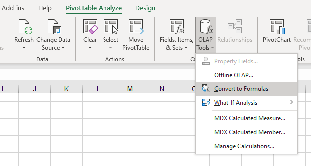

A PivotTable is one option that you can choose when connecting to a dataset in Excel. However, you might occasionally want the flexibility of the grid in Excel. Cube formulas allow you to still use the dataset while also not being limited to the contiguous range of a PivotTable.

## Activate cube formulas

After adding a PivotTable to the sheet, go to the **PivotTable Analyze** tab. Select the **OLAP Tools** dropdown list. Select **Convert to Formulas**.

> [!div class="mx-imgBorder"]
> 

Your PivotTable formatting has been removed and replaced with cells that contain formulas that retrieve the same data. Cube formulas have the following syntax:

-   Row/Column Headers
    
	CUBEMEMBER(“Dataset Name”,”TableName.FieldName.&Field Value”)

-   Values
    
    CUBEVALUE(“Dataset Name”, Row Header Cell Reference, Column Header Cell Reference, Slicer_FieldName)

Cube formulas add formatting flexibility, where you can:

-   Add blank rows or columns to space out the data.

-   Reference cells with cube formulas in other formulas without errors after a refresh (such as custom subtotals).

-   Complete unlimited cell formatting by individual cell or cells that are not dependent on PivotTable style.