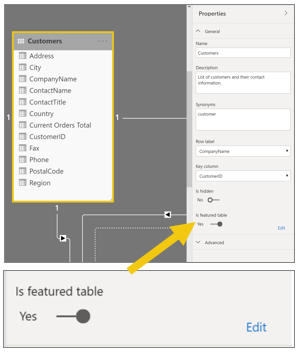
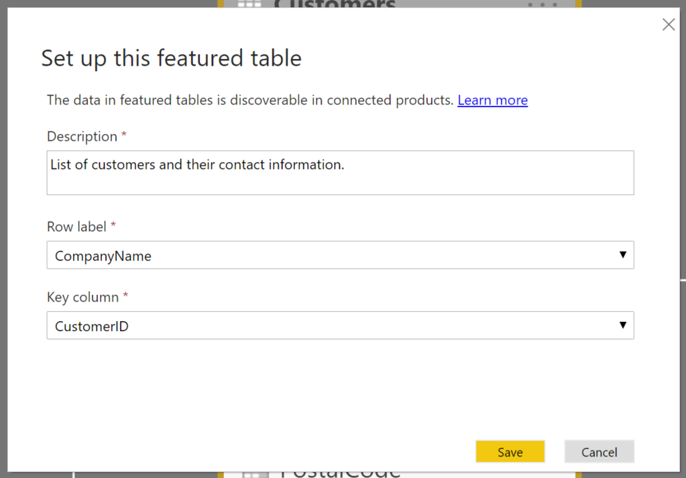
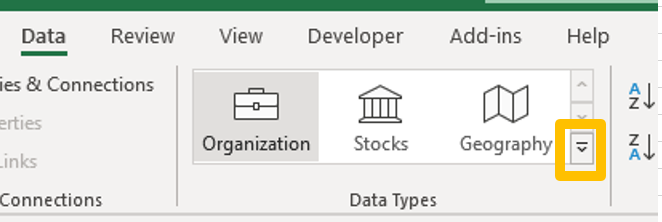
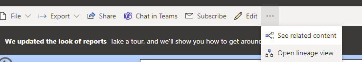
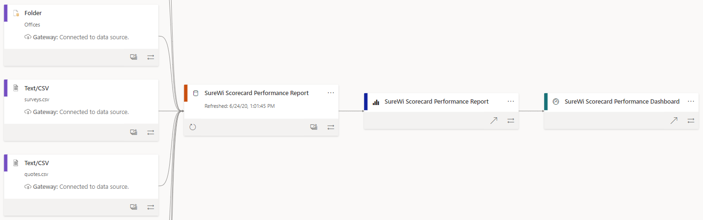

Power BI offers you the ability to highlight which tables from the dataset should be featured connection options within Excel. In the **Model View** of Power BI, you can select one of your tables and then review the **Properties** pane. Tables include a toggle setting that you can enable to make it a featured table. You will need to update the key column section to be a column with unique values and add more details for the user to learn about the contents of the table.

> [!div class="mx-imgBorder"]
> 

> [!div class="mx-imgBorder"]
> 

After updating all featured tables that you want included, save and publish the report to Power BI service.

## Featured tables - end user

The Power BI report author can highlight specific tables from the dataset, and the end user can pull data from these tables directly. You can locate these tables by going to the **Data** tab and selecting the **Data Types** section.

> [!div class="mx-imgBorder"]
> 

## Lineage

Anyone who has access to the workspace is able to view the lineage of the dataset. If you select the ellipsis (**...**) at the end of the toolbar of a Power BI report, you can change to the lineage view.

> [!div class="mx-imgBorder"]
> 

> [!div class="mx-imgBorder"]
> 

This visual is an excellent way to show how dataflows, datasets, reports, and dashboards are flowing together within a workspace. Additionally, each report has more available options, such as **Analyze in Excel** or **View Usage Metrics**.
