## Overview

The estimated time to complete this exercise is 30 minutes.

In this exercise, you will complete the following tasks:

1.  Publish a Power BI Desktop Dataset & Report to the Power BI service
1.  Download, Install, and Use Analyze in Excel
1.  Build an Excel Report using a Power BI Dataset

> [!NOTE]
> This exercise has been created based on the sales activities of the *fictitious* Wi-Fi company called SureWi which has been provided by [P3 Adaptive](https://p3adaptive.com/). The data is property of P3 Adaptive and has been shared with the purpose of demonstrating Excel and Power BI functionality with industry sample data. Any use of this data must include this attribution to P3 Adaptive. If you have not already, download and extract the lab files from https://aka.ms/modern-analytics-labs into your **C:\ANALYST-LABS** folder. 

## Exercise 1: Publish a Power BI Desktop Dataset & Report to the Power BI service

In this exercise, you will use Power BI Desktop to publish your Dataset and Report to My workspace in the Power BI service.

### Task 1: Launch Power BI Desktop

In this task, you will launch Power BI Desktop and open a PBIX file.

1.  Launch Power BI Desktop.
1.  If applicable, use the "x" in the upper right-hand corner to close the Welcome window.

### Task 2: Open the PBIX file

In this task, you will navigate and open the starting PBIX file with the Dataset and Report created from Lab 02.

1.  Select **File** > **Open report** > **Browse reports**.

	> [!div class="mx-imgBorder"]
	> 

1.  Navigate to the **C:\ANALYST-LABS\Lab 03A**  folder.
1.  Select the file **MAIAD Lab 03A - Power BI Model.pbix** and choose **Open**.

### Task 3: Publish the PBIX file to the Service

In this task, you will publish the Dataset and Report from the Power BI Desktop file to the Power BI service.

1.  First, you will need to sign in to Power BI. Click on **Sign in** located in the upper right-hand corner of Power BI Desktop.

	> [!div class="mx-imgBorder"]
	> 

1.  Next, you will need to enter your Power BI **username** and **password**. Once signed in, you will notice the Sign-in changes to become your name.

	> [!div class="mx-imgBorder"]
	> [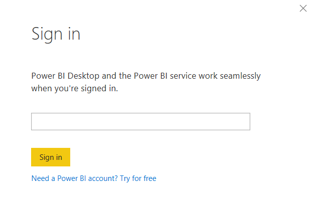](../media/sign-in-window.png#lightbox)

1.  From the **Home** tab in the main menu, select the **Publish** button.

	> [!div class="mx-imgBorder"]
	> [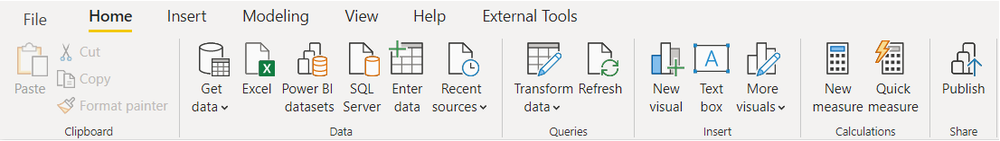](../media/home-tab.png#lightbox)

1.  Select My workspace.

	> [!div class="mx-imgBorder"]
	> [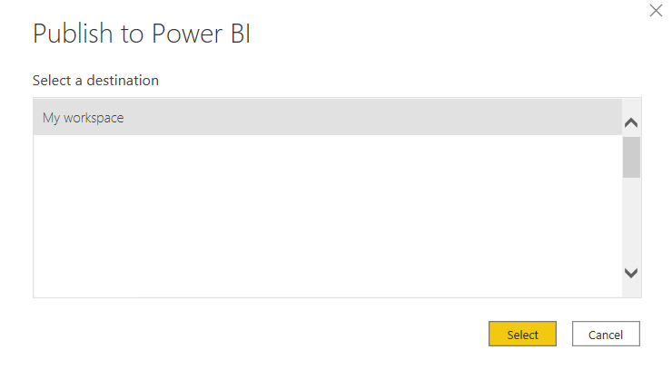](../media/workspace.png#lightbox)

1. Choose the Select button to publish the data model and report page to the Power BI service.

	> [!NOTE]
	> All users have My workspace in Power BI service. This is your *personal* sandbox. Every organization has different Workspaces. Workspaces can be created, and users can be added to Workspaces to share Datasets and Reports across the organization.

1. Once the publish is successful, you will see the **Success!** message with a link that you can click to open the report in the Power BI service.

1. Click on the Open **MAIAD Lab 03A - Power BI Model.pbix** in Power BI link.

	> [!div class="mx-imgBorder"]
	> [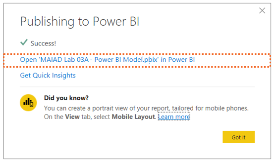](../media/success.png#lightbox)

    After clicking on the link, you will be navigated to your browser where you will see your report published to Power BI service in your My workspace location.

	> [!NOTE]
	> To navigate directly to Power BI service enter the URL: [https://app.powerbi.com](https://app.powerbi.com/groups/me/reports/0a9c5249-218c-41d0-b48f-9d66c93f5e52/ReportSection) in your browser.

	> [!div class="mx-imgBorder"]
	> [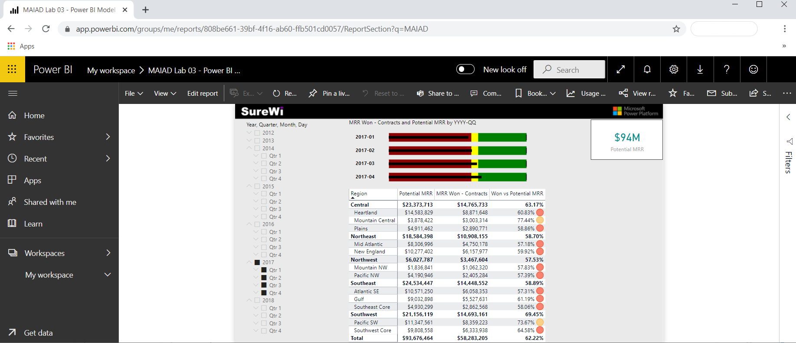](../media/report-displayed.png#lightbox)

	> [!NOTE]
	> Selected report page, slicers and filters are captured as default settings when published to the Power BI service.

## Exercise 2: Download, install, and use Analyze in Excel 

In this exercise, you will download the Analyze in Excel libraries and use Analyze in Excel to connect to the published **MAIAD Lab 03A - Power BI Model** in Power BI from within the Excel application.

### Task 1: Download Analyze in Excel updates

In this task, you will download a one-time download of Excel libraries that enables Excel to connect to Power BI Datasets.

1. From within the Power BI service, select **Analyze in Excel updates** from the Downloads menu, which is in the upper right corner.

	> [!div class="mx-imgBorder"]
	> [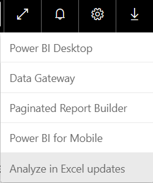](../media/analyze.png#lightbox)

1. Select the **Download** button.

	> [!div class="mx-imgBorder"]
	> [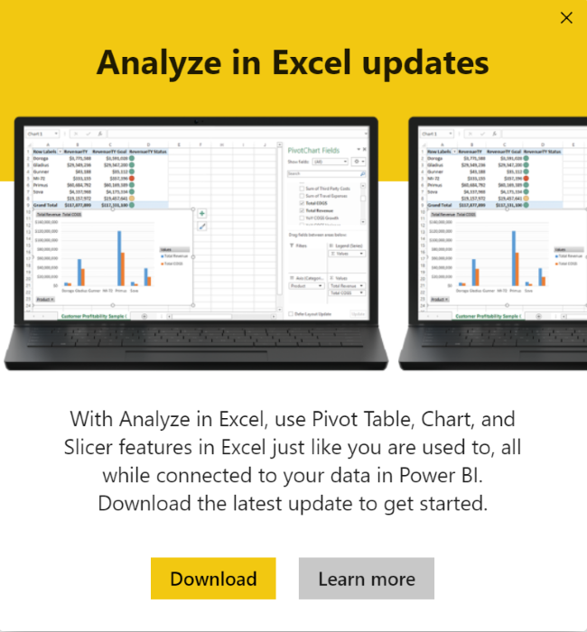](../media/download.png#lightbox)

### Task 2: Install Analyze in Excel

In this task, you will install the Excel libraries that enable Excel to connect to Power BI Datasets.

1. Once the download completes, the installation file will be in bottom left-hand side of your browser. Select the **Open** menu option on the file to launch the (.msi) installer wizard.

	> [!div class="mx-imgBorder"]
	> [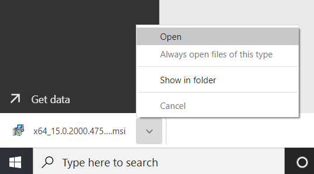](../media/open.png#lightbox)

1. Follow the wizard steps to install the Analyze in Excel libraries.

	> [!div class="mx-imgBorder"]
	> [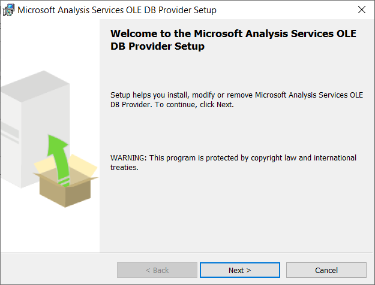](../media/next.png#lightbox)

### Task 3: Launch Analyze in Excel from Datasets + dataflows

In this task, you will navigate to the Datasets + dataflows location in the Power BI service to launch Analyze in Excel using the "MAIAD Lab 03A - Power BI Model" Dataset.

1. From the left-hand pane navigation, select **My workspace**.

1. Select the **Datasets + dataflows** navigation option.

	> [!div class="mx-imgBorder"]
	> 

	> [!NOTE]
	> When you publish your PBIX file to the service, there are two Power BI artifacts created: the Data Model will be in **Datasets + dataflows** and Report Pages will be in **Reports**.

1. From the **MAIAD Lab 03A - Power BI Model** Dataset select **More options** and then choose the **Analyze in Excel** menu option.

	> [!div class="mx-imgBorder"]
	> [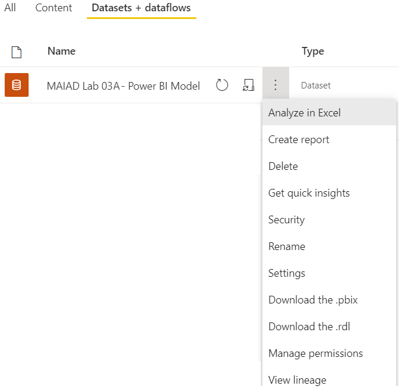](../media/analyze-excel.png#lightbox)

### Task 4: Launch the Analyze in Excel file

In this task, you will launch the Excel file that has been connected to the **MAIAD Lab 03A - Power BI Model** Data Model.

1. From the bottom left-hand side of your browser, select the Excel file and **Open** option.

	> [!div class="mx-imgBorder"]
	> [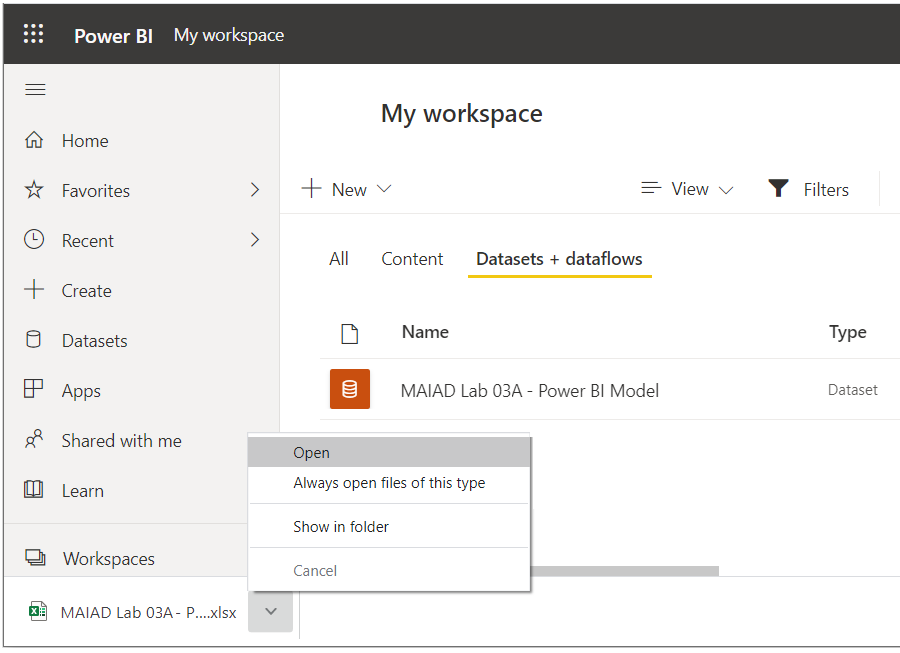](../media/excel-open.png#lightbox)

1. Once Excel launches, you may need to click the buttons to **Enable Editing** and **Enable Content**. This allows Excel to connect to the data model published to the Power BI service, which is an external data connection to Microsoft's Azure storage in the cloud.

	> [!div class="mx-imgBorder"]
	> [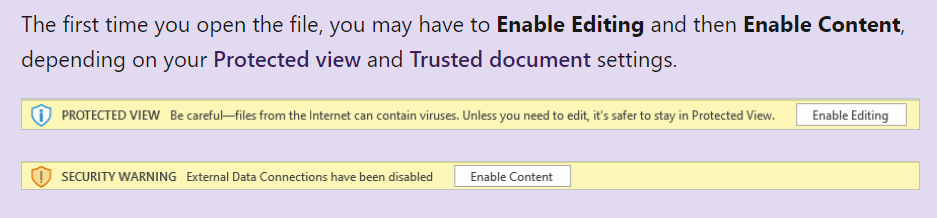](../media/enable-message.png#lightbox)

	> [!NOTE]
	> If you are not prompted with both the Enable Editing and Enable Content messages, you may need to check your Options > Trust Center > Trust Center Settings... to ensure your Message Bar Settings are turned on.

## Exercise 3: Build an Excel report using a Power BI Dataset

In this exercise, you will create a report in Excel using the Power BI Dataset connected to "MAIAD Lab 03A - Power BI Model" created using Analyze in Excel. The Excel report will contain a PivotTable, a PivotChart, and CUBE formulas.

### Task 1: Add Measures to the PivotTable Fields Values

In this task, you will populate the PivotTable with Measure fields from the Power BI Dataset connection.

1. From the **PivotTable Fields** window, select the Gear icon and change to the Fields Section and Areas Section Side-By-Side option.

	> [!div class="mx-imgBorder"]
	> [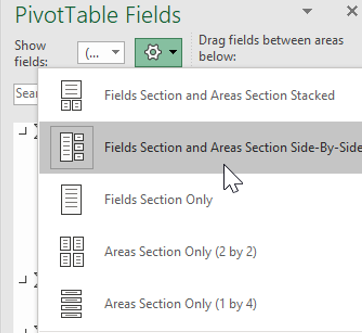](../media/gear.png#lightbox)

	> [!NOTE]
	> By default, the PivotTable Fields are displayed with the **Fields Section and Areas Section Stacked**. The instructions that follow have the Pivot Table Fields displayed as **Fields Section and Areas Section Side-By-Side**.

1. From the **Offices** measure table, drag the [# of Offices] measure to the **Values** section in the PivotTable Fields List.

1. From the **Contracts** measure table, click the **checkbox** for the [Total Contracts] & [MRR Won - Contracts] measures to the **Values** section in the PivotTable Fields List.

	> [!div class="mx-imgBorder"]
	> [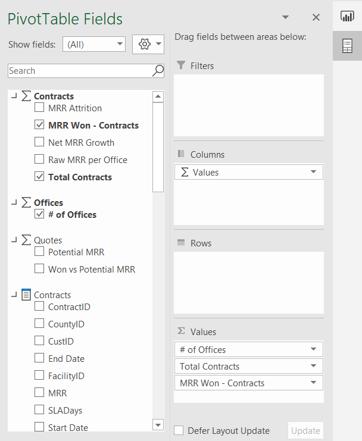](../media/measures.png#lightbox)

	> [!NOTE]
	> When selecting fields from the measure tables, the checkbox will move the field into the Values section by default. This is because only measures can go into the Values section of a PivotTable Field List when connecting Excel to a Power BI service Dataset.

1. Right click on the PivotTable, select the **PivotTable Options**...

	> [!div class="mx-imgBorder"]
	> [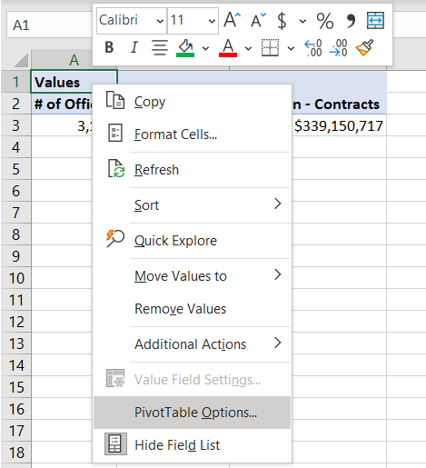](../media/options.png#lightbox)

1. Select Display and then de-select the checkbox to **Show the Values row**.

	> [!div class="mx-imgBorder"]
	> [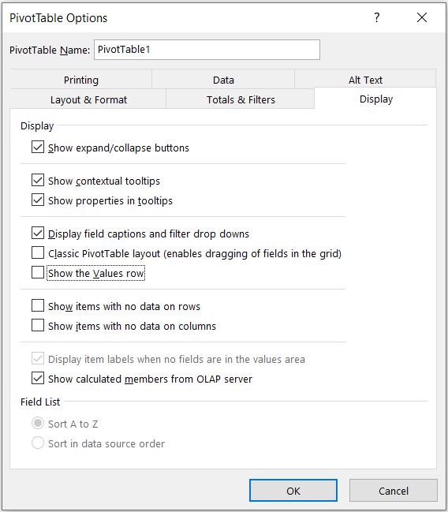](../media/values-row.png#lightbox)

	> [!NOTE]
	> This is done for aesthetics purposes to remove the row with **Values** in the heading that happens by default when adding more than one measure into the Values section of the PivotTable Fields.

### Task 2: Add Fields to the PivotTable Fields Rows

In this task, you will populate the PivotTable with Lookup fields from the Power BI Dataset connection.

1. From the **Offices** field table, drag the [Region] and [District] columns to the **Rows** section in the PivotTable Fields List.

	> [!div class="mx-imgBorder"]
	> [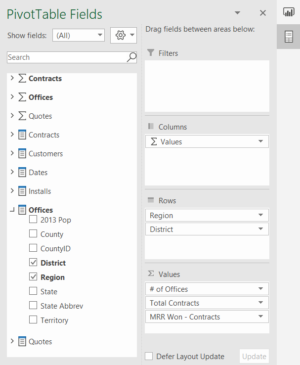](../media/fields.png#lightbox)

1. Use the mouse to place the cursor in **Cell A1** and type the name **Region & District** into the cell to change the default heading name.

	> [!div class="mx-imgBorder"]
	> [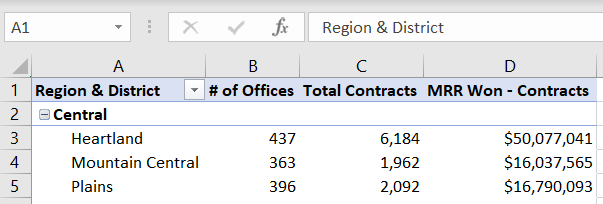](../media/label.png#lightbox)

### Task 3: Insert a PivotChart

In this task, you will insert a PivotChart workspace into the Excel worksheet to the right of the PivotTable. Then you will add fields to the Axis and Values sections.

1. Use your mouse to select **Cell E1** on the worksheet. This is the selects the location for the PivotChart.

	> [!div class="mx-imgBorder"]
	> [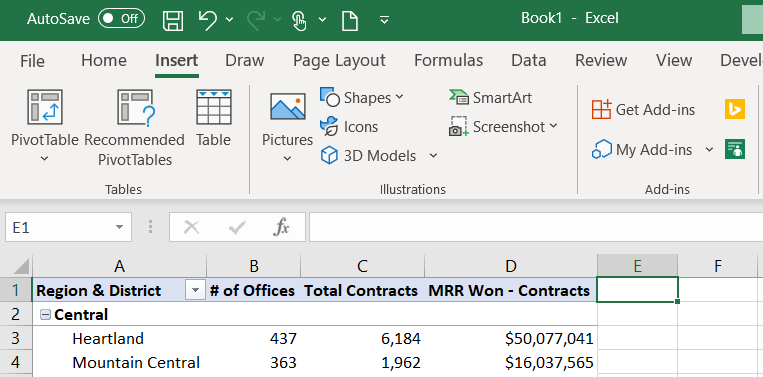](../media/location.png#lightbox)

1. Select the **Insert** tab on the main menu and select the **PivotChart** option from the **PivotChart** button drop-down.

	> [!div class="mx-imgBorder"]
	> [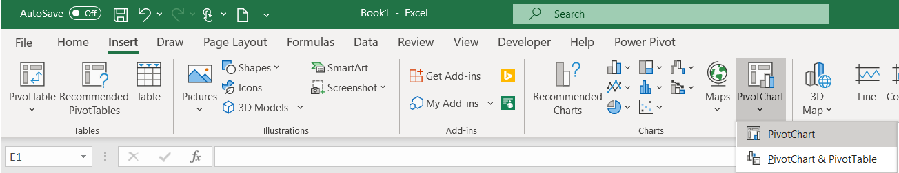](../media/pivotchart.png#lightbox)

1. On the Create PivotChart window, select the **Use an external data source** radio button.

1. Select the **Choose Connection**... button.

	> [!div class="mx-imgBorder"]
	> [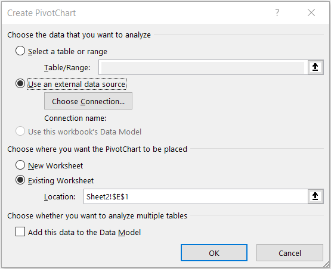](../media/connection.png#lightbox)

1. Then from the **Connections** tab and the **Connections in this Workbook** section, select the `pbiazure//api.powerbi.com` connection string path name to connect the PivotChart to the Power BI Dataset external data source.

	> [!div class="mx-imgBorder"]
	> [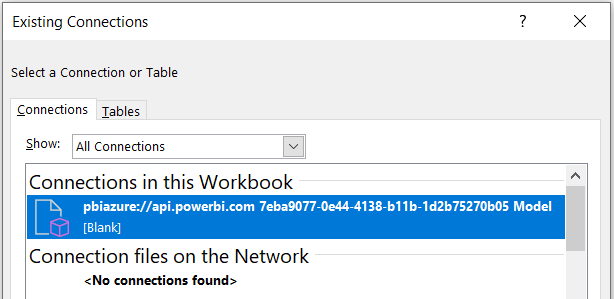](../media/workbook-connections.png#lightbox)

	> [!NOTE]
	> The exact name of your `pbiazure://api.powerbi.com` connection string will be different than the one shown in the above image. This is the unique connection location identifier for a published Power BI dataset artifact.

1. Click **OK**.

1. From the **Quotes** measure table, click the **checkbox** next to the [Won vs Potential MRR] measure to move the measure into the **Values** section in the PivotTable Fields List.

1. From the **Offices** field table, drag the [Region] to the **Rows** section in the PivotTable Fields List.

	> [!div class="mx-imgBorder"]
	> [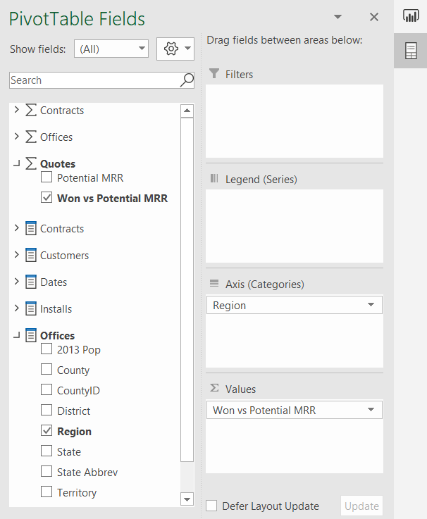](../media/pivot-table-fields.png#lightbox)

### Task 4: Format PivotChart

In this task, you will format the PivotChart using some of the familiar formatting options in Excel.

1. From the **Design** tab in the main menu, select **Style 4**.

	> [!div class="mx-imgBorder"]
	> [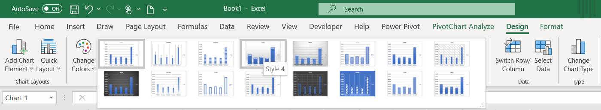](../media/design.png#lightbox)

1. Double-click into the Chart Title and change the default Title text to **MMR Won % by Region**.

1. Use the mouse to hover over the upper right-hand side of the PivotChart to display the Chart Elements options and **de-select the Legend checkbox** to remove the Legend.

	> [!div class="mx-imgBorder"]
	> [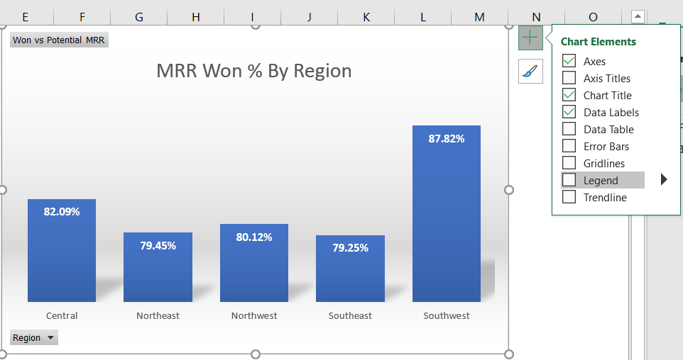](../media/legend.png#lightbox)

### Task 5: Add KPIs using CUBEVALUE

In this task, you will use CUBE formulas to create high-level KPIs for the report.

1. Use a **right-click on row 1** to **Insert** a row above the PivotTable and PivotChart.

1. Use **CTRL+Y** to repeat the last step and add another row above the PivotTable and PivotChart.

1. Use a **right-click on column A** to **Insert** a column before the PivotTable.

	> [!NOTE]
	> This provides a row and column buffer for aesthetics purposes. And provides a row for a report heading and the KPIs using CUBEVALUE formulas.

1. Right-click **column A and set the column with to 1**.

1. Use **Fill Color = Black** from the **Home** tab on the main menu to create a report heading in row 2.

1. Use **Font Color = Gold, Accent 4** for row 2.

1. Select **Cell I2** and enter the text **"Potential MRR:"** - this will serve as the KPI description.

1. In **Cell J2** enter the following CUBEVALUE formula and hit Enter:

    =CUBEVALUE("Power BI - MAIAD Lab 03A – Power BI Model","[Measures].[Potential MRR]")

	> [!div class="mx-imgBorder"]
	> [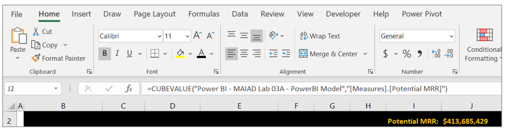](../media/measure-access.png#lightbox)

	> [!TIP]
	> As you type the CUBEVALUE formula, you will notice that Intellisense displays to guide you as to the syntax needed to complete the formula. A CUBEVALUE formula can be combined for use with Slicers.

1. Select **Cell K2** and enter the text **"Won MRR:"** - this will serve as the KPI description.

1. In **Cell L2** enter the following CUBEVALUE formula and hit Enter:

    =CUBEVALUE("Power BI - MAIAD Lab 03A – Power BI Model","[Measures].[MRR Won - Contracts]")

	> [!div class="mx-imgBorder"]
	> [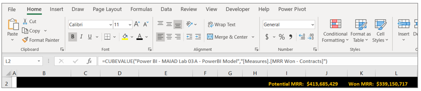](../media/cube-value.png#lightbox)

    Select **Cell M2** and enter the text **"% Won:"** - this will serve as the KPI description.

1. In **Cell N2** enter the following Excel formula and hit Enter:

    =L2/J2

	> [!div class="mx-imgBorder"]
	> [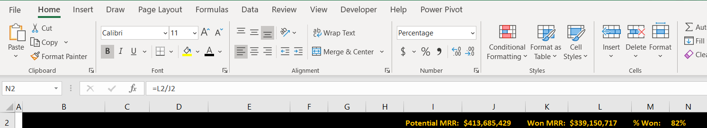](../media/formula-bar.png#lightbox)

	> [!TIP]
	> You can combine the familiarity and features of Excel with Dataset published to Power BI!

1. Using a **right-click**, select **Format Cells**... to **percentage**.

1. Select **File** from the Main Excel Ribbon Menu, then **Save As**.

1. Navigate to the \<CourseFolder\>\Attendee\Lab Materials\Lab 03A\ folder.

1. Save the file as **MAIAD Lab 03A - Power BI Model - My Solution.pbix**.

In this exercise, you published a Power BI Desktop Dataset and Report to the Power BI service. Then you created a report in Excel with a PivotTable, PivotChart, and CUBE functions connected to a Power BI Dataset. This final exercise illustrates what is possible when you use Power BI together with Excel.

> [!div class="mx-imgBorder"]
> 

> [!IMPORTANT]
> Now that you have your report created, you will want to keep it updated. But do not worry, it takes just two button clicks: **Data** > **Refresh All**.

> [!div class="mx-imgBorder"]
> [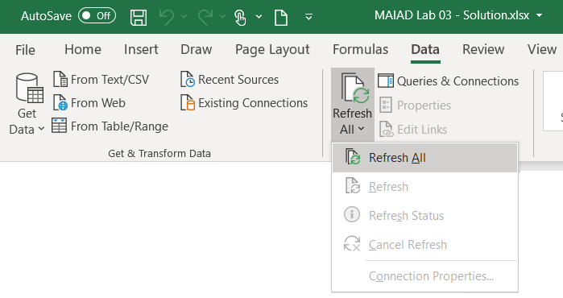](../media/refresh.png#lightbox)
