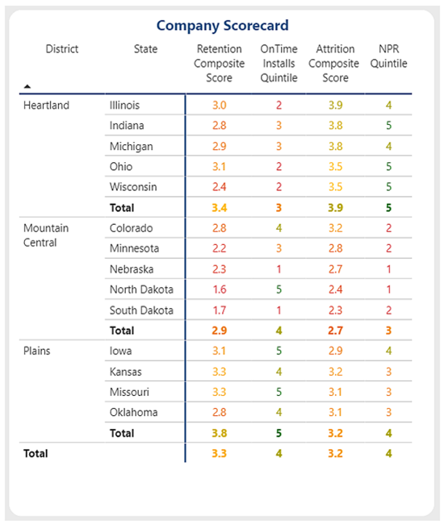
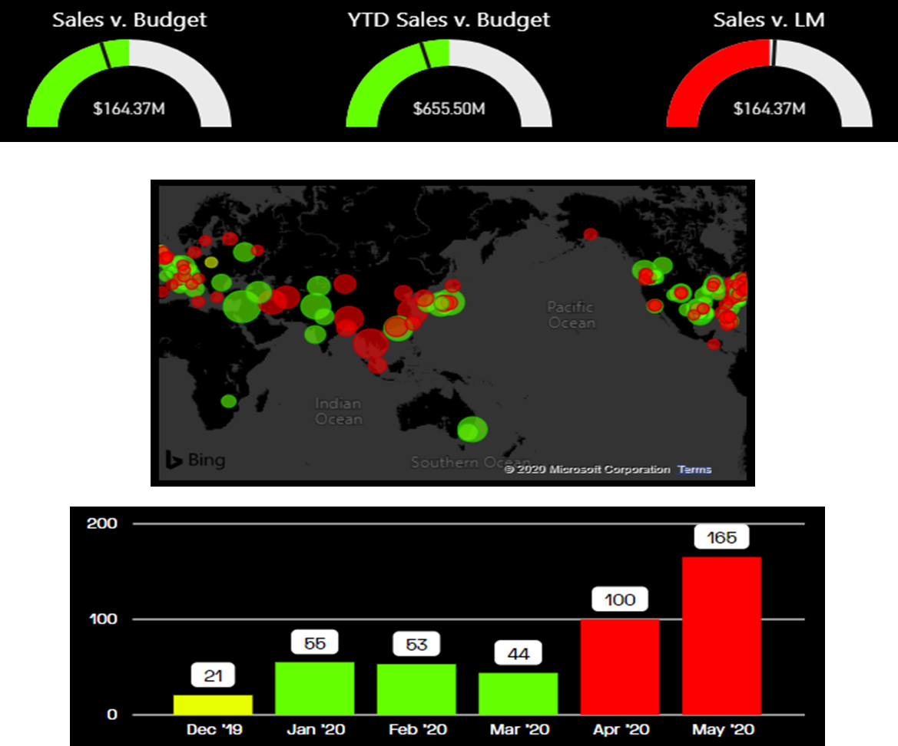
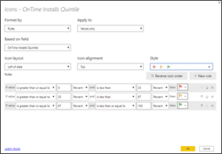
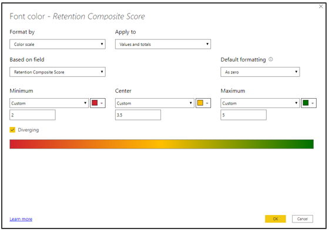
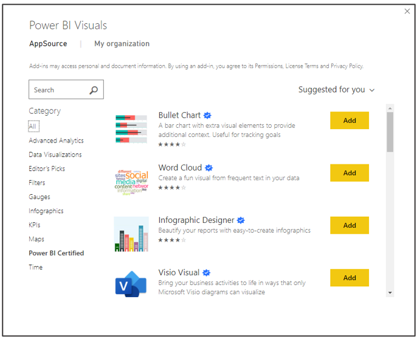
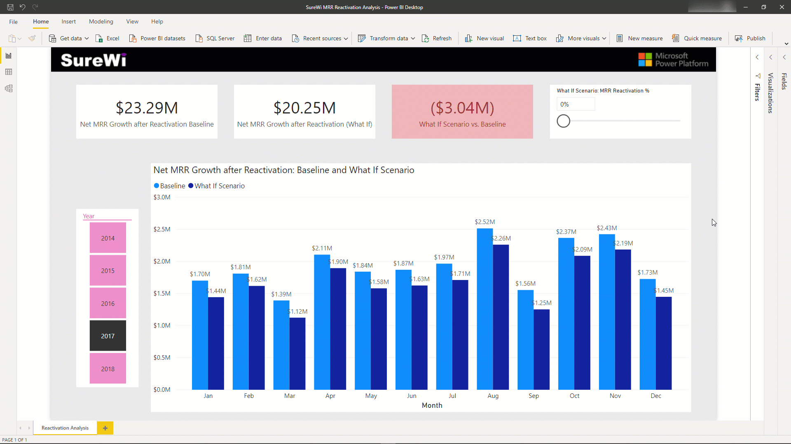

Power BI's interactive visuals sets Power BI apart from Excel when creating and consuming reports. Most visuals in a Power BI report are interactive and connected to each other. The communication across visuals allows you to present a complete story of your data while also allowing report users to explore and discover new insights dynamically. You'll learn about several of the most utilized visuals in Power BI throughout this unit.

## Power BI interactivity demo

You will see several ways in which Power BI is dynamic and interactive in the following demo.

> [!div class="mx-imgBorder"]
> []

The previous demo demonstrates how each of the visuals interact. The scatter chart animates changes over time. The slicers for region impact the output for the scatter chart as well as the line chart and card visuals. Additionally, selecting cells within the matrix impacts the other visualizations on the page too. These interactive experiences are only available in Power BI.

## Power BI visuals -- matrix

When using Power BI, you'll find that the matrix visual is most like PivotTables in Excel. The matrix visual takes **Rows**, **Columns**, and **Values** entries to produce a tabular matrix of outputs. In the following screenshot, the **Rows** entry contains the district and state fields. The **Values** entry contains the measures "Retention Composite Score", "On Time Installs Quintile", "Attrition Composite Score", and "NPR Quintile". Power BI presents the matrix visual like a PivotTable, with the row values along the left, the column values along the top, and the data to the right. The matrix visual includes conditional formatting options which can help users quickly identify key insights from the data.

> [!div class="mx-imgBorder"]
> 

## Power BI visuals -- conditional formatting

Many Power BI visuals incorporate conditional formatting features. Conditional formatting can be applied to data labels, values, backgrounds, titles, points, plots, and more. Rules can be simple color selections or diverging color scales. Virtually anything can be conditionally formatted in Power BI. The following images demonstrate some examples of conditional formatting for gauges, maps, and bar visuals -- additionally, you can see the conditional formatting settings and controls.

> [!div class="mx-imgBorder"]
> 

> [!div class="mx-imgBorder"]
> 

> [!div class="mx-imgBorder"]
> 

The following demo shows you how to apply conditional formatting. You can add icons to a matrix to make it easier to identify trends and outliers, create color scales to generate a heatmap of good or bad outcomes, or apply specific colors for identification purposes. Power BI offers a wide variety of options to apply and modify the formatting within a report.

> [!div class="mx-imgBorder"]
> 

## Power BI visuals -- AI/decomposition tree

Power BI includes AI functionality and enhancements. The decomposition tree visual in Power BI enables you to visualize data across multiple dimensions. It automatically aggregates data and enables drilling down into dimensions in any order. As an artificial intelligence (AI) visualization, you can ask it to find the next dimension to drill down into based on certain criteria. This feature makes it a valuable tool for data exploration and root cause analysis. The Q&A feature in Power BI enables you to explore your data in your own words.

The following demo shows how a decomposition tree visual enables exploration of Monthly Recurring Revenue (MRR Won) metric across several dimensions. This visual works well with the drill through functionality for navigating to another page of the report. Using the natural language Q&A functionality, you can ask questions about the data and get answers.

&nbsp;
> [!VIDEO https://www.microsoft.com/videoplayer/embed/]

1. First, you add the decomposition tree visual to the report canvas and drag the [MRR Won -- Contracts] metric into the **Analyze** input. For the dimensions, the [Segment], [Support Level], and [Region] are added to the **Explain By** inputs. Note that the order of the dimensions does not affect the functionality of the decomposition tree visual.

1. Next, you select the plus (+) to begin to explore the metric by the dimensions and to explore high or low values.

1. You can continue to drill down through each of the dimensions.

1. When combined with Drill through in Power BI, you can interact with other report pages and visuals such as Q&A.

1. In this demo, Q&A is used to explore [MRR Won -- Contracts] by county within US states.

## Power BI visuals - custom visuals

Using Power BI gives you access to over 250 custom visuals. This library of visuals continues to grow because independent developers can publish them to Microsoft's AppSource. Custom visuals are unique visuals developed by the community that can be used by any Power BI user. Some custom visuals might require a purchase to unlock all features.

> [!div class="mx-imgBorder"]
> 

Custom visuals allow you to expand the types of visuals beyond the standard table, line charts, bar charts, and pie charts common to Excel. AppSource has a wide variety of options including advanced analytics visuals like ANOVA charts, different types of filters and gauges, Visio flowchart visuals, and the option to import your own custom visuals.

## Power BI what-if scenarios

End users can use what-if scenarios to toggle specific values and immediately see the impact within the report. The following demo shows an example in which the user changes the what-if scenario slider to see how the results change based upon a percentage multiplier.

> [!div class="mx-imgBorder"]
> []
