The estimated time to complete this exercise is 60 minutes.

In this exercise, you will complete the following tasks:

1. Start with pre-loaded PBIX file

1. Create MANY to ONE relationship in Power BI Desktop

1. Create Measures in Power BI Desktop

1. Build a Report Page with Visuals Types: Card, Slicer, Matrix, Custom Visual

1. Add Conditional Formatting Icons to Matrix Visual

    > [!NOTE]
    > This exercise has been created based on the sales activities of the *fictitious* Wi-Fi company called SureWi which has been provided by P3 Adaptive <https://p3adaptive.com/>. The data is property of P3 Adaptive and has been shared with the purpose of demonstrating Excel and Power BI functionality with industry sample data. Any use of this data must include this attribution to P3 Adaptive.

## Exercise 1: Start with a pre-loaded PBIX

In this exercise, you will launch Power BI Desktop and open a PBIX file that has all the Data & Lookup tables loaded and the data model already partially built.

### Task 1: Launch Power BI Desktop

In this task, you will launch Power BI Desktop and save the new PBIX file.

1. Launch Power BI Desktop.

    > [!div class="mx-imgBorder"]
    > 

1. If applicable, use the "x" in the upper right-hand corner to close the Welcome window.

### Task 2: Open the PBIX file

In this task, you will navigate and open the starting PBIX file.

1. Select **File > Open report > Browse reports.**

    > [!div class="mx-imgBorder"]
    > 

1. Navigate to the **Course Folder > Attendee > Lab Materials > Lab 02B** folder.

1. Select the file **MAIAD Lab 02B - Power BI Model - Start.pbix** and choose Open.

    > [!div class="mx-imgBorder"]
    > [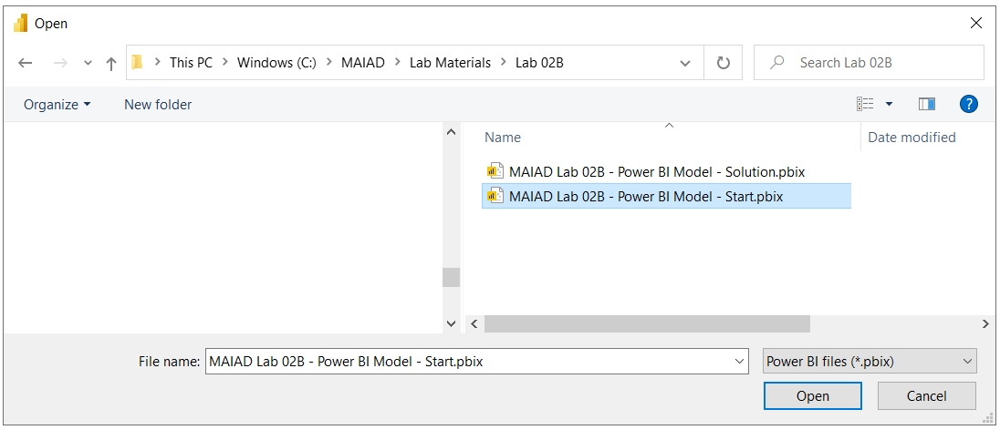](../media/maiad-file-select.png#lightbox)

### Task 3: Save the PBIX file

In this task, you will save the file with a new file name.

1. Select **File > Save as.**

    > [!div class="mx-imgBorder"]
    > 

1. Save the file as **MAIAD Lab 02B - Power BI Model - My Solution.pbix**.

    > [!div class="mx-imgBorder"]
    > [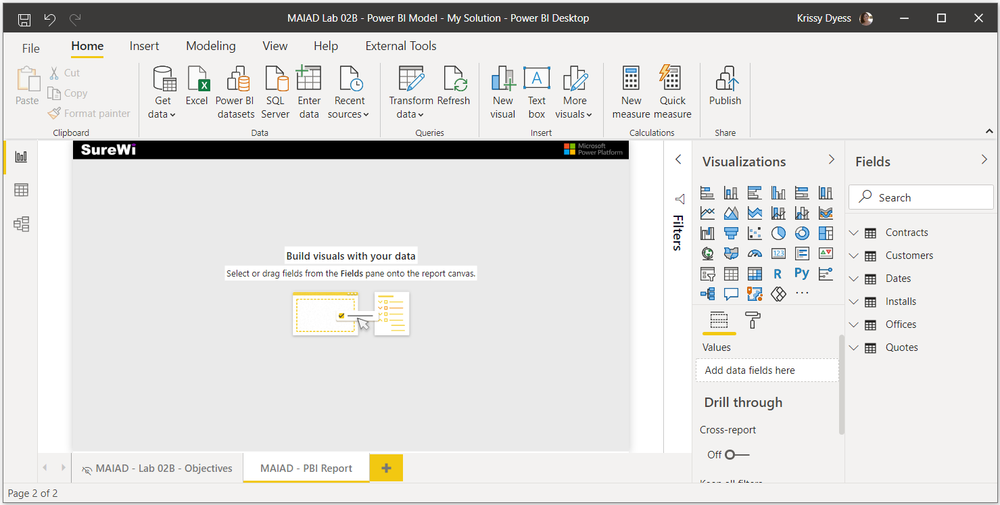](../media/my-solution.png#lightbox)

## Exercise 2: Create MANY to ONE relationships in Power BI Desktop

In this exercise, you will create the relationships needed to complete the data model. You will create relationships from the Quotes Data table to each of the Lookup tables in the data model.

### Task 1: Create relationship from Quotes to Customers

In this task, you will create the relationship from the Quotes Data table to Customers Lookup table.

1. From the left-side view navigation options, select the Model view icon. This changes the display area from the default Report view to the Model view to show the data model diagram.

    > [!div class="mx-imgBorder"]
    > [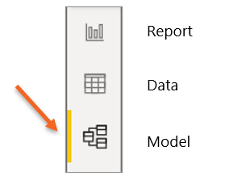](../media/model-icon.png#lightbox)

1. Select the [CustID] column from the Quotes Data table and drag to create the relationship line to the [ID] column on the Customers Lookup table.

    > [!div class="mx-imgBorder"]
    > [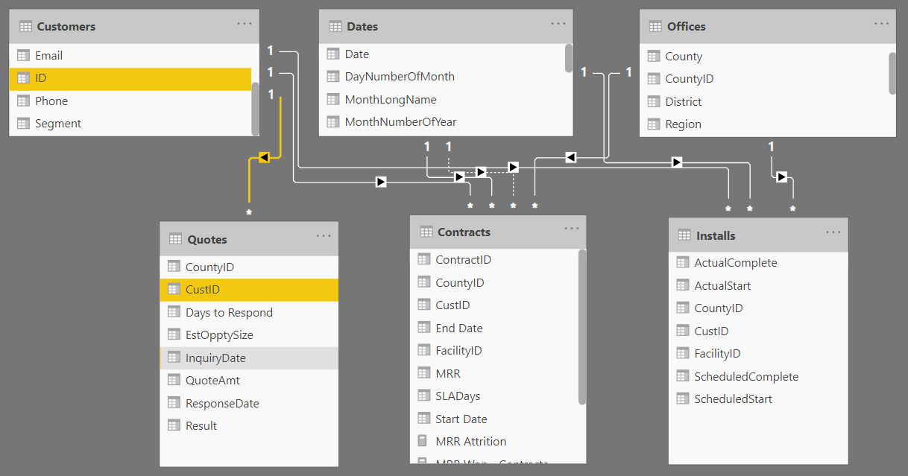](../media/9-cust-id.png#lightbox)

    > [!NOTE]
    > When creating relationships, the name of the column is not important; however, the data type and values in the columns should match.

### Task 2: Create relationship from Quotes to Dates

In this task, you will create the relationship from the Quotes Data table to Dates Lookup table.

1. Select the [InquiryDate] column from the Quotes Data table and drag to create the relationship line to the [Date] column on the Dates Lookup table.

    > [!div class="mx-imgBorder"]
    > [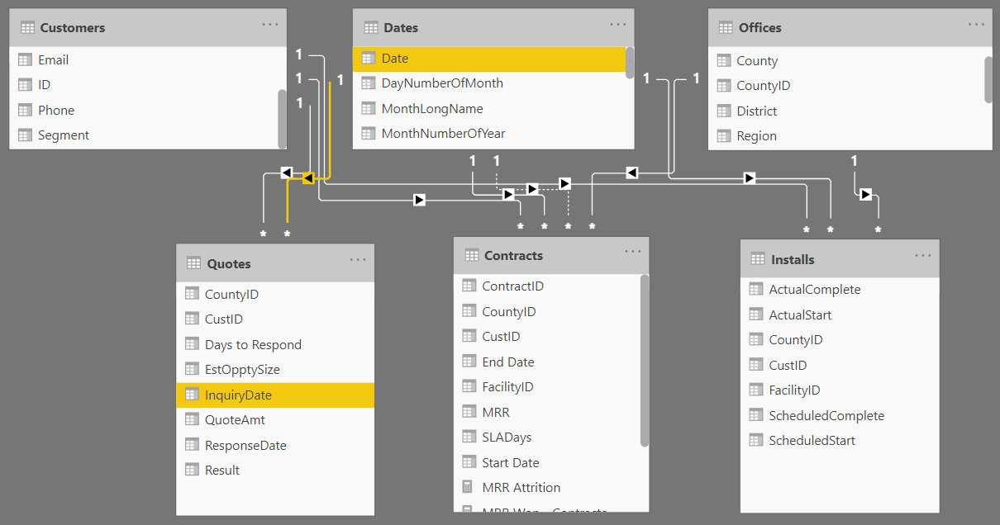](../media/10-inquiry-date.png#lightbox)

### Task 3: Create relationship from Quotes to Offices

In this task, you will create the relationship from the Quotes Data table to Offices Lookup table.

1. Select the [CountyID] column from the Quotes Data table and drag to create the relationship line to the [CountyID] column on the Offices Lookup table.

    > [!div class="mx-imgBorder"]
    > [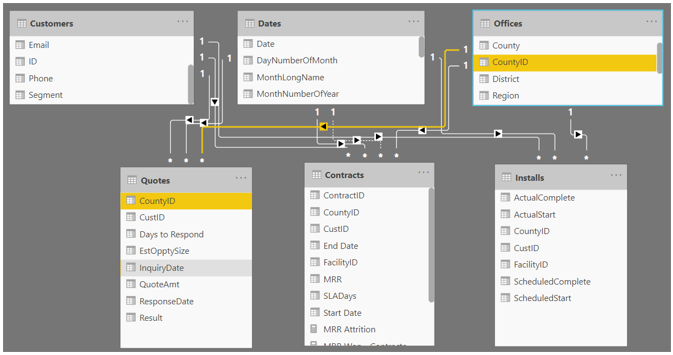](../media/offices-look-up.png#lightbox)

    > [!NOTE]
    > By adopting the best practice of arranging the Lookup tables above the Data tables in the Model view, you will be able to visualize the filters from Lookup tables "flowing down through those relationship lines" to the Data tables -- this will be very helpful when learn how the DAX engine calculates measures.

## Exercise 3: Create Measures in Power BI Desktop

In this exercise, you will create measures on the Quotes table and learn two different ways that new measures can be created in Power BI Desktop.

### Task 1: Create a New Measure from Fields Pane

In this task, you will create a New measure on the Quotes table using the Ellipse menu from the Fields pane.

1. Select the Report view.

    > [!div class="mx-imgBorder"]
    > [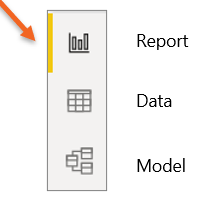](../media/report-views.png#lightbox)

1. From the Fields pane, select the Ellipse menu (...) on the Quotes table.

    > [!div class="mx-imgBorder"]
    > [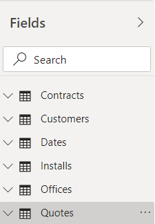](../media/13-quote-field.png#lightbox)

1. Choose New measure.

    > [!div class="mx-imgBorder"]
    > [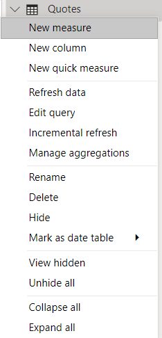](../media/14-new-measure.png#lightbox)

### Task 2: Create the Measure [Potential MRR]

In this task, you will use the DAX function SUM() to create the business logic needed to calculate Monthly Recurring Revenue amount from the Quotes table.

1. In the New measure formula bar, remove the default "Measure = " value.

1. Enter the following DAX formula & then select the [Check Mark] to commit:

    Potential MRR = SUM( Quotes [QuoteAmt] )

    > [!NOTE]
    > As you type the DAX function SUM, you will see Intellisense with matching options, double-click to the select the SUM() function. As you begin to type "Quotes", you will also see Intellisense with matching Quote table and column names - double-click the field to select.

    > [!div class="mx-imgBorder"]
    > [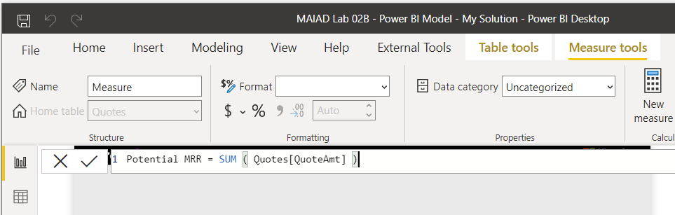](../media/16-check-mark.png#lightbox)

### Task 3: Format the Measure [Potential MRR]

In this task, you will use the Measure Formatting Tools to format the Measure [Potential MRR].

1. Select the measure [Potential MRR] in the Fields pane.

    > [!div class="mx-imgBorder"]
    > [![Fields pane with new measure \[Potential MRR\] showing the calculator icon.](../media/17-potential-mrr.png)](../media/17-potential-mrr.png#lightbox)

    > [!NOTE]
    > Measures can be identified in the Fields pane by the Calculator icon.

1. Use the Measure tools menu options to format the measure as Currency.

    > [!div class="mx-imgBorder"]
    > [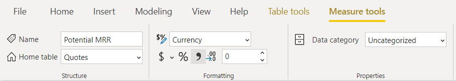](../media/18-measure-tools-menu.png#lightbox)

1. Change decimal places from Auto to 0.

### Task 4: Create the Measure [Won vs Potential MRR]

In this task, you will use the DAX function DIVIDE() to create the business logic needed to calculate the percentage of Potential Monthly Recurring Revenue that has been Won on Quotes table. For this measure, you will use the existing data model measure called [MRR Won -- Contracts] from the Contracts Data table.

1. Use the mouse to click on the [Quotes] table from the Fields pane - to select the Quotes table for the new measure.

1. Select the [New measure] button from the [Table tools] menu options.

    > [!div class="mx-imgBorder"]
    > [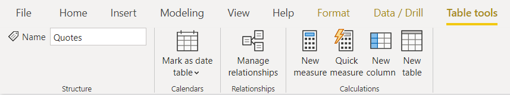](../media/21-table-tools.png#lightbox)

1. In the New measure formula bar, enter the DAX formula & then select the [Check Mark] to commit:

    [Won vs Potential MRR] = DIVIDE ([MRR Won - Contracts], [Potential MRR])

    > [!div class="mx-imgBorder"]
    > [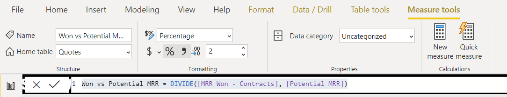](../media/22-dax-formula.png#lightbox)

    > [!NOTE]
    > When entering the DAX formula, and as you type the open square bracket, you will notice intellisense displays a list of the available measures that have been created.

### Task 5: Format the Measure [Won vs Potential MRR]

In this task, you will use the Measure Formatting Tools to format the Measure [Potential MRR].

1. Use the [Measure tools] menu options to format the measure as [Percentage].

1. Validate that the [decimal places] value is set to [2] and remove the comma, if selected.

    > [!div class="mx-imgBorder"]
    > [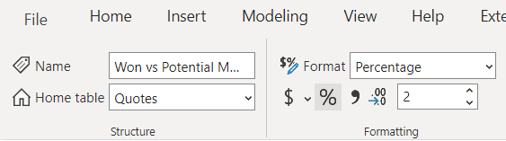](../media/24-percentage.png#lightbox)

## Exercise 4: Build a Report Page with Visuals: Card, Slicer, Matrix, and Custom Visual

In this exercise, you will create a report page with a Card, Slicer, Matrix and Custom visual.

> [!NOTE]
> If at any time you need to undo a step, you can always use the Undo button above File in the main menu.

> [!div class="mx-imgBorder"]
> [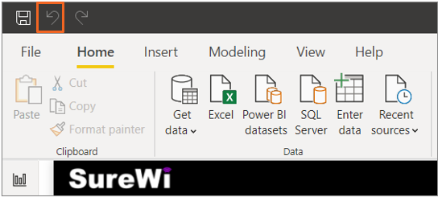](../media/undo-button.png#lightbox)

### Task 1: Create a Card visual

In this task, you will create a Card visual using measure [Potential MRR].

From the Fields pane, select the [Potential MRR] measure from the Quotes table and drag the measure to an empty white space on the report page.

> [!NOTE]
    > Depending on the field type and the data type of the field, you will get a default visual once you drag and drop a new field onto the report page. Since we have a measure, by default we get a Clustered column chart visual -- you can see the chart name by hovering over the icon on the Visualization pane.

    > [!div class="mx-imgBorder"]
    > [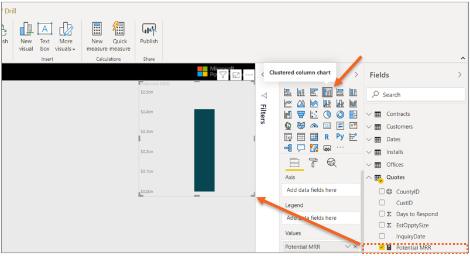](../media/card-visual.png#lightbox)

1. Select the [Clustered column chart visual] to make it active and then select the [Card visual} icon from the Visualization pane.

    > [!div class="mx-imgBorder"]
    > [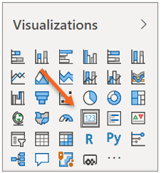](../media/visualization-pane.png#lightbox)

### Task 2: Resize the Card visual

In this task, you will resize a Card visual.

1. Click and drag on the visual border to resize the Card visual OR you can select the [Format/Paint Roller] icon navigation to change the [Width] and [Height] values located in the General Properties.

    > [!div class="mx-imgBorder"]
    > [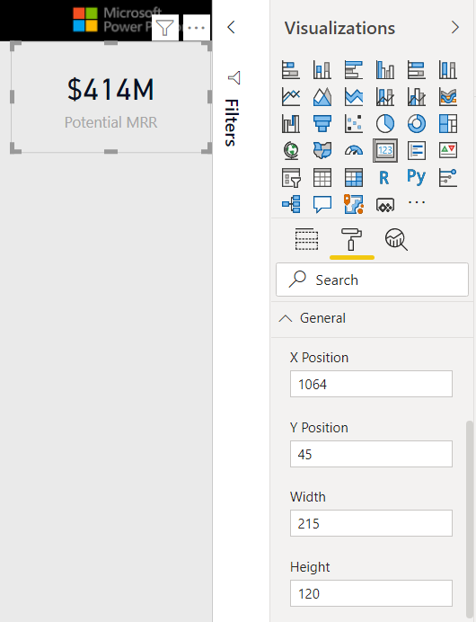](../media/card-visual-resize.png#lightbox)

### Task 3: Format the Card visual

In this task, you will apply formatting to the Card visual -- you will add Conditional Formatting to the Data label, apply a Background color, Category Label, and a Border.

1. From the Format/Paint Roller properties, expand the [Data label] properties and click the "[Fx]" symbol next to the [Color] property -- to apply Conditional Formatting based on the Data label value.

    > [!div class="mx-imgBorder"]
    > [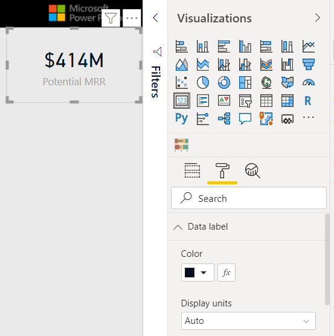](../media/paint-roller-properties.png#lightbox)

1. In the [Color] window, change the [Format by] drop down to [Rules].

1. Enter the Rule: [Is greater than or equal to *Minimum* Number] and [is less than or equal to 90,000,000 Number]. Then use the drop down to apply the color [Red].

1. Select the [+New Rule] button.

1. Enter the Rule: [Is greater than 90,000,000 Number] and [is less than or equal to *Maximum* Number]. Then use the drop down to apply the color [Green].

    > [!div class="mx-imgBorder"]
    > [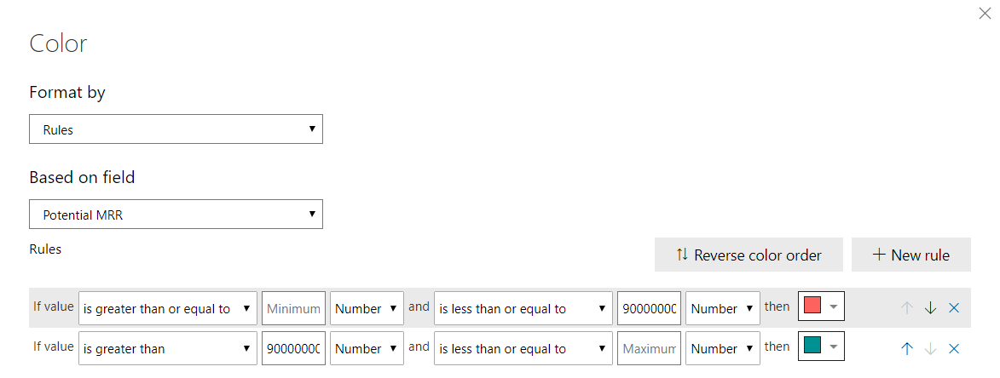](../media/color-rules.png#lightbox)

    > [!TIP]
    > By removing the ending low & high range values in the rules, you will get a Minimum and Maximum range that adjusts dynamically.

1. Click [OK]

1. From the Format/Paint Roller properties, expand the [Background] property. Set toggle to [On].

    > [!div class="mx-imgBorder"]
    > [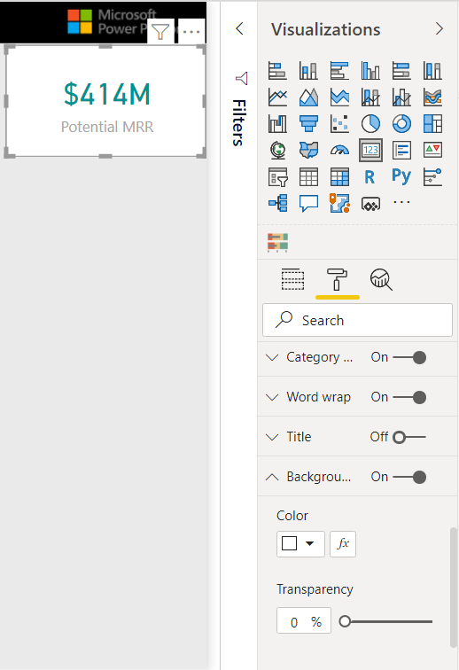](../media/background-property.png#lightbox)

1. Validate the [Color] is set to [White]. And set [Transparency] to [0%].

    > [!NOTE]
    > You can also use the "Fx" icon to use Conditional Formatting for Background color.

1. From the Format/Paint Roller properties, use the right-side scroll bar to navigate down to the [Border] property and set the toggle to [On].

    > [!div class="mx-imgBorder"]
    > 

### Task 4: Create a Slicer visual

In this task, you will create a Slicer using the Dates [Date Hierarchy] column.

1. From the Fields pane, navigate to the [Dates] table.

1. Click the [down arrow] to expand the [Dates\[Date\]] column to reveal the [Dates [Date Hierarchy]] column.

    > [!div class="mx-imgBorder"]
    > [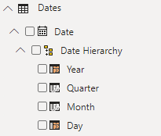](../media/date-hierarchy.png#lightbox)

1. Select the [Dates[Date Hierarchy]] column from the Dates table and [drag] the measure to an empty white space on the report page.

    > [!NOTE]
    > Hierarchy columns are displayed with a grouping image icon -- indicating that there are navigation levels for the column. For example, Date contains the levels Year, Quarter, Month, and Day.

1. Select the default [Clustered column chart visual] to make it active and then select the [Slicer visual] icon from the Visualization pane.

    > [!NOTE]
    > The default visual that is created is dependent on the data type of the field.

    > [!div class="mx-imgBorder"]
    > [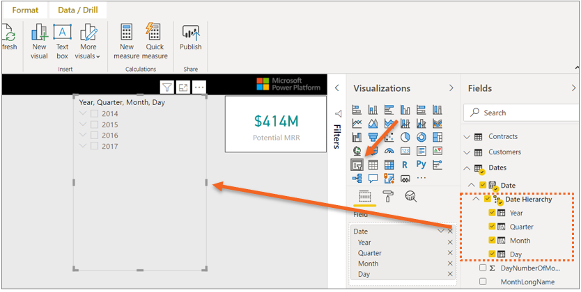](../media/clustered-column-chart.png#lightbox)

1. Click the [down] arrow to the left of Year values to expand to the Quarter values and explore the functionality on the Slicer visual.

    > [!NOTE]
    > The Slicer has this behavior because the Dates [Date Hierarchy] column has been created as a Hierarchy field in the data model -- we can navigate from Year to Quarter, Month, and day.

    > [!div class="mx-imgBorder"]
    > 

1. Click on the [Slicer] and drag the visual all the way over to the left side of the report page. And [expand all the year values down to display the year and quarter levels].

### Task 5: Resize the Slicer visual

In this task, you will resize the Slicer header and Items on the Slicer visual.

1. Click on the [Slicer] to ensure it is active.

1. Select the [Format/Paint Roller icon] navigation in the Visualizations pane. Type the word "[size]" into the search box to filter the properties to quickly find and change the [Slicer header] and [Items] to size [12].

    > [!div class="mx-imgBorder"]
    > [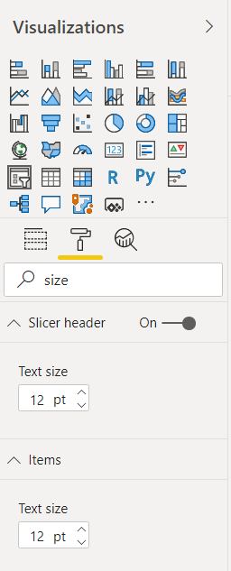](../media/format-paint-roller.png#lightbox)

### Task 6: Create a Matrix visual

In this task, you will create a Matrix visual with columns from the Offices table and the measures Quotes [Potential MRR], Contracts [MRR Won -- Contracts], and Quotes [Won vs Potential MRR].

1. From the [Fields] pane, select the [Quotes] table and the [Potential MRR] measure].

1. [Drag the [Potential MRR] measure] into an empty white space on the report page.

    > [!NOTE]
    > Note: By default, you will get the Clustered column chart.

1. Select the [Clustered column chart visual] to make it active and then select the [Matrix visual] icon from the Visualization pane to change to the Matrix visual.

    > [!div class="mx-imgBorder"]
    > [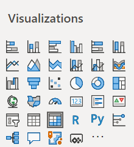](../media/matrix-visual-icon.png#lightbox)

### Task 7: Resize the Matrix visual

In this task, you will resize the Matrix visual.

1. Click and drag on the visual border to [resize] the Matrix visual.

    > [!NOTE]
    > As you drag to resize visuals, you will notice red lines to help with alignment.

    > [!div class="mx-imgBorder"]
    > [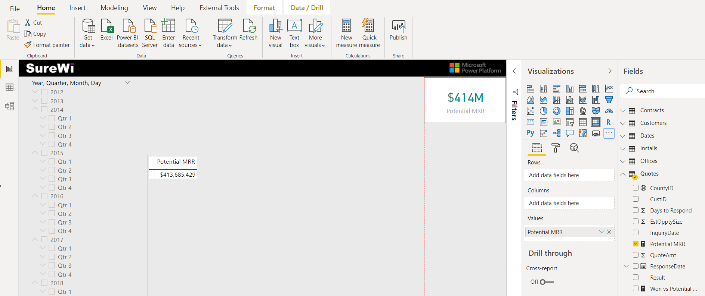](../media/resize-matrix.png#lightbox)

### Task 8: Add more measures and columns to the Matrix visual

In this task, you will add two more measures and two columns to the Matrix visual.

1. Select the [Matrix visual] to make it active.

1. From the [Fields pane], select the [checkbox] next to the [Contracts [MRR Won -- Contracts] measure -- this will add the measure to the Matrix visual.

     > [!div class="mx-imgBorder"]
    > [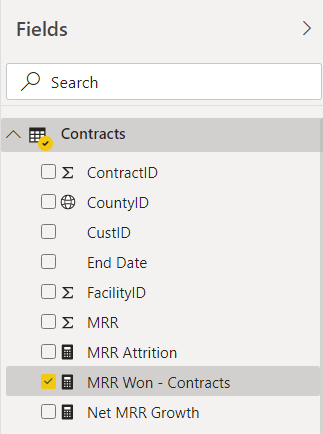](../media/mrr-won-contracts.png#lightbox)

    > [!NOTE]
    > Since the field is a measure, Power BI knows to add the field into the values section of the Fields.

    > [!div class="mx-imgBorder"]
    > [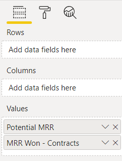](../media/add-rows-mrr-won.png#lightbox)

1. From the [Fields pane], select the [checkbox] next to the Quotes [Won vs Potential MRR] measure -- this will add the measure to the Matrix visual.

1. Now, we will add the [Region] and [District] columns from the Office table into the [Rows] section of the Matrix Fields -- just [drag from the Fields pane and drop into the Rows].

    > [!div class="mx-imgBorder"]
    > [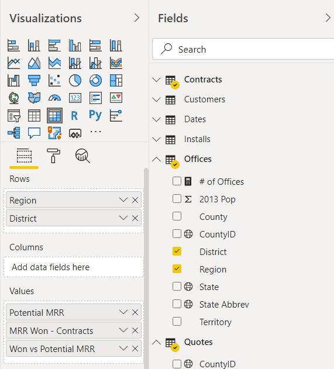](../media/region-district.png#lightbox)

    > [!NOTE]
    > Each visual has different options listed in the Fields. For example, the Matrix visual contains Field sections for Row, Columns, and Values.

    > [!NOTE]
    > The Matrix visual in Power BI Desktop is most like the PivotTable in Excel.

### Task 9: Resize the Matrix visual

In this task, you will resize the Text size of the Matrix visual.

1. Select the [Format/Paint Roller icon], then type "[size]" in the search box and change the Text size to [12] in the Grid property.

    > [!div class="mx-imgBorder"]
    > [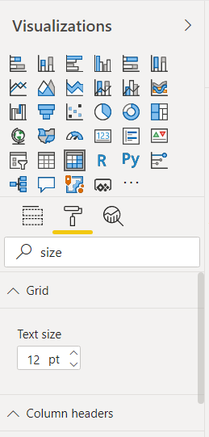](../media/grid-text-size.png#lightbox)

### Task 10: Use Matrix buttons

In this task, you will use the Matrix buttons to display the values for District within Region.

1. Use your mouse to [hover over the Matrix visual] to display the [Matrix navigation buttons].

1. Select the [Expand all down one level in the hierarchy button].

    > [!div class="mx-imgBorder"]
    > [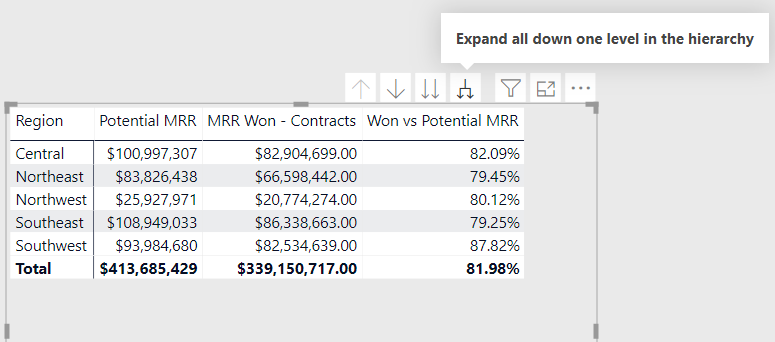](../media/matrix-hierarchy.png#lightbox)

### Task 11: Import a Custom Visual -- From AppSource

In this task, you will import the Bullet Chart Custom visual.

1. Select the [Ellipse menu] option from the Visualization pane to display the Custom visuals menu options.

    > [!div class="mx-imgBorder"]
    > [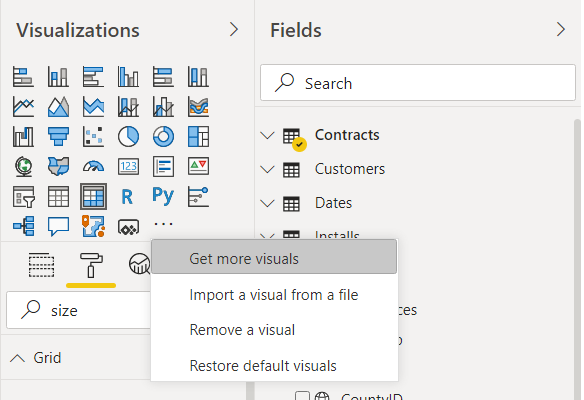](../media/get-more-visuals.png#lightbox)

1. Select the [Get more visuals] option.

    > [!NOTE]
    > Note: If you are already signed into Power BI, you do not need to sign in again. The next steps are [only] needed if you are not signed in to Power BI.

    > [!NOTE]
    > Note: If you do not have a Power BI sign in, you can use the [Import visual from a file] option on the [Ellipse menu]. Then navigate to the Lab 02B folder and select the "[BulletChart.BulletChart1443347686880.2.0.1.0.pbviz]" file.

1. Sign into Power BI by entering your [username].

    > [!div class="mx-imgBorder"]
    > [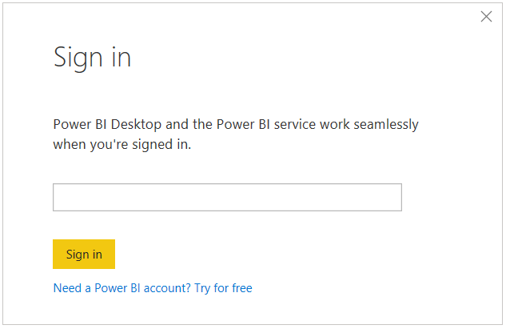](../media/power-bi-sign-in.png#lightbox)

1. Enter your Power BI [password].

    > [!div class="mx-imgBorder"]
    > [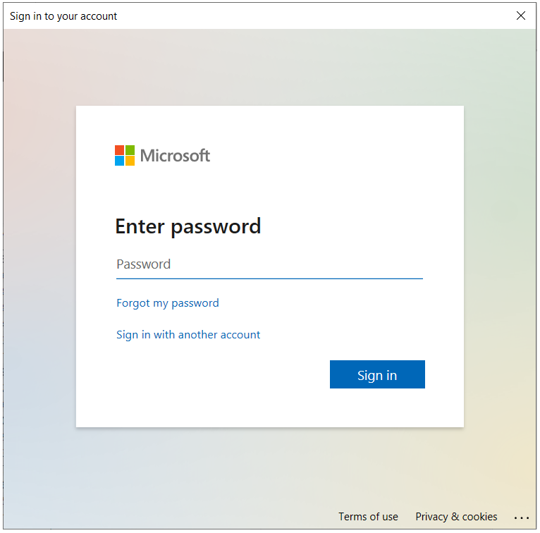](../media/power-bi-password.png#lightbox)

1. From the App store, type "[bullet]" in the search bar.

1. Select the [Add] button next to the [Bullet Chart] visual.

    > [!div class="mx-imgBorder"]
    > [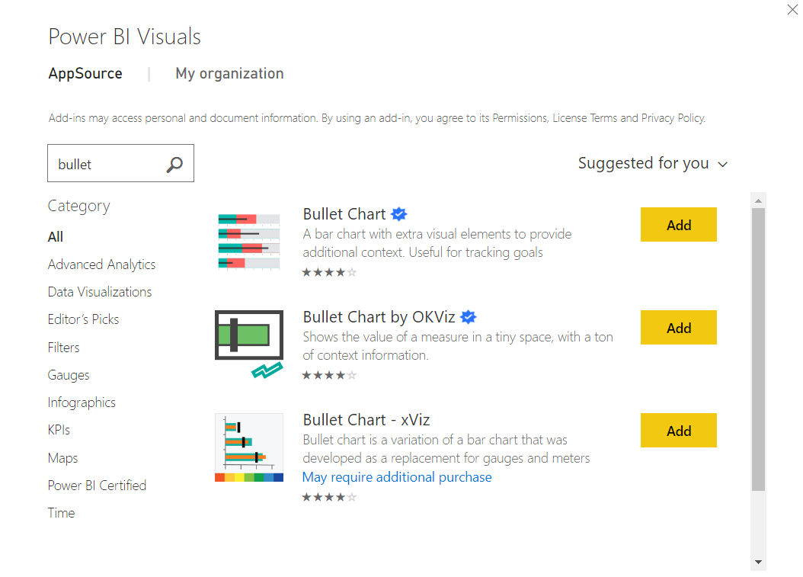](../media/add-bullet-chart.png#lightbox)

1. Select the [OK] button once imported.

1. You will now see the [Bullet Chart as a new visual] icon in the Visualization pane.

    > [!div class="mx-imgBorder"]
    > [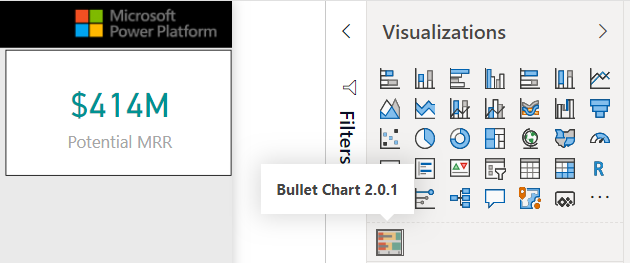](../media/bullet-chart-visual.png#lightbox)

    > [!NOTE]
    > If you do not have a Power BI sign in, you can use any browser and navigate to AppSource.com and download a Custom visual to use with the [Import visual from a file] option on the Visualization pane Ellipse menu.

### Task 12: Use the Bullet Chart Custom Visual

In this task, you will add the Bullet Chart Custom visual to the report page and add columns and measures from the Field pane to the visual.

1. Use the mouse to click into an [empty white space] on the report page.

1. Select the [Bullet Chart] Custom visual from the Visualization pane -- to get a new visual workspace.

1. Select and [drag] the new Bullet Chart Custom visual above the Matrix visual and [resize] to fit.

    > [!div class="mx-imgBorder"]
    > [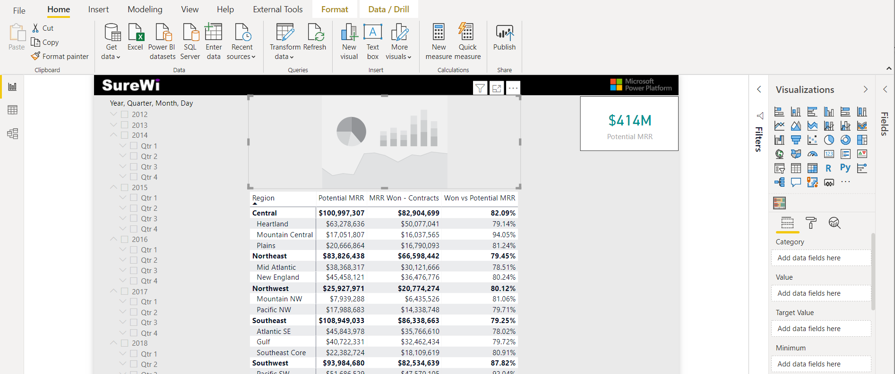](../media/drag-bullet-chart.png#lightbox)

1. Select the [Dates] table from the Fields pane and expand the fields to select the [\[YYYY-QQ\]] column from the Dates table and drag into the [Category] section.

1. Select the [Contracts] table from the Fields pane and expand the fields to select the [MRR Won -- Contracts] measure from the Quotes table and drag into the [Value] section.

1. Select the [Potential MRR] measure from the [Quotes] table and drag into the [Target] section.

    > [!NOTE]
    > You can also use the Field pane search bar to enter the name of a column or measure to quickly limit the Fields pane to find a column or measure.

    > [!div class="mx-imgBorder"]
    > [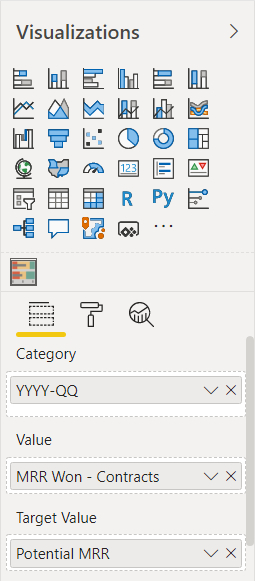](../media/field-pane-search-bar.png#lightbox)

### Task 13: Format the Bullet Chart Custom Visual

In this task, you will update the Format/Paint Roller properties on the Bullet Chart Custom visual to change the way the visual displays.

1. Select the [Format/Paint Roller icon] and expand the [Data values] properties.

    > [!div class="mx-imgBorder"]
    > 

1. Change the [Satisfaction %] to [60].

1. Change the [Good %] to [65].

    > [!div class="mx-imgBorder"]
    > [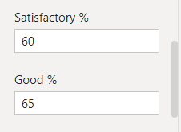](../media/good-percentage.png#lightbox)

1. Expand the [Axis properties] and turn it [off].

    > [!div class="mx-imgBorder"]
    > [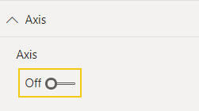](../media/axis-off.png#lightbox)

1. Expand the [Title properties] and change the Title [Font color] to [Black]. This will make the Title more noticeable.

    > [!div class="mx-imgBorder"]
    > [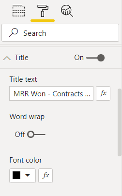](../media/font-color-black.png#lightbox)

1. Select the [Year value equal to 2017] on the [Slicer] visual to see the Bullet Chart Custom visual change and come to life!

    > [!div class="mx-imgBorder"]
    > [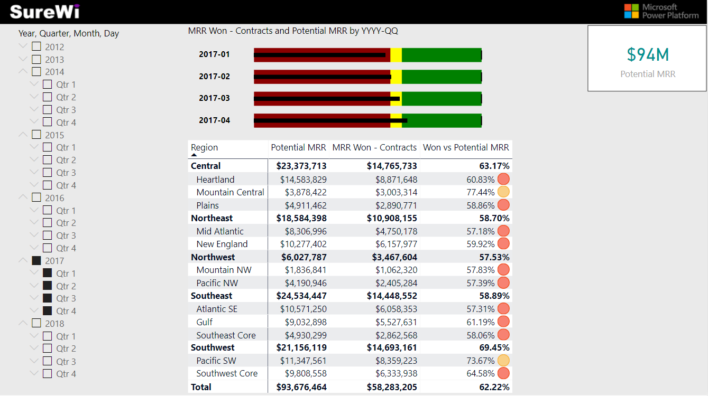](../media/summary-visuals.png#lightbox)

    > [!NOTE]
    > The Bullet Chart is a great Custom visual to show progress towards goals.

### Task 14: Change the Bullet Chart Custom Visual Sort

In this task, you will change the Bullet Chart Custom visual to sort ascending by [YYYY-QQ].

1. Click on [Ellipse menu] on the Bullet Chart Custom visual.

    > [!div class="mx-imgBorder"]
    > [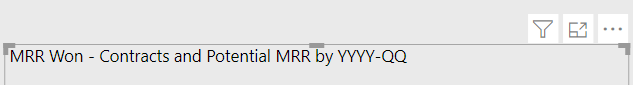](../media/ellipse-menu.png#lightbox)

1. Select [Sort By] then choose the [YYYY-QQ] column value[.]

1. Click on [Ellipse menu] on the Bullet Chart Custom visual again.

Now, select the [Sort ascending] option.

> [!div class="mx-imgBorder"]
> [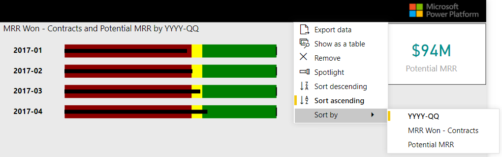](../media/sort-ascending.png#lightbox)

> [!NOTE]
> When changing the sort on a visual using the Ellipse menu, you first need to choose the column or measure to sort by. Then you need to select whether to Sort descending or Sort ascending. The final sort by selections are indicated by the yellow vertical bar.

## Exercise 5: Add Conditional Formatting to Matrix Visual (Icon)

In this exercise, you will apply conditional formatted to a Matrix visual.

### Task 1: Apply Conditional Formatting to the Matrix visual

In this task, you will apply conditional formatting to the Matrix visual.

1. Select the [Matrix visual] -- to make it active.

1. Select the [Fields] icon from the Visualization pane,

1. In the [Values] section, select the [drop down on the [Won vs Potential MRR] measure].

    > [!div class="mx-imgBorder"]
    > [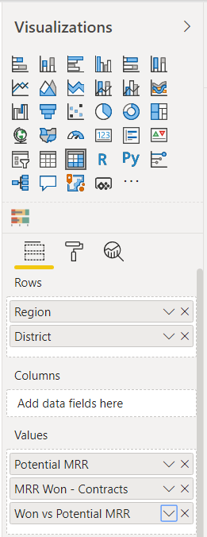](../media/values-drop-down.png#lightbox)

1. From the menu, select [Conditional Formatting] > [Icons].
    > [!div class="mx-imgBorder"]
    > [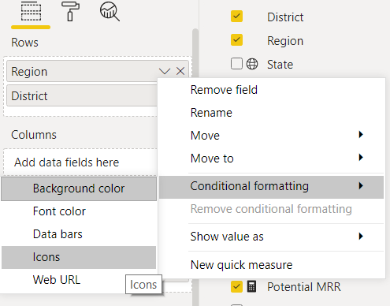](../media/conditional-formatting.png#lightbox)

1. Choose the [icons] option.

1. On the Icons -- Won vs Potential MRR window, change the [Icon layout] to [Right of data].

1. Then change the [Icon Style] to solid circles.

    > [!div class="mx-imgBorder"]
    > [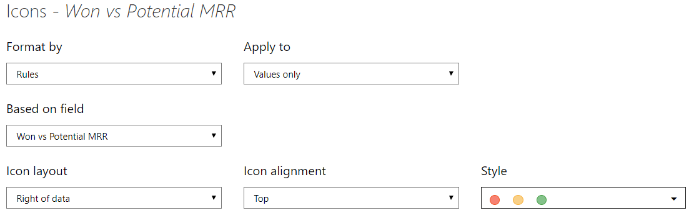](../media/icon-layout.png#lightbox)

1. Enter the Rules: [Is greater than or equal to 0 Number] and [is less than or equal to 0.7 Number].

1. Enter the Rules: [Is greater than or equal to 0.7 Number] and [is less than or equal to 0.8 Number].

1. Enter the Rules: [Is greater than or equal to 0.8 Number] and [is less than 1 Number].

1. Press [OK]

    > [!div class="mx-imgBorder"]
    > [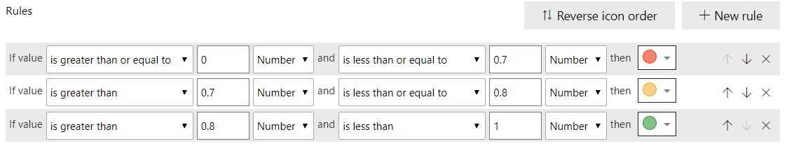](../media/rules-ok.png#lightbox)

## Summary

In this exercise, you started with an existing Power BI Desktop file that contained a partially completed data model, background, and theme. You completed the data model by creating MANY to ONE relationships from the Quotes Data table to the Customers, Dates, and Offices Lookup tables. Then you created measures on the Quotes table so that you could create a report page with Card, Slicer, Matrix, and a Bullet Chart Custom Visuals. You applied Conditional Formatting to the Matrix visual using Icons and Rules to show within progress towards revenue goal of each District with Office Regions.

> [!div class="mx-imgBorder"]
> 

## Reference Mapping learning to Power BI

| Concept                       | Power BI Desktop                                       | Power Pivot in Excel                                         |
|-------------------------------|--------------------------------------------------------|--------------------------------------------------------------|
| File Extension                | PBIX                                                   | XLSX                                                         |
| Edit Queries in Power Query   | Home > Transform data                                   | Queries & Connection > Data > Right-click > Edit             |
| Power Query Transformations   | Same                                                   | Same                                                         |
| Close Power Query Editor      | Home > Apply & Close                                   | Home > Close & Load To > Connection Only, Load To Data Model |
| View Data Model table data    | Data Navigation                                        | Power Pivot > Manage > Data View                             |
| View Data Model table diagram | Model Navigation                                       | Power Pivot > Manage > Diagram View                          |
| Create Measures               | New measure...                                         | Power Pivot > Measures > New Measure…                        |
| Create PivotTable             | Visualizations pane > Matrix                           | Insert > PivotTable > Use this workbook’s Data Model         |
| Apply Conditional Formatting  | Right-click > Conditional Formatting                   | Home > Conditional Formatting                                |
| Create Custom Visuals         | Visualizations pane > Ellipse menu > Get more visuals  | Not available in Excel                                       |
