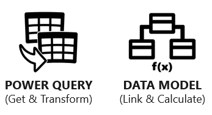

Microsoft Excel is an application that has been used since 1985 by over 750 million users worldwide. Currently, most reports and forecasts are built in Excel by using the existing capabilities that were developed decades ago.

Excel offers more functionality than you might have realized. In 2009, a new version of Excel was created to enable more modern analysis, provide interactive business intelligence, and build a data culture within organizations.

> [!VIDEO https://www.microsoft.com/videoplayer/embed/]

Excel has received two major upgrades:

-   **Power Query**, which is occasionally referred to as **Get & Transform** due to its home on the Excel data ribbon.

-   **Power Pivot**, which is also known as **Data model**.

> [!div class="mx-imgBorder"]
> 

Power Query and data model are two Excel technologies that have been offered since 2009, and they have evolved into Microsoft Power BI, which includes these two Excel technologies. However, Power BI differs in that it also offers you the ability to publish data models to the Power BI service cloud for creating and sharing reports and dashboards.

Collectively, Excel plus these two new technologies and Power BI are referred to as modern analytics. Adoption of these modern tools will save you time and generate smarter, more valuable results, providing real benefit to your company and your career.

Moreover, you can use these technologies in a self-service or enterprise capacity to improve the way that you work with data.

