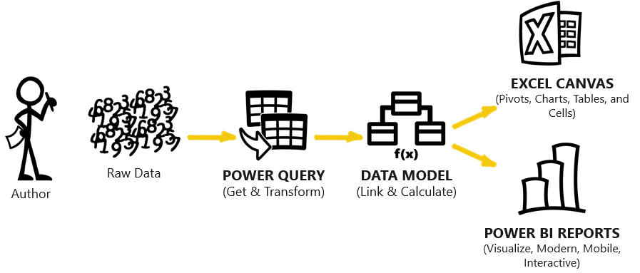

## Modern analytics - The ecosystem

Several references have been made to Microsoft Power BI-related tools and technologies. The following sections closely examine how these tools relate to each other. 

> [!div class="mx-imgBorder"]
> 

Every solution starts with raw data, which is messy.

With Power Query, you can grab, clean, and shape data for feeding into the data model. The **Data Model** feature "crunches" data into meaningful, insightful metrics and analytics, and it's used to explore data to drive informed business decisions and measure impact.

By using Power BI Desktop to create a data model and create reports, you can publish or share those dataset and report assets into Power BI service for consumption. Power BI reports have a modern reporting and visualization surface with support for customizing reports and a dashboard for mobile devices. You can also use the familiar Excel canvas as the reporting and visualization surface with the **Analyze In Excel** feature in Power BI, which includes enhanced functions to access the calculations that are performed by your data model.

This Modern analytics ecosystem allows data professionals to create a *single version of the truth* solution to empower self-service or to support enterprise scale business intelligence reporting and analysis.

