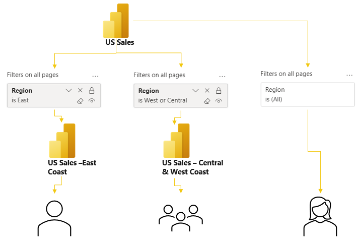
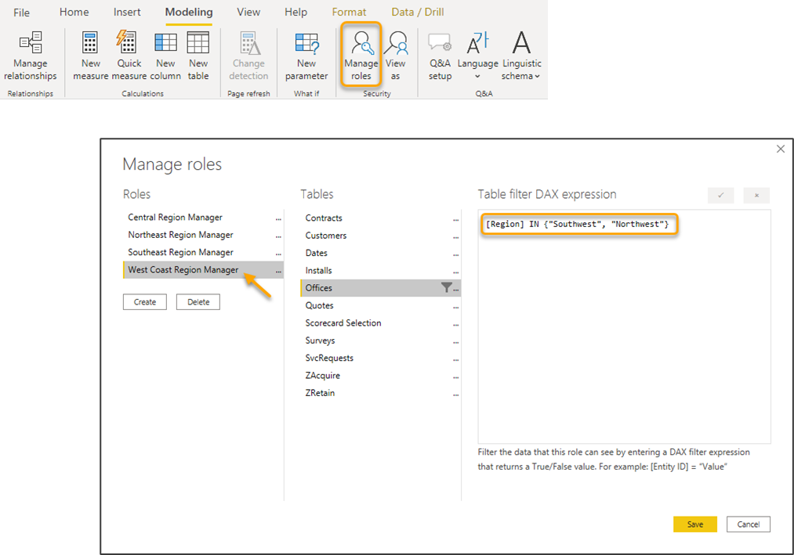
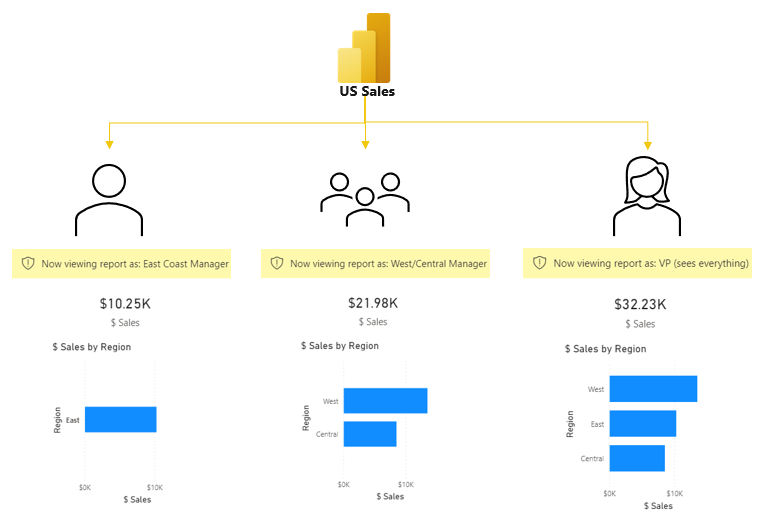

Data modelers can set up roles for individuals or groups to control the data that the report presents to them. Row-level security (RLS) ensures that users can focus on their specific area, and it allows for flexible report design so that one report can serve many users without inappropriate sharing of data. The following example shows what you can incorporate into a published Power BI report.

> [!div class="mx-imgBorder"]
> 

You can set up RLS in Power BI Desktop by using the **Manage Roles** feature on the **Modeling** tab. Typically, the role filters are applied to lookup tables by using the benefit of relationships. Roles dictate which data is shown to which people, and they provide business logic for filtering the data for users who belong to a group.

> [!div class="mx-imgBorder"]
> 

In this example, the West Coast Region Manager can view offices in the Southwest and Northwest regions.

This feature enables you to only maintain a single data model and a single set of roles. The following example shows the same bar chart and how it displays differently for each user based on RLS roles.

> [!div class="mx-imgBorder"]
> 

To test RLS, select the **View As** button for a report and then choose the role that you want to test. This feature will open the report from the perspective of that role and will allow you to preview how the report appears with row-level security applied.
