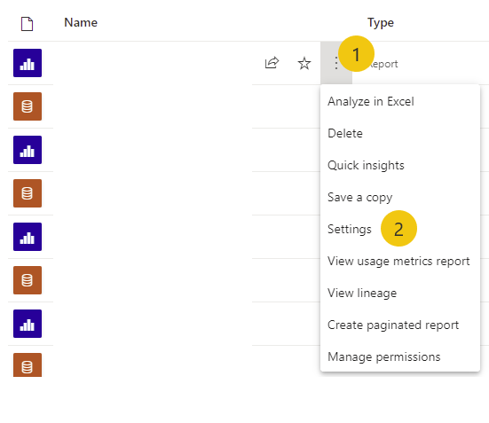
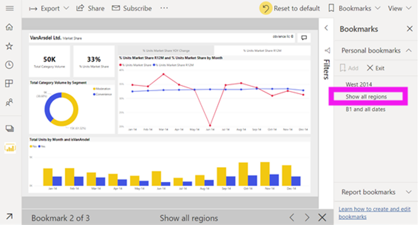

A person who uses a free Power BI account can only publish reports to **My workspace**, which is a private workspace that can't be shared with other users. Reports that are published to **My workspace** can't be accessed by other users except through a public web embed link.

-   To publish a report to any other workspace, the user needs a Power BI Pro or Power BI Premium license. For a user to view the report, they need to have a Power BI Pro license, or the report needs to be published to a Power BI Premium workspace.

-   To create scorecards with goals, the workspace needs to be a premium workspace. Premium workspaces can only be created by users with Power BI Premium.

-   Power BI Premium comes in two licensing forms: per user and per capacity.

## Share settings

You can share an individual report with specific people or with Microsoft Office 365 groups. The publisher needs to configure access rules by going into the **Settings** menu in the report in Power BI service.

> [!div class="mx-imgBorder"]
> 

The publisher can configure settings that enable report users to do any of the following activities:

-   Build new reports with the dataset.

-   Share a report with others.

-   Allow users to change filter types.

-   Allow users to add comments to the report.

## Comments

People can interact with each other within the report in Power BI service, such as creating comments on a page, specific visual, or dashboard tile. Commenting is similar to other documents across Office 365. Using \@mention will behave the same way and will send a notification to the person.

## Personal bookmarks

Bookmarks can be personalized, and the Power BI developer can also make bookmarks that everyone can use. This feature facilitates storytelling with the report. 

> [!div class="mx-imgBorder"]
> 

Set the filters/slicers the way that you want them and then select **Add Bookmark**. Select this bookmark later to automatically reset the page to that layout
