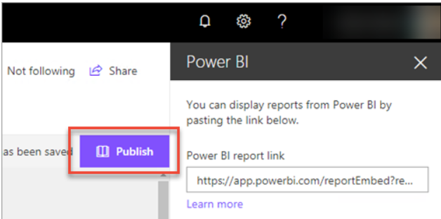
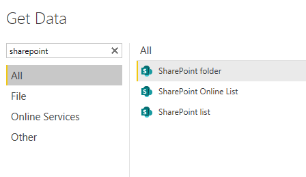

Once you've published a report to the Power BI service, you can embed interactive Power BI reports in SharePoint Online pages. From the Power BI service report: Use the **More Options** menu, select **Embed** > **SharePoint Online** to get the URL.

> [!div class="mx-imgBorder"]
> 

Then from SharePoint Online, add a **New** > **Site Page** > **Power BI** > **Add Report** and Paste URL.

> [!div class="mx-imgBorder"]
> 

## SharePoint Online search

SharePoint Online makes relevant reports easily accessible through its search function without knowing the workspace the report is saved to.

> [!div class="mx-imgBorder"]
> 

## SharePoint as a data source

Power BI has three standard connectors with SharePoint. You can connect to both SharePoint Online and on-premises SharePoint for Lists. SharePoint folder pulls all files included in the folder.

> [!div class="mx-imgBorder"]
> 

It's important to note when utilizing the SharePoint folder connector, the M language query uses SharePoint.Files(). This function can cause slow refresh speeds due to the site metadata that loads with it. Updating the formula to use SharePoint.Contents() instead can provide a large boost to query refresh speeds.
