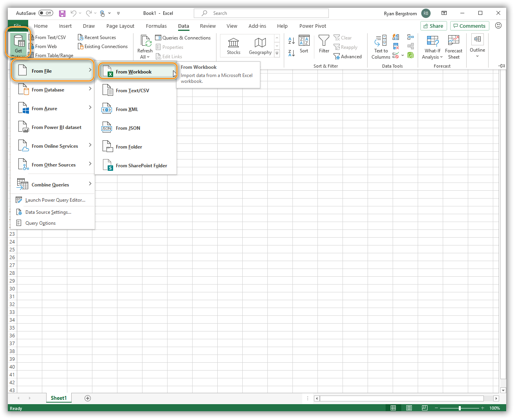
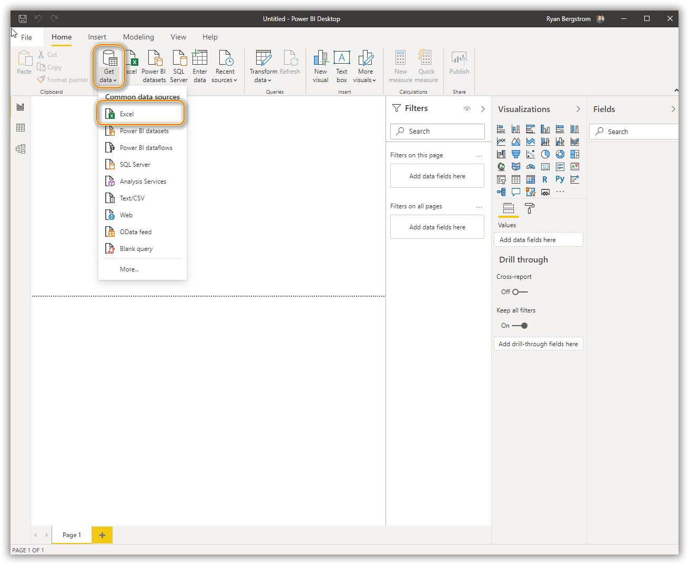
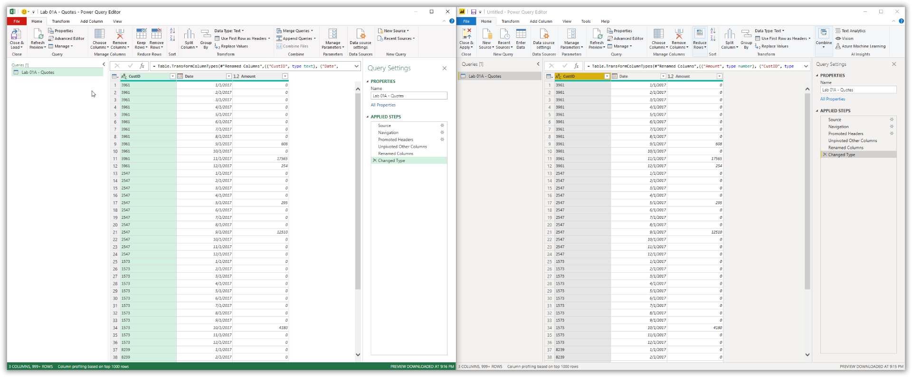

Few differences exist within Power Query between Excel and Power BI. The ribbon menu includes some differences, but the primary features are identical. The data connectors and transformations available within Excel's Power Query are also available with Power BI's Power Query. Power BI offers some advanced features such as Python and R support that Excel does not.

## Power Query import from Excel

Excel and Power BI follow a similar data import process.

### In Excel

On the **Data** tab of the Excel ribbon, use the **Get Data** dropdown list; select **From File**; select **From Workbook**. This will launch a Windows Explorer window. Navigate to the folder where the source data is stored and select the workbook.

> [!div class="mx-imgBorder"]
> 

### In Power BI

On the **Home** tab of the Power BI ribbon, use the **Get Data** dropdown list; select **From Excel**.

> [!div class="mx-imgBorder"]
> 

In both applications, you can accomplish the same outcome. You need to connect to your data sources wherever they might be.

## Power Query transform data

Most data sources need to be transformed once loaded into Excel or Power BI. You will make these transformations and edits using the Power Query editor in either Power BI or Excel. Creating solutions using Power Query is an iterative process because data sources or business questions change and evolve over time. In the following screenshot, you see the Power Query user interface (UI) in Excel (left) and in Power BI (right).

There are two options to launch the Power Query editor in Excel

-   You can use the **Data** tab of the ribbon; **Get Data** dropdown list button; Launch Power Query Editor.

-   You can open the Queries and Connections pane using the **Queries and Connections** button on the **Data** tab. Right-click and choose the Edit option to launch the Power Query Editor window.

To launch the Power Query editor in Power BI Desktop, select the **Transform data** button on the **Home** tab on the ribbon.

> [!div class="mx-imgBorder"]
> 

The Power Query editors are nearly identical. You still have all the same functionality regardless of which application launched the editor.

>[!NOTE]
>Power Query also exists in the Power BI Service as **dataflows** to empower reuse of clean and transformed data for enterprise solutioning.