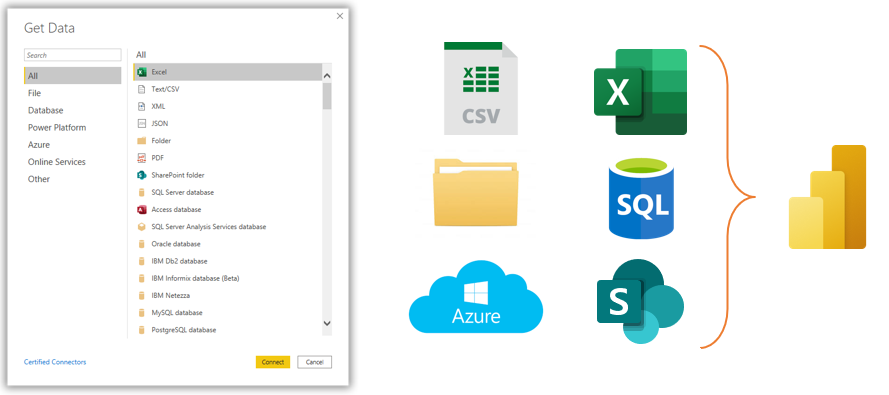
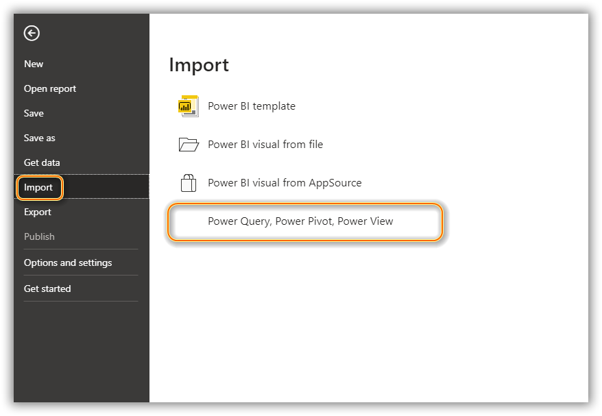
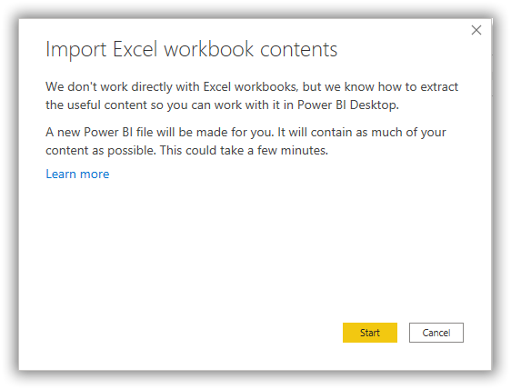
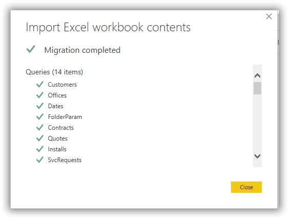

Power Query can connect to files, relational databases, data warehouses, line-of-business applications, SaaS providers, OLAP systems, cloud storage systems, web sources, social networks, and "big" data. In Power BI, click **Get Data** > **Search** > **Connect to your data**. Best practice is to create your data model in Power BI.
> [!div class="mx-imgBorder"]
> 

Modern analytics solutions that connect to data using Power Query do not require the data sources to exist in a single place. Connect directly to source systems (such as Microsoft Dynamics 365) or to database sources (like Microsoft SQL Server) or to individual Microsoft Excel files hosted on SharePoint. Power Query attempts to eliminate the repetitive and manual steps when connecting to and refreshing data sources.

In this demo (no audio), Power Query retrieves customer data from an Excel file, promotions data from a SQL server, and installation data from a SharePoint list.

> [!VIDEO https://www.microsoft.com/videoplayer/embed/RWMFRN]

1.  Connect to an Excel file to get customers data. Select the **Excel workbook** button on the **Home** tab of the ribbon. Browse to the desired workbook, select it, and select open. In the Navigator window, select the sheet and then select **Transform Data**.

1.  Connect to a SQL Server to collect promotions data. SQL Server data source connections require the SQL server name and user credentials to connect to a server or database. You may select the table(s) or view(s) needed for your data model. Third, connect to a SharePoint list to import installations data.

1.  In Power Query, the **Query Dependencies** button on the **View** tab shows you the queries in the model, the data sources for each of the queries, and the dependencies among queries.

## Importing from Excel and Power Query

If you have an existing Power Query or a data model in Excel, you can import the data model and queries into Power BI.

> [!NOTE]
> Once you have imported a data model from Excel to Power BI Desktop, you cannot export changes back to the Excel file; however, Excel can query, and access Power BI data models using the Power BI service, which includes many other benefits such as scheduled data model refreshes.

Power BI only imports the data model and any Power Queries. From the **File** menu in Power BI, go to the **Import** section and select **Power Query, Power Pivot, Power View**.

> [!div class="mx-imgBorder"]
> 

Browse to the Excel file with the data model and queries and select the open button. Select **Start** to import queries, relationships, calculated columns, measures, and KPIs. Power BI will display a migration report window (shown in the following screenshot) with a list of successfully imported objects.

> [!div class="mx-imgBorder"]
> 

> [!div class="mx-imgBorder"]
> 

