## Overview

The estimated time to complete this exercise is 20 minutes.

In this exercise, you will complete the following tasks:

1.  Import from Excel to Power BI Desktop: Customers & Quotes queries & tables
1.  Edit imported Queries to Include a Dates table
1.  Close Power Query & Load the Dates table to the Data Model

> [!NOTE]
> This exercise has been created based on the sales activities of the *fictitious* Wi-Fi company called SureWi which has been provided by [P3 Adaptive](https://p3adaptive.com/?azure-portal=true). The data is property of P3 Adaptive and has been shared with the purpose of demonstrating Excel and Power BI functionality with industry sample data. Any use of this data must include this attribution to P3 Adaptive. If you have not already, download and extract the lab files from https://aka.ms/modern-analytics-labs into your **C:\ANALYST-LABS** folder. 

## Exercise 1: Import from Excel to Power BI Desktop: Customers and quotes queries and tables

In this exercise, you will launch Power BI Desktop and import the Customers & Quotes queries and tables from Excel to Power BI Desktop.

### Task 1: Launch Power BI Desktop

In this task, you will launch Power BI Desktop and save the new PBIX file.

1.  Launch Power BI Desktop.
1.  If applicable, use the "x" in the upper right-hand corner to close the Welcome window.

### Task 2: Verify Settings

1.  In the Main Power BI Ribbon, navigate to **File** > **Options and settings** > **Options**.

1.  In the **Global** section, select **Data Load** and in the **Type Detection** section, validate the radio button option for **Detect column type and headers for unstructured sources according to each file's settings** is selected.

	> [!div class="mx-imgBorder"]
	> [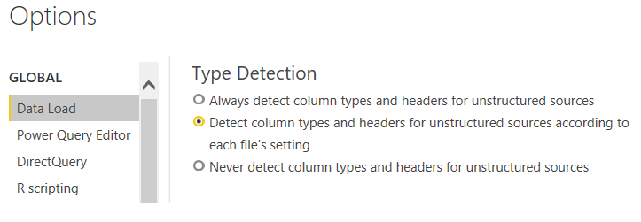](../media/options.png#lightbox)

### Task 3: Import Power Query, Power Pivot, Power View

In this task, you will navigate and open the starting XLSX file then start the import process.

1.  Select **File** > **Import** > **Power Query, Power Pivot, Power View**.

1.  Navigate to the **C:\ANALYST-LABS\Lab 02A** folder.

1.  Select the file **MAIAD Lab 02A - Start.xlsx** and choose **Open**.

1.  Select the **Start** button to begin the import.

1.  View the Import Excel workbook contents report.

1. Then select the **Close** button.

	> [!div class="mx-imgBorder"]
	> [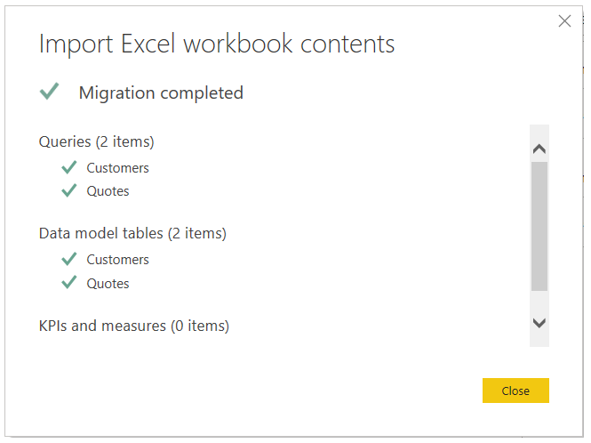](../media/import-excel.png#lightbox)

	> [!NOTE]
	> When importing from Excel to Power BI Desktop, it is a one-way transition. Any Queries, Data Model tables, KPIs and measures will be imported into Power BI Desktop. Any subsequent imports with the same file name will overwrite the existing PBIX.

1. Notice that the **Customers** and **Quotes** tables are available in the Fields list.

	> [!div class="mx-imgBorder"]
	> [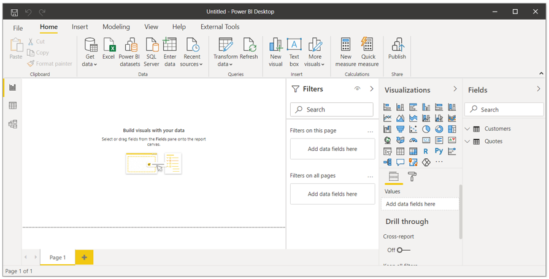](../media/field-list.png#lightbox)

### Task 4: Save the PBIX file

In this task, you will save the file with a new file name.

1. Select **File** > **Save as**.

1. Save the file as **MAIAD Lab 02A - Power BI Import - My Solution.pbix**.

	> [!div class="mx-imgBorder"]
	> [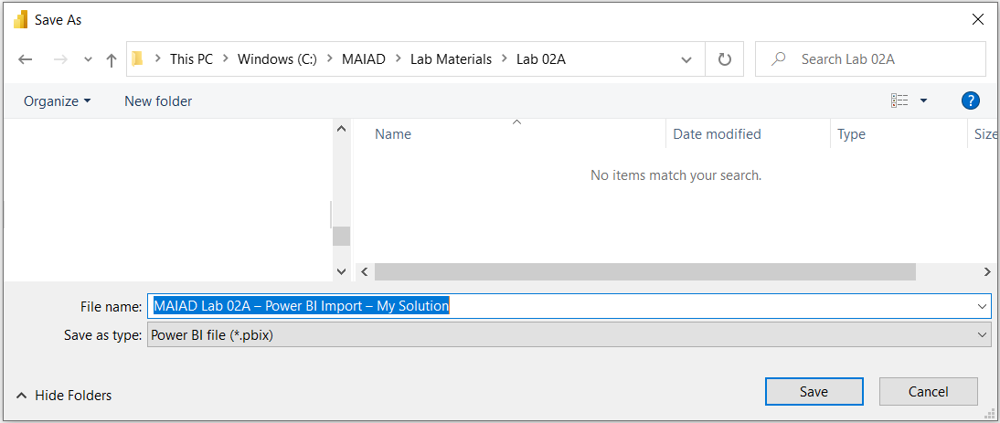](../media/save-file-name.png#lightbox)

## Exercise 2: Edit imported queries to Include a dates table

In this exercise, you will launch the Power Query Editor from BI Desktop and edit the imported Queries to add a new Dates query and table to the Data Model.

### Task 1: Launch Power Query from Power BI Desktop

In this task, you will launch Power Query from Power BI Desktop and edit the existing queries to add a new Dates table.

1. From the **Home** ribbon, select **Transform data** > **Transform data** option.

	> [!NOTE]
	> This will launch Power Query from Power BI Desktop. It looks very similar to Power Query in Excel and both the Customers and Quotes queries have been imported with their transformation.

	> [!div class="mx-imgBorder"]
	> [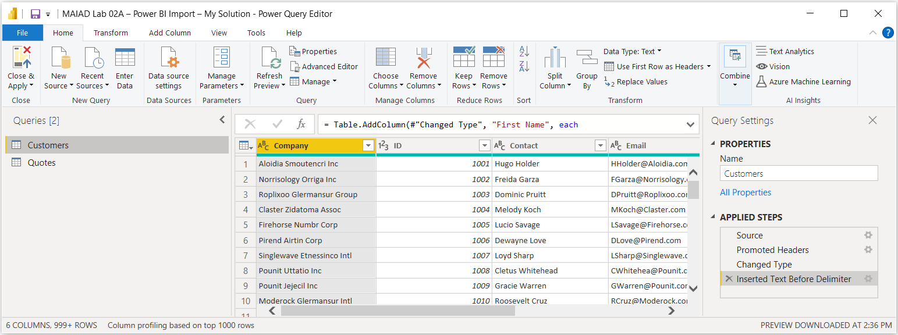](../media/queries.png#lightbox)

### Task 2: New Source - Add a dates table

In this task, you will add a Dates table to the existing Queries and Load the new query and table to the Data Model.

1. From the Power Query Editor **Home** ribbon, select **New Source** > **Text/CSV** option.

	> [!div class="mx-imgBorder"]
	> [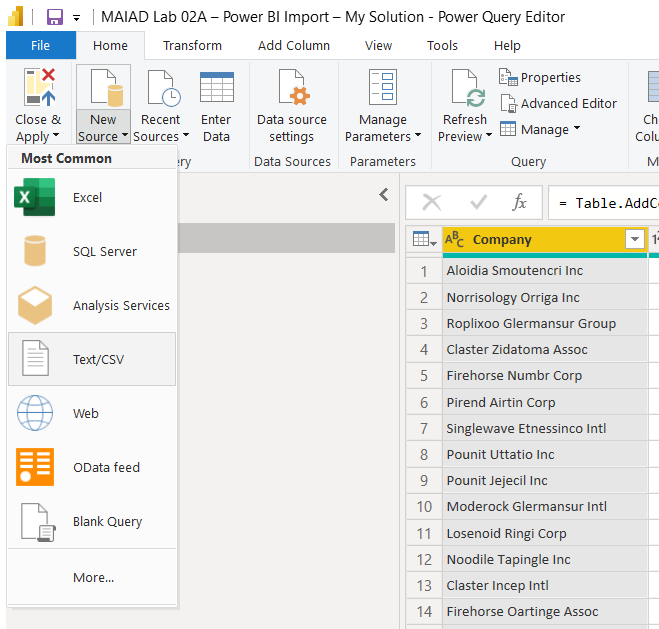](../media/text-cvs-option.png#lightbox)

1. Navigate to the **C:\ANALYST-LABS\Lab 02A** folder.

1. Select the file **MAIAD Lab 02A - Data Source - Dates.csv** and choose **Open**.

	> [!div class="mx-imgBorder"]
	> [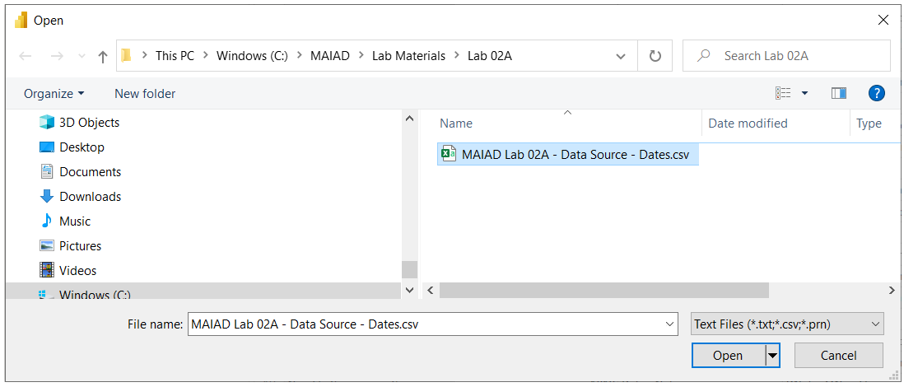](../media/open-data-source.png#lightbox)

1. Accept the default File Origin, Delimiter, and Data Type Detection options. Then select the **OK** button.

	> [!div class="mx-imgBorder"]
	> [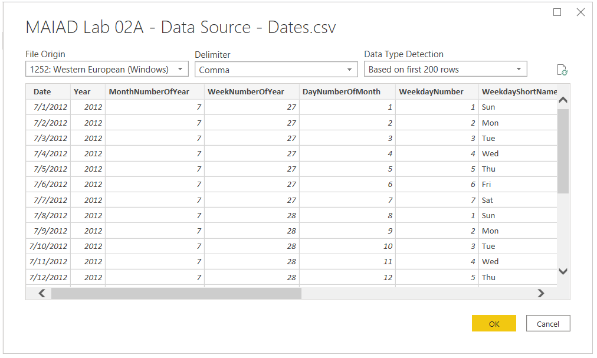](../media/power-query-editor-csv-file.png#lightbox)

### Task 3: Rename query

In this task, you will add a rename the Query to use a user-friendly noun name versus the default file name.

1. Double-click in the Queries Pane on **MAIAD Lab 02A - Data Source - Dates** to rename the default Query name.

	> [!div class="mx-imgBorder"]
	> [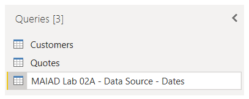](../media/queries-pane.png#lightbox)

1. Rename from **MAIAD Lab 02A - Data Source - Dates** to just **Dates**.

### Task 4: Perform a data type transformation

In this task, you will add a change the default data type for the \[Year\] column of the \#"Dates" query.

1. In the Preview area, click on the "123" data type icon of the \[Year\] column and change the data type from a Whole Number to **Text**.

	> [!NOTE]
	> Column data types drive different functionality in Power BI, for example, a Whole Number will default to aggregate. It would not make sense that we would ever SUM the \[Year\] column so by changing to a Text data type, we prevent this default aggregation in Power BI.

	> [!div class="mx-imgBorder"]
	> [![Screenshot of Power Query Editor with Dates table and the \[Year\] column data types displayed.](../media/dates-year.png)](../media/dates-year.png#lightbox)

1. Select the **Replace current** button from the Change Column Type window.

	> [!NOTE]
	> Since we are on the Change Type in the Applied Steps, this message confirms that we want to change the \[Year\] to the Text data type in this existing step. The Add new step would change the \[Year\] to the Text data type but add as a NEW step in the Applied Steps.

	> [!div class="mx-imgBorder"]
	> [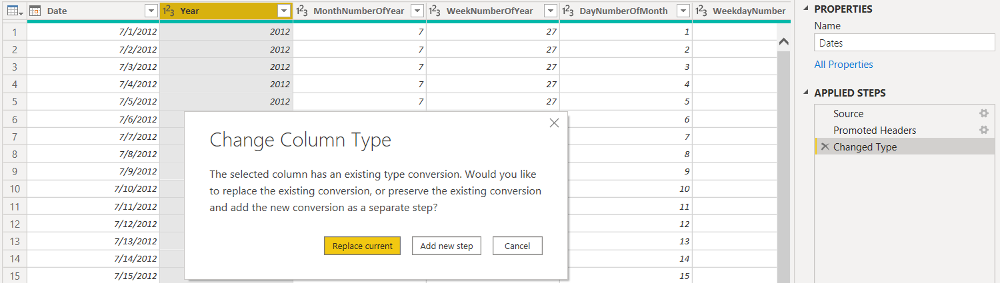](../media/column-type.png#lightbox)

## Exercise 3: Close Power Query & load dates table to the data model

In this exercise, you will Close & Apply the Power Query Editor changes and Load the Dates table to the Data Model.

### Task 1: Close & Apply

In this task, you will use the Close & Apply button to save the Dates query in the Power Query Editor and Load the Dates table to the Data Model.

- From the Power Query Editor **Home** ribbon, select **Close & Apply** button > **Close & Apply** option to load the new Dates table to the Data Model.

	> [!div class="mx-imgBorder"]
	> [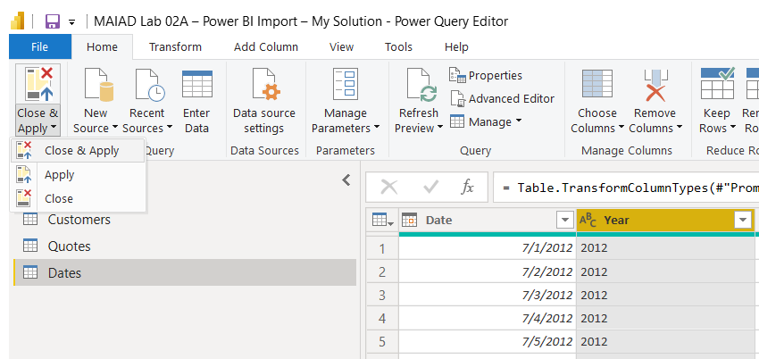](../media/close-apply.png#lightbox)

### Task 2: View the Dates table in the Fields list

In this task, you will observe that the new Dates table is now also available in the Fields list.

- From the Fields list, notice the new **Dates** table is now available.

	> [!div class="mx-imgBorder"]
	> [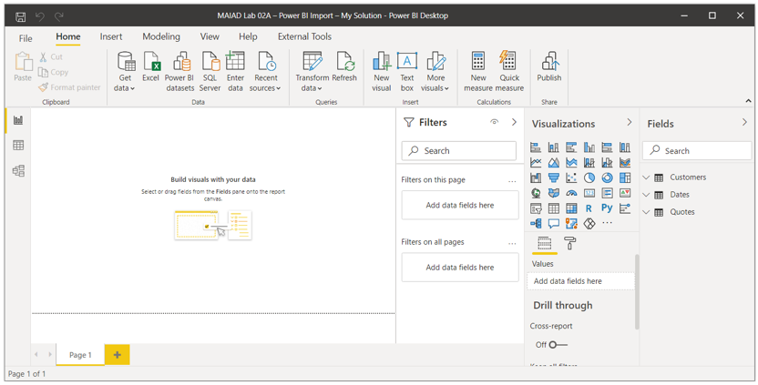](../media/customers-dates-quotes.png#lightbox)

In this lab, you started with an existing Excel file that contained Power Query data connections to an Excel and CSV file from the previous Lab. You launched the Power BI Desktop application and imported the existing Power Connections from Excel to Power BI Desktop and saved as a PBIX file. Then you used the Transform data button to launch the Power Query Editor from within Power BI Desktop to load a new Dates query from a CSV data source and used the Preview area to perform a data type transformation of the \[Year\] column. Lastly, you used the Closed & Apply option to add the Dates query as a new table to the Data Model.