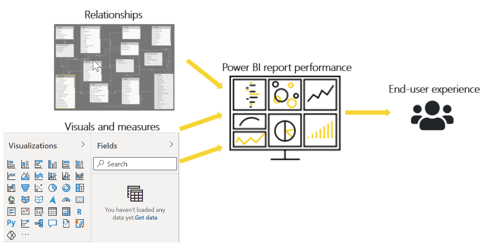
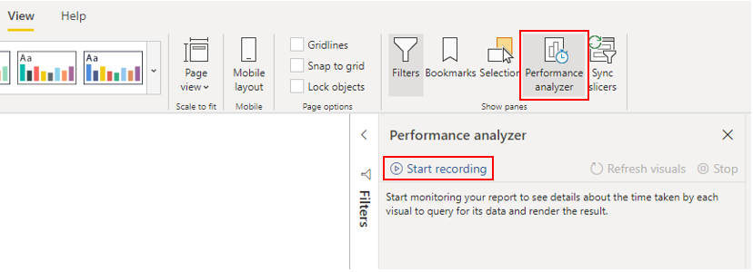
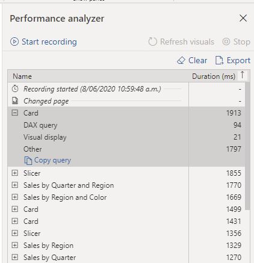
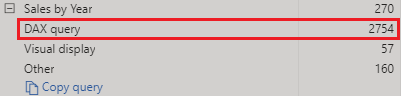
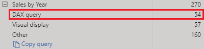
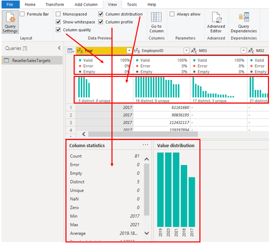
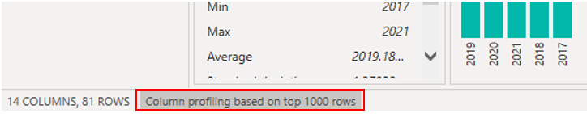
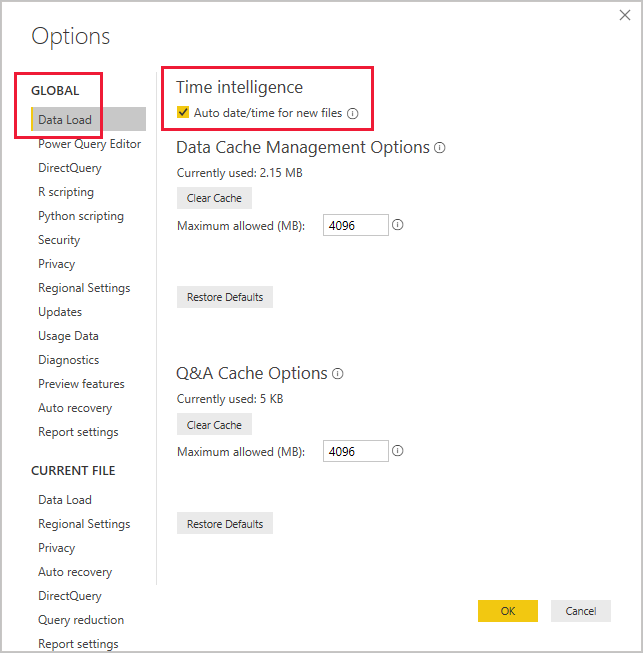

If your data model has multiple tables, complex relationships, intricate calculations, multiple visuals, and redundant data, a potential exists for poor report performance. The poor performance of a report leads to a negative user experience.

> [!div class="mx-imgBorder"]
> [](../media/2-graphic-factors-impacting-performance-c.png#lightbox)

To optimize performance, you must first identify where the problem is coming from; in other words, find out which elements of your report and data model are causing the performance issues. Afterward, you can take action to resolve those issues and, therefore, improve performance.

## Identify report performance bottlenecks

To achieve optimal performance in your reports, you need to create an efficient data model that has fast running queries and measures. When you have a good foundation, you can improve the model further by analyzing the query plans and dependencies and then making changes to further optimize performance.

You should review the measures and queries in your data model to ensure that you are using the most efficient way to get the results that you want. Your starting point should be to identify bottlenecks that exist in the code. When you identify the slowest query in the data model, you can focus on the biggest bottleneck first and establish a priority list to work through the other issues.

### Analyze performance

You can use **Performance analyzer** in Power BI Desktop to help you find out how each of your report elements are performing when users interact with them. For example, you can determine how long it takes for a particular visual to refresh when it is initiated by a user interaction. **Performance analyzer** will help you identify the elements that are contributing to your performance issues, which can be useful during troubleshooting.

Before you run **Performance analyzer**, to ensure you get the most accurate results in your analysis (test), make sure that you start with a clear visual cache and a clear data engine cache.

-   **Visual cache** - When you load a visual, you can't clear this visual cache without closing Power BI Desktop and opening it again. To avoid any caching in play, you need to start your analysis with a clean visual cache.

    To ensure that you have a clear visual cache, add a blank page to your Power BI Desktop (.pbix) file and then, with that page selected, save and close the file. Reopen the Power BI Desktop (.pbix) file that you want to analyze. It will open on the blank page.

-   **Data engine cache** - When a query is run, the results are cached, so the results of your analysis will be misleading. You need to clear the data cache before rerunning the visual.

    To clear the data cache, you can either restart Power BI Desktop or connect DAX Studio to the data model and then call Clear Cache.

When you have cleared the caches and opened the Power BI Desktop file on the blank page, go to the **View** tab and select the **Performance analyzer** option.

To begin the analysis process, select **Start recording**, select the page of the report that you want to analyze, and interact with the elements of the report that you want to measure. You will see the results of your interactions display in the **Performance analyzer** pane as you work. When you are finished, select the **Stop** button.

> [!div class="mx-imgBorder"]
> [](../media/2-performance-analyzer-overview-ssm.png#lightbox)

For more detailed information, see [Use Performance Analyzer to examine report element performance](https://docs.microsoft.com/power-bi/create-reports/desktop-performance-analyzer/?azure-portal=true).

### Review results

You can review the results of your performance test in the **Performance analyzer** pane. To review the tasks in order of duration, longest to shortest, right-click the **Sort** icon next to the **Duration (ms)** column header, and then select **Total time** in **Descending** order.

> [!div class="mx-imgBorder"]
> [](../media/2-sort-results-performance-analyzer-ss.png#lightbox)

The log information for each visual shows how much time it took (duration) to complete the following categories of tasks:

-   **DAX query** - The time it took for the visual to send the query, along with the time it took Analysis Services to return the results.

-   **Visual display** - The time it took for the visual to render on the screen, including the time required to retrieve web images or geocoding.

-   **Other** - The time it took the visual to prepare queries, wait for other visuals to complete, or perform other background processing tasks. If this category displays a long duration, the only real way to reduce this duration is to optimize DAX queries for other visuals, or reduce the number of visuals in the report.

> [!div class="mx-imgBorder"]
> [](../media/2-categories-performance-analyze-results-ss.png#lightbox)

The results of the analysis test help you to understand the behavior of your data model and identify the elements that you need to optimize. You can compare the duration of each element in the report and identify the elements that have a long duration. You should focus on those elements and investigate why it takes them so long to load on the report page.

To analyze your queries in more detail, you can use DAX Studio, which is a free, open-source tool that is provided by another service.

## Resolve issues and optimize performance

The results of your analysis will identify areas for improvement and opportunities for performance optimization. You might find that you need to carry out improvements to the visuals, the DAX query, or other elements in your data model. The following information provides guidance on what to look for and the changes that you can make.

### Visuals

If you identify visuals as the bottleneck leading to poor performance, you should find a way to improve performance with minimal impact to user experience.

Consider the number of visuals on the report page; less visuals means better performance. Ask yourself if a visual is really necessary and if it adds value to the end user. If the answer is no, you should remove that visual. Rather than using multiple visuals on the page, consider other ways to provide additional details, such as drill-through pages and report page tooltips.

Examine the number of fields in each visual. The more visuals you have on the report, the higher chance for performance issues. In addition, the more visuals, the more the report can appear crowded and lose clarity. The upper limit for visuals is 100 fields (measures or columns), so a visual with more than 100 fields will be slow to load. Ask yourself if you really need all of this data in a visual. You might find that you can reduce the number of fields that you currently use.

### DAX query

When you examine the results in the **Performance analyzer** pane, you can see how long it took the Power BI Desktop engine to evaluate each query (in milliseconds). A good starting point is any DAX query that is taking longer than 120 milliseconds. In this example, you identify one particular query that has a large duration time.

> [!div class="mx-imgBorder"]
> [](../media/2-performance-analyzer-large-duration-measures-ssm.png#lightbox)

**Performance analyzer** highlights potential issues but does not tell you what needs to be done to improve them. You might want to conduct further investigation into why this measure takes so long to process. You can use DAX Studio to investigate your queries in more detail.

For example, select **Copy Query** to copy the calculation formula onto the clipboard, then paste it into Dax Studio. You can then review the calculation step in more detail. In this example, you are trying to count the total number of products with order quantities greater than or equal to five.

```
Count Customers =
CALCULATE (
    DISTINCTCOUNT ( Order[ProductID] ),
    FILTER ( Order, Order[OrderQty] >= 5 )
)
```

After analyzing the query, you can use your own knowledge and experience to identify where the performance issues are. You can also try using different DAX functions to see if they improve performance. In the following example, the FILTER function was replaced with the KEEPFILTER function. When the test was run again in **Performance analyzer**, the duration was shorter as a result of the KEEPFILTER function.

```
Count Customers =
CALCULATE (
    DISTINCTCOUNT ( Order[ProductID] ),
    KEEPFILTERS (Order[OrderQty] >= 5 )
)
```

In this case, you can replace the FILTER function with the KEEPFILTER function to significantly reduce the evaluation duration time for this query. When you make this change, to check whether the duration time has improved or not, clear the data cache and then rerun the **Performance analyzer** process.

> [!div class="mx-imgBorder"]
> [](../media/2-performance-analyzer-small-duration-measures-ssm.png#lightbox)

### Data model

If the duration of measures and visuals are displaying low values (in other words they have a short duration time), they are not the reason for the performance issues. Instead, if the DAX query is displaying a high duration value, it is likely that a measure is written poorly or an issue has occurred with the data model. The issue might be caused by the relationships, columns, or metadata in your model, or it could be the status of the **Auto date/time** option, as explained in the following section.

### Relationships

You should review the relationships between your tables to ensure that you have established the correct relationships. Check that relationship cardinality properties are correctly configured. For example, a one-side column that contains unique values might be incorrectly configured as a many-side column. You will learn more about how cardinality affects performance later in this module.

### Columns

It is best practice to not import columns of data that you do not need. To avoid deleting columns in Power Query Editor, you should try to deal with them at the source when loading data into Power BI Desktop. However, if it is impossible to remove redundant columns from the source query or the data has already been imported in its raw state, you can always use Power Query Editor to examine each column. Ask yourself if you really need each column and try to identify the benefit that each one adds to your data model. If you find that a column adds no value, you should remove it from your data model. For example, suppose that you have an ID column with thousands of unique rows. You know that you won't use this particular column in a relationship, so it will not be used in a report. Therefore, you should consider this column as unnecessary and admit that it is wasting space in your data model.

When you remove an unnecessary column, you will reduce the size of the data model which, in turn, results in a smaller file size and faster refresh time. Also, because the dataset contains only relevant data, the overall report performance will be improved.

For more information, see [Data reduction techniques for Import modeling](https://docs.microsoft.com/power-bi/guidance/import-modeling-data-reduction/?azure-portal=true).

### Metadata

Metadata is information about other data. Power BI metadata contains information on your data model, such as the name, data type and format of each of the columns, the schema of the database, the report design, when the file was last modified, the data refresh rates, and much more.

When you load data into Power BI Desktop, it is good practice to analyze the corresponding metadata so you can identify any inconsistences with your dataset and normalize the data before you start to build reports. Running analysis on your metadata will improve data model performance because, while analyzing your metadata, you will identify unnecessary columns, errors within your data, incorrect data types, the volume of data being loaded (large datasets, including transactional or historic data, will take longer to load), and much more.

You can use Power Query Editor in Power BI Desktop to examine the columns, rows, and values of the raw data. You can then use the available tools, such as those highlighted in the following screenshot, to make the necessary changes.

> [!div class="mx-imgBorder"]
> [](../media/2-query-editor-home-tab-ssm.png#lightbox)

The Power Query options include:

-   **Unnecessary columns** - Evaluates the need for each column. If one or more columns will not be used in the report and are therefore unnecessary, you should remove them by using the **Remove Columns** option on the **Home** tab.

-   **Unnecessary rows** - Checks the first few rows in the dataset to see if they are empty or if they contain data that you do not need in your reports; if so, it removes those rows by using the **Remove Top Rows** option on the **Home** tab.

-   **Data type** - Evaluates the column data types to ensure that each one is incorrect. If you identify a data type that is incorrect, change it by selecting the column, selecting **Data Type** on the **Transform** tab, and then selecting the correct data type from the list.

-   **Query names** - Examines the query (table) names in the **Queries** pane. Just like you did for column header names, you should change uncommon or unhelpful query names to names that are more obvious or names that the user is more familiar with. You can rename a query by right-clicking that query, selecting **Rename**, editing the name as required, and then pressing **Enter**.

-   **Column details** - Power Query Editor has the following three data preview options that you can use to analyze the metadata that is associated with your columns. You can find these options on the **View** tab, as illustrated in the following screenshot.

    -   **Column quality** - Determines what percentage of items in the column are valid, have errors, or are empty. If the Valid percentage is not 100, you should investigate the reason, correct the errors, and populate empty values.

    -   **Column distribution** - Identifies how many distinct items you have and how many are unique. This information is useful when you want to identify the cardinality of a column. You will investigate this further later in this module.

    -   **Column profile** - Shows more statistics for the column and a chart showing the distribution of the unique items.

> [!div class="mx-imgBorder"]
> [](../media/2-data-preview-column-profile-options-ssm.png#lightbox)

> [!NOTE]
> If you are reviewing a large dataset with more than 1,000 rows, and you want to analyze that whole dataset, you need to change the default option at the bottom of the window. Select **Column profiling based on top 1000 rows** **>** **Column profiling based on entire data set**.

> [!div class="mx-imgBorder"]
> [](../media/2-column-profile-rows-ssm.png#lightbox)

Other metadata that you should consider is the information about the data model as a whole, such as the file size and data refresh rates. You can find this metadata in the associated Power BI Desktop (.pbix) file. The data that you load into Power BI Desktop is compressed and stored to the disk by the VertiPaq storage engine. The size of your data model has a direct impact on its performance; a smaller sized data model uses less resources (memory) and achieves faster data refresh, calculations, and rendering of visuals in reports.

### Auto date/time feature

Another item to consider when optimizing performance is the **Auto date/time** option in Power BI Desktop. By default, this feature is enabled globally, which means that Power BI Desktop automatically creates a hidden calculated table for each date column, provided that certain conditions are met. The new, hidden tables are in addition to the tables that you already have in your dataset.

The **Auto date/time** option allows you to work with time intelligence when filtering, grouping, and drilling down through calendar time periods. We recommend that you keep the **Auto date/time** option enabled only when you work with calendar time periods and when you have simplistic model requirements in relation to time.

If your data source already defines a date dimension table, that table should be used to consistently define time within your organization, and you should disable the global **Auto date/time** option. Disabling this option can lower the size of your data model and reduce the refresh time.

You can enable/disable this **Auto date/time** option globally so that it applies to all of your Power BI Desktop files, or you can enable/disable the option for the current file so that it applies to an individual file only.

To enable/disable this **Auto date/time** option, go to **File** **>** **Options and settings** **>** **Options**, and then select either the **Global** or **Current File** page. On either page, select **Data Load** and then, in the **Time Intelligence** section, select or clear the check box as required.

> [!div class="mx-imgBorder"]
> [](../media/2-auto-date-time-configure-global-options-ssm.png#lightbox)

For an overview and general introduction to the **Auto date/time** feature, see [Apply auto date/time in Power BI Desktop](https://docs.microsoft.com/power-bi/transform-model/desktop-auto-date-time/?azure-portal=true).
