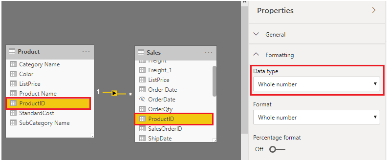

Cardinality is a term that is used to describe the uniqueness of the values in a column. Cardinality is also used in the context of the relationships between two tables, where it describes the direction of the relationship.

## Identify cardinality levels in columns

Previously, when you used Power Query Editor to analyze the metadata, the **Column distribution** option on the **View** tab displayed statistics on how many distinct and unique items were in each column in the data.

-   **Distinct values count** - The total number of different values found in a given column.

-   **Unique values count** - The total number of values that only appear once in a given column.

> [!div class="mx-imgBorder"]
> 

A column that has a lot of repeated values in its range (distinct count is high) will have a low level of cardinality. Conversely, a column that has a lot of unique values in its range (unique count is high) will have a high level of cardinality.

Lower cardinality leads to more optimized performance, so you might need to reduce the number of high cardinally columns in your dataset.

## Reduce relationship cardinality

When you import multiple tables, it is possible that you'll do some analysis by using data from all those tables. Relationships between those tables are necessary to accurately calculate results and display the correct information in your reports. Power BI Desktop helps make creating those relationships easier. In fact, in most cases, you won't have to do anything, the autodetect feature does it for you. However, you might occasionally have to create relationships or need to make changes to a relationship. Regardless, it's important to understand relationships in Power BI Desktop and how to create and edit them.

When you create or edit a relationship, you can configure additional options. By default, Power BI Desktop automatically configures additional options based on its best guess, which can be different for each relationship based on the data in the columns.

The relationships can have different cardinality. Cardinality is the direction of the relationship, and each model relationship must be defined with a cardinality type. The cardinality options in Power BI are:

-   **Many-to-one (*:1)** - This relationship is the most common, default type. It means that the column in one table can have more than one instance of a value, and the other related table, often known as the lookup table, has only one instance of a value.

-   **One-to-one (1:1)** - In this relationship type, the column in one table has only one instance of a particular value, and the other related table has only one instance of a particular value.

-   **One-to-many (1:*)** - In this relationship type, the column in one table has only one instance of a particular value, and the other related table can have more than one instance of a value.

-   **Many-to-many (:)** - With composite models, you can establish a many-to-many relationship between tables, which removes requirements for unique values in tables. It also removes previous workarounds, such as introducing new tables only to establish relationships.

During development, you will be creating and editing relationships in your model, so when you are building new relationships in your model, regardless of what cardinality you have chosen, always ensure that both of the columns that you are using to participate in a relationship are sharing the same data type. Your model will never work if you try to build a relationship between two columns, where one column has a text data type and another column has an integer data type.

In the following example, the **ProductID** field has the data type **Whole number** in the Product and Sales tables. The columns with data type **Integer** perform better than columns with data type **Text**.

> [!div class="mx-imgBorder"]
> 

## Improve performance by reducing cardinality levels

Power BI Desktop offers different techniques that you can use to help reduce the data that is loaded into data models, such as summarization. Reducing the data that is loaded into your model will improve the relationship cardinality of the report. For this reason, it is important that you strive to minimize the data that will be loaded into your models. This case is especially true for large models, or models that you anticipate will grow to become large over time.

Perhaps the most effective technique to reduce a model size is to use a summary table from the data source. Where a detail table might contain every transaction, a summary table would contain one record per day, per week, or per month. It might be an average of all of the transactions per day, for instance.

For example, a source sales fact table stores one row for each order line. Significant data reduction could be achieved by summarizing all sales metrics if you group by date, customer, and product, and individual transaction detail is not needed.

Consider, then, that an even more significant data reduction could be achieved by grouping by date at month level. It could achieve a possible 99 percent reduction in model size; but, reporting at day level or an individual order level is no longer possible. Deciding to summarize fact-type data will always involve a tradeoff with the detail of your data. A disadvantage is that you may lose the ability to drill into data because the detail no longer exists. This tradeoff could be mitigated by using a mixed model design.

In Power BI Desktop, a Mixed mode design produces a composite model. Essentially, it allows you to determine a storage mode for each table. Therefore, each table can have its **Storage Mode** property set as **Import** or **DirectQuery**.

An effective technique to reduce the model size is to set the **Storage Mode** property for larger fact-type tables to **DirectQuery**. This design approach can work well in conjunction with techniques that are used to summarize your data. For example, the summarized sales data could be used to achieve high performance "summary" reporting. A drill-through page could be created to display granular sales for specific (and narrow) filter context, displaying all in-context sales orders. The drill-through page would include visuals based on a DirectQuery table to retrieve the sales order data (sales order details). Storage mode is discussed later in this module in the section about aggregate tables.

For more information, see [Data reduction techniques for Import modeling](https://docs.microsoft.com/power-bi/guidance/import-modeling-data-reduction#group-by-and-summarize/?azure-portal=true).

