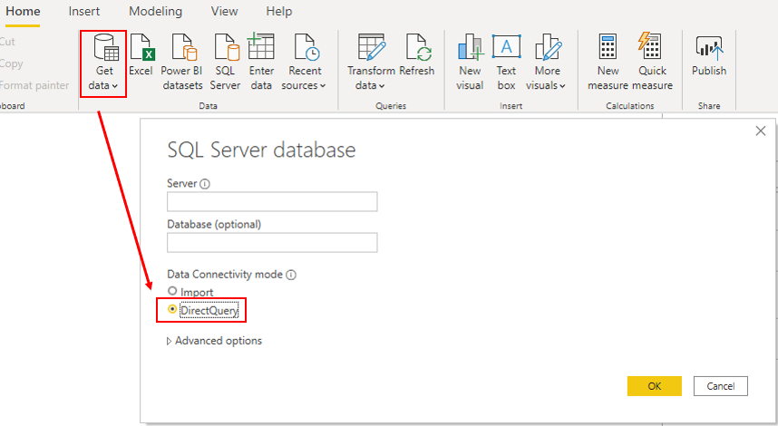

DirectQuery is one way to get data into Power BI Desktop. The DirectQuery method involves connecting directly to data in its source repository from within Power BI Desktop. It is an alternative to importing data into Power BI Desktop.

> [!div class="mx-imgBorder"]
> 

When you use the DirectQuery method, the overall user experience depends heavily on the performance of the underlying data source. Slow query response times will lead to a negative user experience and, in the worst-case scenarios, queries might time out. Also, the number of users who are opening the reports at any one time will impact the load that is placed on the data source. For example, if your report has 20 visuals in it and 10 people are using the report, 200 queries or more will exist on the data source because each visual will issue one or more queries.

Unfortunately, the performance of your Power BI model will not only be impacted by the performance of the underlying data source, but also by other uncontrollable factors, such as:

-   Network latency; faster networks return data quicker.

-   The performance of the data source's server and how many other workloads are on that server. For example, consider the implications of a server refresh taking place while hundreds of people are using the same server for different reasons.

Therefore, using DirectQuery poses a risk to the quality of your model's performance. To optimize performance in this situation, you need to have control over, or access to, the source database.

For more detailed information, see [DirectQuery model guidance in Power BI Desktop](https://docs.microsoft.com/power-bi/guidance/directquery-model-guidance/?azure-portal=true).

## Implications of using DirectQuery

It is best practice to import data into Power BI Desktop, but your organization might need to use the DirectQuery data connectivity mode because of one of the following reasons (benefits of DirectQuery):

-   It is suitable in cases where data changes frequently and near real-time reporting is required.

-   It can handle large data without the need to pre-aggregate.

-   It applies data sovereignty restrictions to comply with legal requirements.

-   It can be used with a multidimensional data source that contains measures such as SAP Business Warehouse (BW).

If your organization needs to use DirectQuery, you should clearly understand its behavior within Power BI Desktop and be aware of its limitations. You will then be in a good position to take action to optimize the DirectQuery model as much as possible.

### Behavior of DirectQuery connections

When you use DirectQuery to connect to data in Power BI Desktop, that connection behaves in the following way:

-   When you initially use the **Get Data** feature in Power BI Desktop, you will select the source. If you connect to a relational source, you can select a set of tables and each one will define a query that logically returns a set of data. If you select a multidimensional source, such as SAP BW, you can only select the source.

-   When you load the data, no data is imported into the Power BI Desktop, only the schema is loaded. When you build a visual within Power BI Desktop, queries are sent to the underlying source to retrieve the necessary data. The time it takes to refresh the visual depends on the performance of the underlying data source.

-   If changes are made to the underlying data, they won't be immediately reflected in the existing visuals in Power BI due to caching. You need to carry out a refresh to see those changes. The necessary queries are resent for each visual, and the visuals are updated accordingly.

-   When you publish the report to the Power BI service, it will result in a dataset in Power BI service, the same as for import. However, no data is included with that dataset.

-   When you open an existing report in Power BI service, or build a new one, the underlying source is again queried to retrieve the necessary data. Depending on the location of the original source, you might have to configure an on-premises data gateway.

-   You can pin visuals, or entire report pages, as dashboard tiles. The tiles are automatically refreshed on a schedule, for example, every hour. You can control the frequency of this refresh to meet your requirements. When you open a dashboard, the tiles reflect the data at the time of the last refresh and might not include the latest changes that are made to the underlying data source. You can always refresh an open dashboard to ensure that it\'s up-to-date.

### Limitations of DirectQuery connections 

The use of DirectQuery can have negative implications. The limitations vary, depending on the specific data source that is being used. You should take the following points into consideration:

-   **Performance** - As previously discussed, your overall user experience depends heavily on the performance of the underlying data source.

-   **Security** - If you use multiple data sources in a DirectQuery model, it is important to understand how data moves between the underlying data sources and the associated security implications. You should also identify if security rules are applicable to the data in your underlying source because, in Power BI, every user can see that data.

-   **Data transformation** - Compared to imported data, data that is sourced from DirectQuery has limitations when it comes to applying data transformation techniques within Power Query Editor. For example, if you connect to an OLAP source, such as SAP BW, you can't make any transformations at all; the entire external model is taken from the data source. If you want to make any transformations to the data, you will need to do this in the underlying data source.

-   **Modeling** - Some of the modeling capabilities that you have with imported data aren't available, or are limited, when you use DirectQuery.

-   **Reporting** -- Almost all the reporting capabilities that you have with imported data are also supported for DirectQuery models, provided that the underlying source offers a suitable level of performance. However, when the report is published in Power BI service, the Quick Insights and Q&A features are not supported. Also, the use of the Explore feature in Excel will likely result in poorer performance.

For more detailed information on the limitations of using DirectQuery, see Implications of using DirectQuery.

Now that you have a brief understanding of how DirectQuery works and the limitations that it poses, you can take action to improve the performance.

## Optimize performance

Continuing with the Tailwind Traders scenario, during your review of the data model, you discover that the query used DirectQuery to connect Power BI Desktop to the source data. This use of DirectQuery is the reason why users are experiencing poor report performance. It's taking too long to load the pages in the report, and tables are not refreshing quickly enough when certain selections are made. You need to take action to optimize the performance of the DirectQuery model.

You can examine the queries that are being sent to the underlying source and try to identify the reason for the poor query performance. You can then make changes in Power BI Desktop and the underlying data source to optimize overall performance.

### Optimize data in Power BI Desktop

When you have optimized the data source as much as possible, you can take further action within Power BI Desktop by using **Performance analyzer**, where you can isolate queries to validate query plans.

You can analyze the duration of the queries that are being sent to the underlying source to identify the queries that are taking a long time to load. In other words, you can identify where the bottlenecks exist.

You don't need to use a special approach when optimizing a DirectQuery model; you can apply the same optimization techniques that you used on the imported data to tune the data from the DirectQuery source. For example, you can reduce the number of visuals on the report page or reduce the number of fields that are used in a visual. You can also remove unnecessary columns and rows.

For more detailed guidance on how a optimize a DirectQuery query, see: [DirectQuery model guidance in Power BI Desktop](https://docs.microsoft.com/power-bi/guidance/directquery-model-guidance/?azure-portal=true) and [Guidance for using DirectQuery successfully](https://docs.microsoft.com/power-bi/connect-data/desktop-directquery-about#guidance-for-using-directquery-successfully/?azure-portal=true).

### Optimize the underlying data source (connected database)

Your first stop is the data source. You need to tune the source database as much as possible because anything you do to improve the performance of that source database will in turn improve Power BI DirectQuery. The actions that you take in the database will do the most good.

Consider the use of the following standard database practices that apply to most situations:

-   Avoid the use of complex calculated columns because the calculation expression will be embedded into the source queries. It is more efficient to push the expression back to the source because it avoids the push down. You could also consider adding surrogate key columns to dimension-type tables.

-   Review the indexes and verify that the current indexing is correct. If you need to create new indexes, ensure that they are appropriate.

Refer to the guidance documents of your data source and implement their performance recommendations.

### Customize the Query reduction options

Power BI Desktop gives you the option to send fewer queries and to disable certain interactions that will result in a poor experience if the resulting queries take a long time to run. Applying these options prevents queries from continuously hitting the data source, which should improve performance.

In this example, you edit the default settings to apply the available data reduction options to your model. You access the settings by selecting **File** **>** **Options and settings** **>** **Options**, scrolling down the page, and then selecting the **Query reduction** option.

The following query reduction options are available:

-   **Reduce number of queries sent by** - By default, every visual interacts with every other visual. Selecting this check box disables that default interaction. You can then optionally choose which visuals interact with each other by using the **Edit interactions** feature.

-   **Slicers** - By default, the **Instantly apply slicer changes** option is selected. To force the report users to manually apply slicer changes, select the **Add an apply button to each slicer to apply changes when you're ready** option.

-   **Filters** - By default, the **Instantly apply basic filter changes** option is selected. To force the report users to manually apply filter changes, select one of the alternative options:

    -   **Add an apply button to all basic filters to apply changes when you're ready**

    -   **Add a single apply button to the filter pane to apply changes at once (preview)**

> [!div class="mx-imgBorder"]
> 