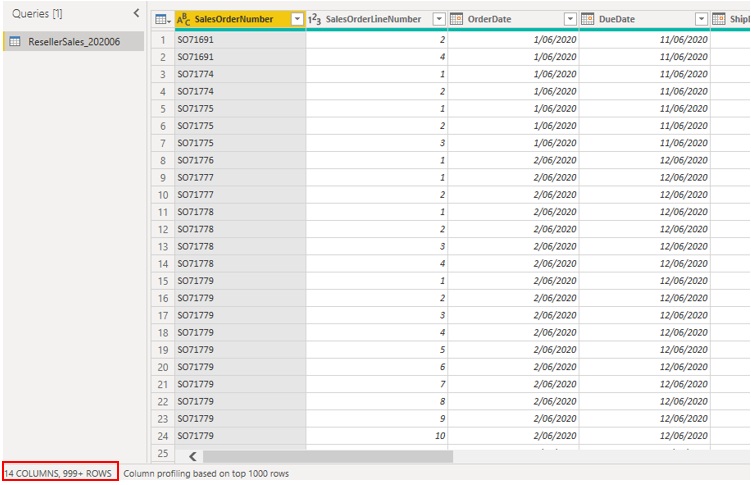
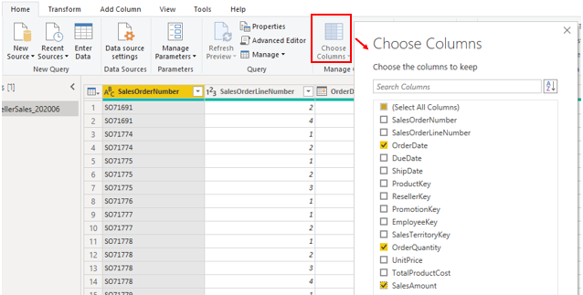
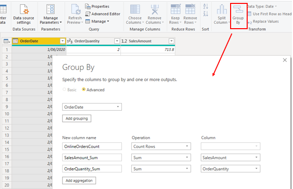
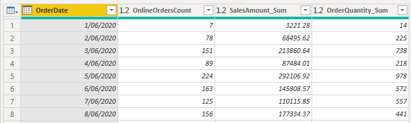
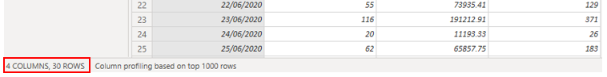
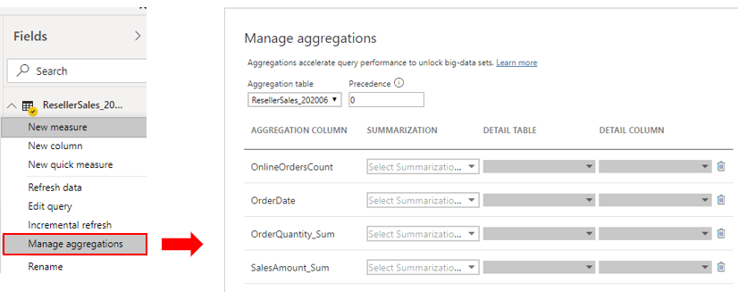

When aggregating data, you summarize that data and present it in at a higher grain (level). For example, you can summarize all sales data and group it by date, customer, product, and so on. The aggregation process reduces the table sizes in the data model, allowing you to focus on important data and helping to improve the query performance.

> [!div class="mx-imgBorder"]
> 

Your organization might decide to use aggregations in their data models for the following reasons:

-   If you are dealing with a large amount of data (big data), aggregations will provide better query performance and help you analyze and reveal the insights of this large data. Aggregated data is cached and, therefore, uses a fraction of the resources that are required for detailed data.

-   If you are experiencing a slow refresh, aggregations will help you speed up the refresh process. The smaller cache size reduces the refresh time, so data gets to users faster. Instead of refreshing what could be millions of rows, you would refresh a smaller amount of data instead.

-   If you have a large data model, aggregations can help you reduce and maintain the size of your model.

-   If you anticipate your data model growing in size in the future, you can use aggregations as a proactive step toward future proofing your data model by lessening the potential for performance and refresh issues and overall query problems.

Continuing with the Tailwind Traders scenario, you have taken several steps to optimize the performance of the data model, but the IT team has informed you that the file size is still too large. The file size is currently 1 gigabyte (GB), so you need to reduce it to around 50 megabytes (MB). During your performance review, you identified that the previous developer did not use aggregations in the data model, so you now want to create some aggregations for the sales data to reduce the file size and further optimize the performance.

## Create aggregations

Before you start creating aggregations, you should decide on the grain (level) on which you want to create them. In this example, you want to aggregate the sales data at the day level.

When you decide on the grain, the next step is to decide on how you want to create the aggregations. You can create aggregations in different ways and each method will yield the same results, for example:

-   If you have access to the database, you could create a table with the aggregation and then import that table into Power BI Desktop.

-   If you have access to the database, you could create a view for the aggregation and then import that view into Power BI Desktop.

-   In Power BI Desktop, you can use Power Query Editor to create the aggregations step-by-step.

In this example, you open a query in Power Query Editor and notice that the data has not been aggregated; it has over 999 rows, as illustrated the following screenshot.

> [!div class="mx-imgBorder"]
> 

You want to aggregate the data by the **OrderDate** column and view the **OrderQuantity** and **SalesAmount** columns. Start by selecting **Choose Columns** on the **Home** tab. On the window that displays, select the columns that you want in the aggregation and then select **OK**.

> [!div class="mx-imgBorder"]
> 

When the selected columns display on the page, select the **Group By** option on the **Home** tab. On the window that displays, select the column that you want to group by (**OrderDate**) and enter a name for the new column (**OnlineOrdersCount**).

Select the **Advanced** option and then select the **Add aggregation** button to display another column row. Enter a name for the aggregation column, select the operation of the column, and then select the column to which you want to link the aggregation. Repeat these steps until you have added all the aggregations and then select **OK**.

> [!div class="mx-imgBorder"]
> 

It might take a few minutes for your aggregation to display, but when it does, you'll see how the data has been transformed. The data will be aggregated into each date, and you will be able to see the values for the orders count and the respective sum of the sales amount and order quantity.

> [!div class="mx-imgBorder"]
> 

Select the **Close and Apply** button to close Power Query Editor and apply the changes to your data model. Return to the **Power BI Desktop** page and then select the **Refresh** button to see the results. Observe the screen because a brief message will display the number of rows that your data model now has. This number of rows should be significantly less than the number that you started with. You can also see this number when you open Power Query Editor again, as illustrated in the following screenshot. In this example, the number of rows was reduced to 30.

> [!div class="mx-imgBorder"]
> 

Remember, you started with over 999 rows. Using aggregation has significantly reduced the number of rows in your dataset, which means that Power BI has less data to refresh and your model should perform better.

## Manage aggregations

When you have created aggregations, you can manage those aggregations in Power BI Desktop and make changes to their behavior, if required.

You can open the **Manage Aggregations** window from any view in Power BI Desktop. In the **Fields** pane, right-click the table and then select **Manage aggregations**.

> [!div class="mx-imgBorder"]
> 

For each aggregation column, you can select an option from the **Summarization** drop-down list and make changes to the selected detail table and column. When you are finished managing the aggregations, select **Apply All**.

For more detailed information on how to create and manage aggregations, see [Use aggregations in Power BI Desktop](https://docs.microsoft.com/power-bi/transform-model/desktop-aggregations/?azure-portal=true).
